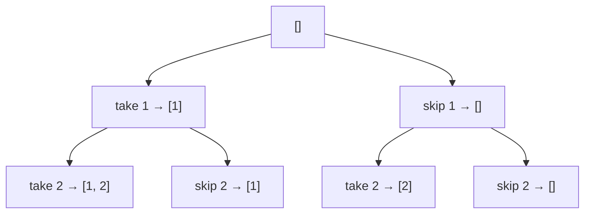

# Backtracking

## Definition

Backtracking tries a candidate path, recurses, and then undoes the choice when it cannot lead to a valid solution. It is often used for combinations, permutations, and constraint-satisfaction problems.

## Typical complexity

- Best: depends on pruning
- Average: exponential
- Worst: exponential
- Space: O(depth) recursion stack, plus output storage

## Visual example: subsets of [1, 2]

Each level decides whether to include the next value. Every leaf is one subset; a real constrained search can prune a branch as soon as it cannot produce a valid answer.



## Problem 1: Subsets

```ts
function subsets(nums: number[]): number[][] {
  const result: number[][] = [];

  const backtrack = (start: number, path: number[]) => {
    result.push([...path]);
    for (let i = start; i < nums.length; i++) {
      path.push(nums[i]);
      backtrack(i + 1, path);
      path.pop();
    }
  };

  backtrack(0, []);
  return result;
}
```

Time: O(n * 2^n), space: O(n) stack plus output.

## Problem 2: Permutations

```ts
function permute(nums: number[]): number[][] {
  const result: number[][] = [];

  const backtrack = (path: number[], used: boolean[]) => {
    if (path.length === nums.length) {
      result.push([...path]);
      return;
    }

    for (let i = 0; i < nums.length; i++) {
      if (used[i]) continue;
      used[i] = true;
      path.push(nums[i]);
      backtrack(path, used);
      path.pop();
      used[i] = false;
    }
  };

  backtrack([], Array(nums.length).fill(false));
  return result;
}
```

Time: O(n * n!), space: O(n) recursion stack plus output.

## Problem 3: N-Queens

```ts
function solveNQueens(n: number): string[][] {
  const board = Array.from({ length: n }, () => Array(n).fill('.'));
  const result: string[][] = [];

  const isSafe = (row: number, col: number) => {
    for (let i = 0; i < row; i++) {
      if (board[i][col] === 'Q') return false;
      const diff = row - i;
      if (col - diff >= 0 && board[i][col - diff] === 'Q') return false;
      if (col + diff < n && board[i][col + diff] === 'Q') return false;
    }
    return true;
  };

  const backtrack = (row: number) => {
    if (row === n) {
      result.push(board.map((line) => line.join('')));
      return;
    }

    for (let col = 0; col < n; col++) {
      if (!isSafe(row, col)) continue;
      board[row][col] = 'Q';
      backtrack(row + 1);
      board[row][col] = '.';
    }
  };

  backtrack(0);
  return result;
}
```

Time: O(n!), space: O(n^2) board + recursion stack.

## Common mistakes

- Not undoing state changes after a recursive branch.
- Failing to prune impossible branches.
- Treating backtracking as brute force with no pruning heuristic.

## Related notes

- [Dynamic programming](dynamic-programming.md)
- [Patterns overview](patterns-overview.md)
- [Trie](trie.md)
