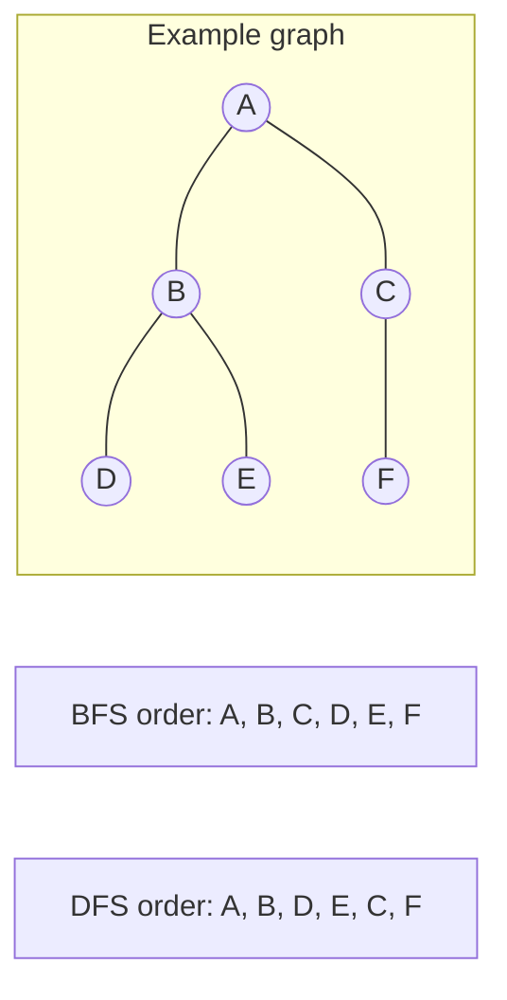

# BFS / DFS

## Definition

Breadth-first search (BFS) explores level by level. Depth-first search (DFS) explores as deep as possible before backtracking. Both are standard for tree and graph traversal.

## Visual example

For this graph, assume neighbors are visited alphabetically. BFS visits the nearest layer first; recursive DFS follows one branch before backtracking.



The traversal sequences assume neighbors are explored alphabetically; a different adjacency order can change DFS order.

## Typical complexity

- Graph traversal: O(V + E)
- Tree traversal: O(n)
- Space: O(V) for visited sets / queues / recursion stack

## Problem 1: Level order traversal

```ts
class TreeNode {
  val: number;
  left: TreeNode | null;
  right: TreeNode | null;
  constructor(val: number) {
    this.val = val;
    this.left = null;
    this.right = null;
  }
}

function levelOrder(root: TreeNode | null): number[][] {
  if (!root) return [];

  const result: number[][] = [];
  const queue: Array<TreeNode> = [root];

  while (queue.length) {
    const levelSize = queue.length;
    const level: number[] = [];

    for (let i = 0; i < levelSize; i++) {
      const node = queue.shift()!;
      level.push(node.val);
      if (node.left) queue.push(node.left);
      if (node.right) queue.push(node.right);
    }

    result.push(level);
  }

  return result;
}
```

## Problem 2: Number of islands

```ts
function numIslands(grid: string[][]): number {
  const rows = grid.length;
  const cols = grid[0]?.length ?? 0;
  const visited = new Set<string>();
  let count = 0;

  const dfs = (r: number, c: number) => {
    if (r < 0 || c < 0 || r >= rows || c >= cols) return;
    if (grid[r][c] === '0') return;
    const key = `${r},${c}`;
    if (visited.has(key)) return;
    visited.add(key);

    dfs(r + 1, c);
    dfs(r - 1, c);
    dfs(r, c + 1);
    dfs(r, c - 1);
  };

  for (let r = 0; r < rows; r++) {
    for (let c = 0; c < cols; c++) {
      if (grid[r][c] === '1' && !visited.has(`${r},${c}`)) {
        count += 1;
        dfs(r, c);
      }
    }
  }

  return count;
}
```

## Problem 3: Shortest path in an unweighted graph

```ts
function shortestPath(graph: number[][], start: number, end: number): number[] {
  const queue: number[] = [start];
  const prev = new Array(graph.length).fill(-1);
  prev[start] = start;

  while (queue.length) {
    const node = queue.shift()!;
    if (node === end) break;

    for (const neighbor of graph[node]) {
      if (prev[neighbor] === -1) {
        prev[neighbor] = node;
        queue.push(neighbor);
      }
    }
  }

  if (prev[end] === -1) return [];
  const path: number[] = [];
  let current = end;
  while (current !== start) {
    path.push(current);
    current = prev[current];
  }
  path.push(start);
  return path.reverse();
}
```

## Common mistakes

- Mixing up queue-based BFS and recursive DFS semantics.
- Forgetting to mark visited nodes.
- Using recursion for very deep graphs without considering stack limits.

## Related notes

- [Dynamic programming](dynamic-programming.md)
- [Union find](union-find.md)
- [Trie](trie.md)
