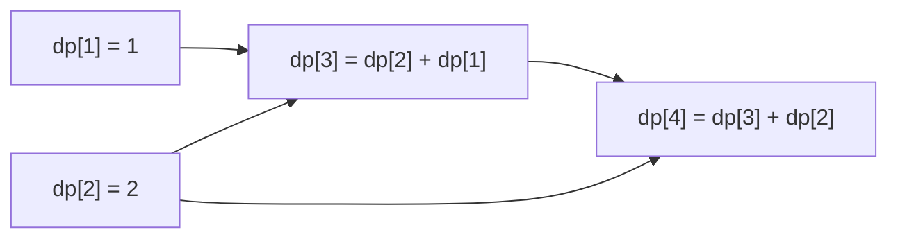

# Dynamic programming

## Definition

Dynamic programming breaks a problem into overlapping subproblems and reuses computed results instead of recomputing them.

## Typical complexity

- Best / average / worst depend on the state design
- Common forms: O(n), O(n^2), O(n * m)
- Space: O(n) or O(n * m)

## Visual example: climbing stairs

Each state depends on the previous two states. The arrows show dependencies; evaluate from the base cases toward the target.



## Problem 1: Climbing stairs

```ts
function climbStairs(n: number): number {
  if (n <= 2) return n;

  let prev2 = 1;
  let prev1 = 2;

  for (let i = 3; i <= n; i++) {
    const current = prev1 + prev2;
    prev2 = prev1;
    prev1 = current;
  }

  return prev1;
}
```

Time: O(n), space: O(1).

## Problem 2: House robber

```ts
function rob(nums: number[]): number {
  let prev2 = 0;
  let prev1 = 0;

  for (const value of nums) {
    const current = Math.max(prev1, prev2 + value);
    prev2 = prev1;
    prev1 = current;
  }

  return prev1;
}
```

Time: O(n), space: O(1).

## Problem 3: Longest palindromic subsequence

```ts
function longestPalindromicSubsequence(s: string): number {
  const n = s.length;
  const dp = Array.from({ length: n }, () => Array(n).fill(0));

  for (let i = n - 1; i >= 0; i--) {
    dp[i][i] = 1;
    for (let j = i + 1; j < n; j++) {
      if (s[i] === s[j]) {
        dp[i][j] = 2 + (i + 1 <= j - 1 ? dp[i + 1][j - 1] : 0);
      } else {
        dp[i][j] = Math.max(dp[i + 1][j], dp[i][j - 1]);
      }
    }
  }

  return dp[0][n - 1];
}
```

Time: O(n^2), space: O(n^2).

## Common mistakes

- Not identifying the state clearly before coding.
- Forgetting to define the recurrence transition correctly.
- Overusing DP when a greedy or two-pointer solution is enough.

## Related notes

- [Backtracking](backtracking.md)
- [BFS / DFS](bfs-dfs.md)
- [Patterns overview](patterns-overview.md)
