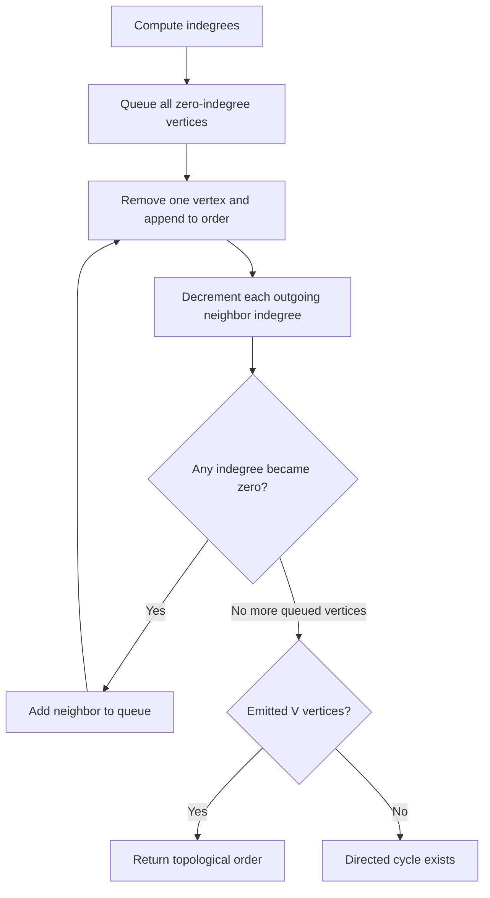

# Graph Algorithms: Dijkstra and Topological Sort

## Definition

Dijkstra's algorithm finds shortest-path distances from one source in a graph with non-negative edge weights. Topological sort orders the vertices of a directed acyclic graph (DAG) so every directed edge points from an earlier to a later vertex.

## When to use

- Use Dijkstra for weighted shortest paths when every edge weight is non-negative.
- Use BFS instead for unweighted/equal-weight edges.
- Use topological ordering for dependency scheduling, build order, and prerequisite graphs that are acyclic.
- A directed cycle means no topological ordering exists.

## How it works

### Dijkstra with array-based minimum selection

1. Set source distance to zero and all other distances to infinity.
2. Repeatedly select the unvisited vertex with the smallest known distance.
3. Relax outgoing edges: if going through this vertex improves a neighbor's distance, update it.
4. Stop when no reachable unvisited vertex remains.

This note's implementation uses a linear scan to select the next vertex, so its time is O(V² + E). A binary-heap implementation can achieve O((V + E) log V) with adjacency lists, subject to heap details.

### Topological sort with Kahn's algorithm

1. Compute each vertex's indegree.
2. Enqueue every zero-indegree vertex.
3. Repeatedly emit one such vertex and decrement the indegree of its outgoing neighbors.
4. If fewer than V vertices are emitted, the graph contains a directed cycle.



## Problem 1: Single-source shortest paths (Dijkstra)

**Input contract:** directed adjacency list; edge weights must be finite and non-negative; vertices are numbered `0..V-1`. For an undirected graph, include each edge in both adjacency lists.

### Brute force vs optimal

| Approach | Time | Extra space | Notes |
| --- | --- | --- | --- |
| Repeatedly relax every edge (Bellman-Ford style) | O(VE) | O(V) | Handles negative edges if no reachable negative cycle; slower for non-negative graphs |
| Dijkstra, scan all unsettled vertices | O(V² + E) | O(V) | Straightforward; suitable for dense/smaller graphs |
| Dijkstra with binary min-heap | O((V + E) log V) | O(V + E) | Better for sparse graphs; requires a priority queue and stale-entry handling |

### TypeScript solution

```ts
type Edge = { to: number; weight: number };

function dijkstra(graph: Edge[][], start: number): number[] {
  const vertexCount = graph.length;
  if (!Number.isInteger(start) || start < 0 || start >= vertexCount) {
    throw new RangeError("start vertex is out of range");
  }

  for (const edges of graph) {
    for (const edge of edges) {
      if (!Number.isInteger(edge.to) || edge.to < 0 || edge.to >= vertexCount) {
        throw new RangeError("edge destination is out of range");
      }
      if (!Number.isFinite(edge.weight) || edge.weight < 0) {
        throw new RangeError("Dijkstra requires finite, non-negative weights");
      }
    }
  }

  const distance = Array<number>(vertexCount).fill(Number.POSITIVE_INFINITY);
  const settled = Array<boolean>(vertexCount).fill(false);
  distance[start] = 0;

  for (let step = 0; step < vertexCount; step++) {
    let current = -1;
    for (let vertex = 0; vertex < vertexCount; vertex++) {
      if (!settled[vertex] && (current === -1 || distance[vertex] < distance[current])) {
        current = vertex;
      }
    }

    if (current === -1 || distance[current] === Number.POSITIVE_INFINITY) break;
    settled[current] = true;

    for (const edge of graph[current]) {
      const candidate = distance[current] + edge.weight;
      if (!Number.isFinite(candidate)) throw new RangeError("path distance exceeds finite number range");
      if (candidate < distance[edge.to]) distance[edge.to] = candidate;
    }
  }

  return distance;
}

const graph: Edge[][] = [
  [{ to: 1, weight: 4 }, { to: 2, weight: 1 }],
  [{ to: 3, weight: 1 }],
  [{ to: 1, weight: 2 }, { to: 3, weight: 5 }],
  [],
];
console.log(dijkstra(graph, 0));
```

Expected result: `[0, 3, 1, 4]`; unreachable vertices remain `Infinity`.

### Java solution (Java 17+)

```java
import java.util.ArrayList;
import java.util.Arrays;
import java.util.List;

class Solution {
    static class Edge {
        final int to;
        final int weight;

        Edge(int to, int weight) {
            this.to = to;
            this.weight = weight;
        }
    }

    static long[] dijkstra(List<List<Edge>> graph, int start) {
        int vertexCount = graph.size();
        if (start < 0 || start >= vertexCount) {
            throw new IllegalArgumentException("start vertex is out of range");
        }
        for (List<Edge> edges : graph) {
            for (Edge edge : edges) {
                if (edge.to < 0 || edge.to >= vertexCount || edge.weight < 0) {
                    throw new IllegalArgumentException("invalid edge for Dijkstra");
                }
            }
        }

        long[] distance = new long[vertexCount];
        Arrays.fill(distance, Long.MAX_VALUE);
        boolean[] settled = new boolean[vertexCount];
        distance[start] = 0;

        for (int step = 0; step < vertexCount; step++) {
            int current = -1;
            for (int vertex = 0; vertex < vertexCount; vertex++) {
                if (!settled[vertex]
                        && (current == -1 || distance[vertex] < distance[current])) {
                    current = vertex;
                }
            }

            if (current == -1 || distance[current] == Long.MAX_VALUE) break;
            settled[current] = true;

            for (Edge edge : graph.get(current)) {
                if (distance[current] <= Long.MAX_VALUE - edge.weight) {
                    long candidate = distance[current] + edge.weight;
                    if (candidate < distance[edge.to]) distance[edge.to] = candidate;
                }
            }
        }

        return distance;
    }

    public static void main(String[] args) {
        List<List<Edge>> graph = new ArrayList<>();
        for (int i = 0; i < 4; i++) graph.add(new ArrayList<>());
        graph.get(0).add(new Edge(1, 4));
        graph.get(0).add(new Edge(2, 1));
        graph.get(1).add(new Edge(3, 1));
        graph.get(2).add(new Edge(1, 2));
        graph.get(2).add(new Edge(3, 5));
        System.out.println(Arrays.toString(dijkstra(graph, 0)));
    }
}
```

Expected output: `[0, 3, 1, 4]`. The implementation uses `long` distances and guards addition overflow; unreachable vertices remain `Long.MAX_VALUE`.

### Dry run

For edges `0→1 (4)`, `0→2 (1)`, `2→1 (2)`, `1→3 (1)`, `2→3 (5)`, source `0`:

| Settled vertex | Relaxation | Distances after step `[d0,d1,d2,d3]` |
| ---: | --- | --- |
| 0 | Set d1=4, d2=1 | `[0,4,1,∞]` |
| 2 | Improve d1 to 3; set d3=6 | `[0,3,1,6]` |
| 1 | Improve d3 to 4 | `[0,3,1,4]` |
| 3 | No outgoing edges | `[0,3,1,4]` |

## Problem 2: Topological ordering (Kahn's algorithm)

**Input contract:** directed adjacency list with vertices `0..V-1`. Returns an ordering or `null` when a directed cycle exists.

### TypeScript solution

```ts
function topologicalSort(graph: number[][]): number[] | null {
  const vertexCount = graph.length;
  const indegree = Array<number>(vertexCount).fill(0);

  for (const neighbors of graph) {
    for (const neighbor of neighbors) {
      if (!Number.isInteger(neighbor) || neighbor < 0 || neighbor >= vertexCount) {
        throw new RangeError("edge destination is out of range");
      }
      indegree[neighbor]++;
    }
  }

  const queue: number[] = [];
  for (let vertex = 0; vertex < vertexCount; vertex++) {
    if (indegree[vertex] === 0) queue.push(vertex);
  }

  const order: number[] = [];
  let head = 0;
  while (head < queue.length) {
    const current = queue[head++];
    order.push(current);
    for (const neighbor of graph[current]) {
      indegree[neighbor]--;
      if (indegree[neighbor] === 0) queue.push(neighbor);
    }
  }

  return order.length === vertexCount ? order : null;
}

console.log(topologicalSort([[1, 2], [3], [3], []]));
```

Expected result: a valid ordering such as `[0, 1, 2, 3]` or `[0, 2, 1, 3]`.

### Java solution (Java 17+)

```java
import java.util.ArrayDeque;
import java.util.ArrayList;
import java.util.List;
import java.util.Queue;

class TopologicalSolution {
    static List<Integer> topologicalSort(List<List<Integer>> graph) {
        int vertexCount = graph.size();
        int[] indegree = new int[vertexCount];

        for (List<Integer> neighbors : graph) {
            for (int neighbor : neighbors) {
                if (neighbor < 0 || neighbor >= vertexCount) {
                    throw new IllegalArgumentException("edge destination is out of range");
                }
                indegree[neighbor]++;
            }
        }

        Queue<Integer> queue = new ArrayDeque<>();
        for (int vertex = 0; vertex < vertexCount; vertex++) {
            if (indegree[vertex] == 0) queue.add(vertex);
        }

        List<Integer> order = new ArrayList<>();
        while (!queue.isEmpty()) {
            int current = queue.remove();
            order.add(current);
            for (int neighbor : graph.get(current)) {
                indegree[neighbor]--;
                if (indegree[neighbor] == 0) queue.add(neighbor);
            }
        }

        return order.size() == vertexCount ? order : null;
    }

    public static void main(String[] args) {
        List<List<Integer>> graph = List.of(
            List.of(1, 2), List.of(3), List.of(3), List.of()
        );
        System.out.println(topologicalSort(graph));
    }
}
```

Expected output is one valid ordering, e.g. `[0, 1, 2, 3]`.

### Complexity and edge cases

- Dijkstra with linear minimum selection: best O(V + E) when the source is the only reachable vertex (one selection scan), average/worst O(V² + E); O(V) extra distance/visited space. A heap implementation has different bounds as noted above.
- Kahn's algorithm takes O(V + E) time and O(V) extra space.
- Topological sorting has the same O(V + E) work whether the graph is a DAG or contains a cycle; cycle detection happens when emitted vertex count is below V.
- Multiple valid topological orders may exist; test validity by checking every edge points forward in the returned order, not by requiring one exact sequence.
- Empty DAG returns an empty ordering. A self-loop or any directed cycle returns `null`.

### Topological-sort dry run

For edges `0→1`, `0→2`, `1→3`, `2→3`, initial indegrees are `[0,1,1,2]`. Emit `0`, then `1` and `2` as their indegrees become zero, then emit `3`. Either `[0,1,2,3]` or `[0,2,1,3]` is valid.

## Common mistakes

- Running Dijkstra with a negative edge; its greedy settled-vertex rule is not valid then.
- Using BFS for unequal positive edge weights.
- Forgetting unreachable vertices or confusing infinity with a very large finite path.
- Integer overflow when adding distances in fixed-width languages.
- Treating one topological ordering as the only valid answer.
- Forgetting that a cycle is detected when fewer than V vertices are emitted.
- Using JavaScript `Array.shift()` for a large BFS queue; use a head index or deque to avoid repeated front-removal costs.

## Interview questions

### Q1: When is Dijkstra valid?
**Model answer:** When all edge weights are non-negative. Negative edges can invalidate the greedy assumption that the smallest unsettled distance is final.

### Q2: Why does BFS solve unweighted shortest paths?
**Model answer:** BFS explores vertices in increasing number of edges from the source, so the first discovery gives the minimum-edge path when every edge has equal cost.

### Q3: What is the complexity of this Dijkstra implementation?
**Model answer:** It scans all vertices to select the next one, costing O(V²), and processes adjacency edges in O(E), for O(V² + E) time and O(V) extra distance/visited space.

### Q4: How does a heap improve Dijkstra?
**Model answer:** A min-heap selects the next minimum-distance vertex in logarithmic time, giving O((V+E) log V) with an adjacency list, while requiring careful stale-entry handling.

### Q5: What does `Infinity` mean in the distance array?
**Model answer:** No path from the source has been discovered for that vertex. It remains unreachable unless a relaxation finds a finite route.

### Q6: How does Kahn's algorithm detect a cycle?
**Model answer:** It emits only vertices that become zero-indegree. If fewer than V vertices are emitted, some cycle vertices retain positive indegree.

### Q7: Is a topological order unique?
**Model answer:** Not necessarily. If multiple zero-indegree choices exist, several valid orders may be possible.

### Q8: When would DFS-based topological sort be preferable?
**Model answer:** It is another O(V+E) approach using postorder and reverse finishing order; it can fit naturally with DFS cycle detection, while Kahn's algorithm exposes indegrees and is iterative.

### Q9: How do you model course prerequisites?
**Model answer:** Create a directed edge from prerequisite to dependent course. A topological order gives a feasible order; a cycle means the prerequisites are inconsistent.

### Q10: What changes for an undirected weighted graph?
**Model answer:** Add each undirected edge to both endpoint adjacency lists. Dijkstra still requires non-negative weights; the graph representation changes, not the algorithm's weight constraint.

## Related notes

- [BFS / DFS](bfs-dfs.md)
- [Union find](union-find.md)
- [Complexity cheat sheet](complexity-cheat-sheet.md)
- [DSA problem template](../templates/dsa-problem.md)
