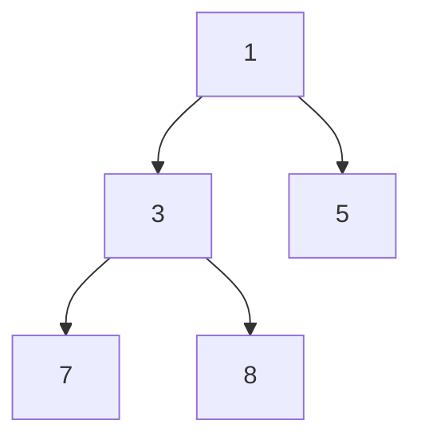

# Heap

## Definition

A heap is a complete binary tree that satisfies the heap property: 
- **Min-Heap**: The value of each node is greater than or equal to the value of its parent. The root is the minimum element.
- **Max-Heap**: The value of each node is less than or equal to the value of its parent. The root is the maximum element.

Heaps are typically implemented using arrays for space efficiency. For a node at index `i`:
- Left child: `2i + 1`
- Right child: `2i + 2`
- Parent: `floor((i - 1) / 2)`

## Typical complexity

- Push: $O(\log n)$
- Pop: $O(\log n)$
- Peek: $O(1)$
- Build heap: $O(n)$
- Space: $O(n)$

## Visual example: min-heap

The root is the smallest value. A heap is only partially ordered: each parent is no larger than its children, but siblings are not necessarily sorted.



## Heap Implementation (TypeScript)

Since JavaScript/TypeScript does not have a built-in Priority Queue, a standard min-heap implementation is required for interview correctness.

```ts
class MinHeap<T> {
  private heap: T[] = [];
  constructor(private compare: (a: T, b: T) => number) {}

  push(val: T) {
    this.heap.push(val);
    this.bubbleUp();
  }

  pop(): T | undefined {
    if (this.size() === 0) return undefined;
    const top = this.heap[0];
    const bottom = this.heap.pop()!;
    if (this.size() > 0) {
      this.heap[0] = bottom;
      this.bubbleDown();
    }
    return top;
  }

  peek(): T | undefined {
    return this.heap[0];
  }

  size(): number {
    return this.heap.length;
  }

  private bubbleUp() {
    let index = this.heap.length - 1;
    while (index > 0) {
      let parentIndex = Math.floor((index - 1) / 2);
      if (this.compare(this.heap[index], this.heap[parentIndex]) >= 0) break;
      [this.heap[index], this.heap[parentIndex]] = [this.heap[parentIndex], this.heap[index]];
      index = parentIndex;
    }
  }

  private bubbleDown() {
    let index = 0;
    const length = this.heap.length;
    while (true) {
      let left = 2 * index + 1;
      let right = 2 * index + 2;
      let swap = null;

      if (left < length) {
        if (this.compare(this.heap[left], this.heap[index]) < 0) {
          swap = left;
        }
      }

      if (right < length) {
        if (
          (swap === null && this.compare(this.heap[right], this.heap[index]) < 0) ||
          (swap !== null && this.compare(this.heap[right], this.heap[left]) < 0)
        ) {
          swap = right;
        }
      }

      if (swap === null) break;
      [this.heap[index], this.heap[swap]] = [this.heap[swap], this.heap[index]];
      index = swap;
    }
  }
}
```

## Problem 1: Kth largest element

To find the $K^{th}$ largest element, we maintain a **min-heap** of size $K$. The root of the min-heap will be the smallest of the $K$ largest elements, which is the $K^{th}$ largest overall.

```ts
function kthLargest(nums: number[], k: number): number {
  const minHeap = new MinHeap<number>((a, b) => a - b);

  for (const value of nums) {
    minHeap.push(value);
    if (minHeap.size() > k) {
      minHeap.pop();
    }
  }

  return minHeap.peek()!;
}
```
**Complexity:** Time: $O(n \log k)$, Space: $O(k)$.

## Problem 2: Merge k sorted lists

We use a min-heap to keep track of the smallest current element among all $K$ lists.

```ts
function mergeKSortedLists(lists: number[][]): number[] {
  const heap = new MinHeap<[number, number, number]>((a, b) => a[0] - b[0]);
  const output: number[] = [];

  // Initial push: first element of each list
  for (let i = 0; i < lists.length; i++) {
    if (lists[i].length) heap.push([lists[i][0], i, 0]);
  }

  while (heap.size() > 0) {
    const [value, listIndex, itemIndex] = heap.pop()!;
    output.push(value);
    
    const nextIndex = itemIndex + 1;
    if (nextIndex < lists[listIndex].length) {
      heap.push([lists[listIndex][nextIndex], listIndex, nextIndex]);
    }
  }

  return output;
}
```
**Complexity:** Time: $O(n \log k)$ where $n$ is total elements. Space: $O(k)$.

## Problem 3: Top k frequent elements

```ts
function topKFrequent(nums: number[], k: number): number[] {
  const freq = new Map<number, number>();
  for (const n of nums) freq.set(n, (freq.get(n) ?? 0) + 1);

  const minHeap = new MinHeap<[number, number]>((a, b) => a[1] - b[1]);

  for (const entry of freq.entries()) {
    minHeap.push(entry);
    if (minHeap.size() > k) {
      minHeap.pop();
    }
  }

  return Array.from({ length: k }, () => minHeap.pop()!).map(([val]) => val);
}
```
**Complexity:** Time: $O(n \log k)$, Space: $O(n)$.

## Common mistakes

- **Incorrect complexity claims**: Using `Array.sort()` inside a loop makes the complexity $O(n \cdot n \log n)$ or $O(n \cdot k \log k)$, not $O(n \log k)$.
- **Heap Property**: Forgetting that a heap is not fully sorted; only the root is guaranteed.
- **Index Errors**: Incorrectly calculating parent/child indices in array-based implementations.

## Related notes

- [Binary search](binary-search.md)
- [Dynamic programming](dynamic-programming.md)
- [Patterns overview](patterns-overview.md)
