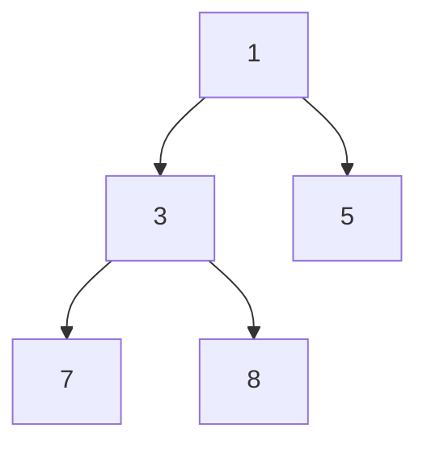

# Heap

## Definition

A heap is a complete binary tree that satisfies the heap property: parent is smaller than its children for a min-heap, or larger for a max-heap.

## Typical complexity

- Push: O(log n)
- Pop: O(log n)
- Peek: O(1)
- Build heap: O(n)
- Space: O(n)

## Visual example: min-heap

The root is the smallest value. A heap is only partially ordered: each parent is no larger than its children, but siblings are not necessarily sorted.



## Problem 1: Kth largest element

```ts
function kthLargest(nums: number[], k: number): number {
  const minHeap = new Array<number>();

  for (const value of nums) {
    minHeap.push(value);
    if (minHeap.length > k) {
      minHeap.sort((a, b) => a - b);
      minHeap.shift();
    }
  }

  return minHeap[0];
}
```

A production solution would use a min-heap with `push` and `shift` logic, but the key idea is the same: keep only the k largest elements.

## Problem 2: Merge k sorted lists

```ts
function mergeKSortedLists(lists: number[][]): number[] {
  const heap: Array<[number, number, number]> = [];
  const output: number[] = [];

  for (let i = 0; i < lists.length; i++) {
    if (lists[i].length) heap.push([lists[i][0], i, 0]);
  }

  while (heap.length) {
    heap.sort((a, b) => a[0] - b[0]);
    const [value, listIndex, itemIndex] = heap.shift()!;
    output.push(value);
    const nextIndex = itemIndex + 1;
    if (nextIndex < lists[listIndex].length) {
      heap.push([lists[listIndex][nextIndex], listIndex, nextIndex]);
    }
  }

  return output;
}
```

Time: O(n log k) for `n` total elements and heap size `k`.

## Problem 3: Top k frequent elements

```ts
function topKFrequent(nums: number[], k: number): number[] {
  const freq = new Map<number, number>();
  for (const n of nums) freq.set(n, (freq.get(n) ?? 0) + 1);

  const heap = Array.from(freq.entries()).sort((a, b) => b[1] - a[1]).slice(0, k);
  return heap.map(([value]) => value);
}
```

Time: O(n log n) in the simple sort-based version; a heap-based solution is closer to O(n log k).

## Common mistakes

- Using heap terminology without a clear min/max relation.
- Forgetting that the heap property is about the parent-child ordering, not the array order.
- Overlooking the cost of heap maintenance in repeated insertions.

## Related notes

- [Binary search](binary-search.md)
- [Dynamic programming](dynamic-programming.md)
- [Patterns overview](patterns-overview.md)
