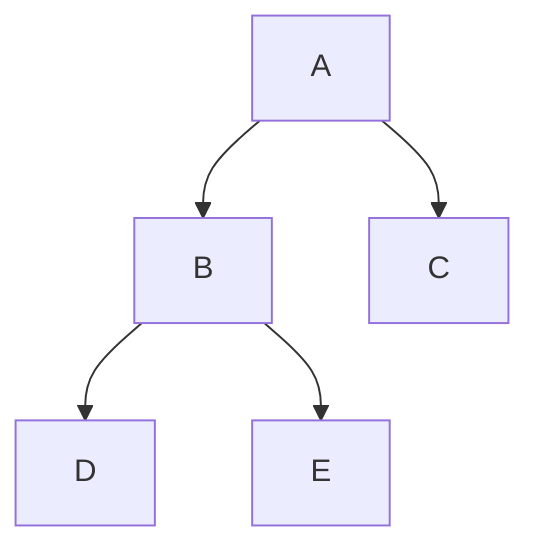

 Tree Traversal

Tags: #dsa #tree
Difficulty: Medium
Status: Learning

## Definition

Tree traversal visits all nodes in a structured way to inspect, process, or compute values in a tree.

## Why it matters / when to use

Trees are common in hierarchical data, expression parsing, DOM structures, and decision systems. Traversal defines how you navigate them.

## How it works

- DFS explores depth-first: pre-order, in-order, post-order
- BFS explores breadth-first level by level
- Use recursion or an explicit stack/queue

## Visual example

For this tree, the visit orders are preorder `A, B, D, E, C`, inorder `D, B, E, A, C`, postorder `D, E, B, C, A`, and level order `A, B, C, D, E`.



## Code example

```ts
class TreeNode {
  val: number;
  left: TreeNode | null;
  right: TreeNode | null;

  constructor(val: number) {
    this.val = val;
    this.left = null;
    this.right = null;
  }
}

function preorder(root: TreeNode | null): number[] {
  if (!root) return [];
  return [root.val, ...preorder(root.left), ...preorder(root.right)];
}
```

## Time and space complexity

| Traversal | Time | Space |
| --- | --- | --- |
| DFS | O(n) | O(h) |
| BFS | O(n) | O(w) |

## Common mistakes and pitfalls

- Failing to handle null nodes
- Confusing in-order and post-order semantics
- Using recursion where stack depth may be unsafe in large trees

## Interview questions

### Q: When would you prefer BFS over DFS?
Model answer: BFS is useful when you need the shortest path in an unweighted graph or want level-order traversal.

## Related topics

- [Patterns overview](patterns-overview.md)
- [Complexity cheat sheet](complexity-cheat-sheet.md)
- [Binary search](binary-search.md)
