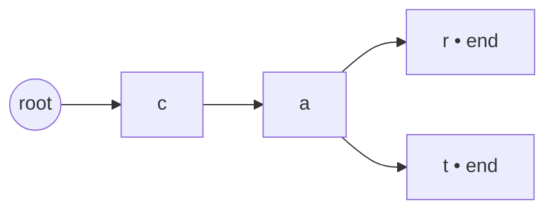

# Trie

## Definition

A trie (prefix tree) is a specialized tree-like data structure used for efficient retrieval of keys in a large dataset of strings. It is especially useful in dictionaries, autocomplete, and prefix matching tasks.

## Visual example

The words `car` and `cat` share the `ca` prefix. A marked terminal node means a complete word ends there; a prefix alone is not necessarily a stored word.



## Typical complexity

- Insert: $O(L)$
- Search: $O(L)$
- Prefix check: $O(L)$
- Space: $O(N \cdot L)$ where $N$ is the number of words and $L$ is average length.

## Problem 1: Implement trie

```ts
class TrieNode {
  children: Map<string, TrieNode>;
  isEnd: boolean;

  constructor() {
    this.children = new Map();
    this.isEnd = false;
  }
}

class Trie {
  root: TrieNode;

  constructor() {
    this.root = new TrieNode();
  }

  insert(word: string): void {
    let node = this.root;
    for (const ch of word) {
      if (!node.children.has(ch)) node.children.set(ch, new TrieNode());
      node = node.children.get(ch)!;
    }
    node.isEnd = true;
  }

  search(word: string): boolean {
    let node = this.root;
    for (const ch of word) {
      if (!node.children.has(ch)) return false;
      node = node.children.get(ch)!;
    }
    return node.isEnd;
  }

  startsWith(prefix: string): boolean {
    let node = this.root;
    for (const ch of prefix) {
      if (!node.children.has(ch)) return false;
      node = node.children.get(ch)!;
    }
    return true;
  }
}
```

## Problem 2: Longest common prefix

```ts
function longestCommonPrefix(words: string[]): string {
  if (!words.length) return '';

  let prefix = words[0];
  for (let i = 1; i < words.length; i++) {
    while (!words[i].startsWith(prefix)) {
      prefix = prefix.slice(0, -1);
      if (!prefix) return '';
    }
  }

  return prefix;
}
```

## Problem 3: Word search II

Corrected implementation using the Trie class for runtime safety and correctness.

```ts
function findWords(board: string[][], words: string[]): string[] {
  if (!board.length || !board[0].length) return [];
  
  const trie = new Trie();
  for (const word of words) {
    trie.insert(word);
  }

  const rows = board.length;
  const cols = board[0].length;
  const result = new Set<string>();

  const dfs = (r: number, c: number, node: TrieNode, word: string) => {
    const ch = board[r][c];
    const next = node.children.get(ch);
    
    if (!next) return;

    const updatedWord = word + ch;
    if (next.isEnd) {
      result.add(updatedWord);
      // Optimization: mark next.isEnd = false if we only need one instance of each word
    }

    board[r][c] = '#'; // Mark as visited
    
    const directions = [[1,0],[-1,0],[0,1],[0,-1]];
    for (const [dr, dc] of directions) {
      const nr = r + dr;
      const nc = c + dc;
      if (nr >= 0 && nr < rows && nc >= 0 && nc < cols) {
        dfs(nr, nc, next, updatedWord);
      }
    }
    
    board[r][c] = ch; // Backtrack
  };

  for (let r = 0; r < rows; r++) {
    for (let c = 0; c < cols; c++) {
      dfs(r, c, trie.root, '');
    }
  }

  return Array.from(result);
}
```

## Common mistakes

- **Runtime mismatch**: Using a `Map` as a plain object (`node[ch]`), which leads to `undefined` or runtime errors in TS.
- **Boundary conditions**: Not handling empty boards or empty target strings.
- **Backtracking**: Forgetting to unmark visited cells when exploring alternative paths in Word Search.
- **Trie Structure**: Forgetting that `search()` must check `isEnd`, while `startsWith()` only checks if the path exists.

## Related notes

- [BFS / DFS](bfs-dfs.md)
- [Backtracking](backtracking.md)
- [Patterns overview](patterns-overview.md)
