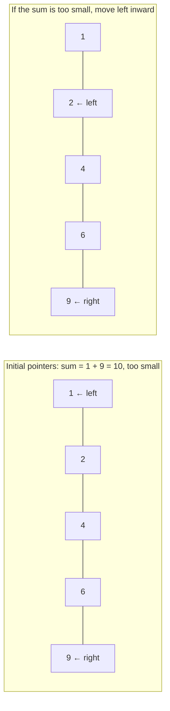

# Two pointers

## Definition

Two pointers walk through a data structure from different ends or with a moving invariant, often reducing time from O(n^2) to O(n).

## When to use

- Sorted arrays and pair sum problems
- Reversing or removing items in-place
- Detection of duplicates, palindromes, or partitioning

## Typical complexity

- Best: O(n)
- Average: O(n)
- Worst: O(n)
- Space: O(1)

## Visual example: sorted two-sum

For `[1, 2, 4, 6, 9]` and target `11`, the first pair is too small, so move `left` right; the next pair matches.



## Problem 1: Two sum in sorted array

Given a sorted array and target, find indices that sum to target.

```ts
function twoSumSorted(nums: number[], target: number): number[] {
  let left = 0;
  let right = nums.length - 1;

  while (left < right) {
    const sum = nums[left] + nums[right];
    if (sum === target) return [left, right];
    if (sum < target) left += 1;
    else right -= 1;
  }

  return [];
}
```

Why it works: left and right move toward the center while maintaining the pointer invariant that the current sum is either too small or too large.

## Problem 2: Remove duplicates from sorted array

```ts
function removeDuplicates(nums: number[]): number {
  if (nums.length === 0) return 0;

  let write = 1;
  for (let read = 1; read < nums.length; read++) {
    if (nums[read] !== nums[write - 1]) {
      nums[write] = nums[read];
      write += 1;
    }
  }

  return write;
}
```

Complexity: O(n) time, O(1) space.

## Problem 3: Valid palindrome

```ts
function isPalindrome(s: string): boolean {
  let left = 0;
  let right = s.length - 1;

  while (left < right) {
    if (s[left] !== s[right]) return false;
    left += 1;
    right -= 1;
  }

  return true;
}
```

Complexity: O(n) time, O(1) space.

## Common mistakes

- Forgetting that the array must be sorted for many pointer patterns.
- Moving one pointer without maintaining a clear invariant.
- Not checking boundary/empty input.

## Related notes

- [Sliding window](sliding-window.md)
- [Binary search](binary-search.md)
- [Complexity cheat sheet](complexity-cheat-sheet.md)
