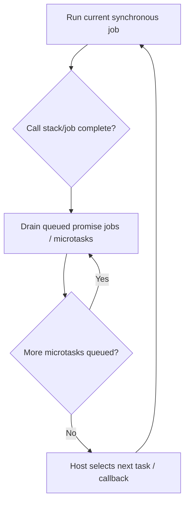

# JavaScript Essentials

## Definition

JavaScript is a dynamically typed, prototype-based language standardized by ECMAScript. A JavaScript agent executes one job at a time, while host environments such as browsers and Node.js provide asynchronous I/O, timers, and worker facilities.

## Why it matters / when to use

JavaScript underlies browser applications and server-side runtimes. Interviews commonly test scope/closures, `this`, prototypes, coercion, promises, and event-loop ordering.

## How it works

### Closures and scope

Functions capture access to their lexical environment. A closure can retain private state after the outer function returns. `let` and `const` are block-scoped; `var` is function-scoped and is initialized to `undefined` during declaration processing.

### Hoisting and temporal dead zone

Function declarations are available throughout their scope. `var` declarations are hoisted and initialized to `undefined`; `let`/`const` declarations are hoisted but cannot be accessed before initialization (the temporal dead zone). Prefer declaring values before use.

### `this`

For ordinary functions, `this` depends on the call site. A method call such as `obj.method()` binds `this` to `obj`; extracting the function loses that receiver unless it is bound. Arrow functions capture lexical `this` and do not have their own `this` binding.

### Prototypes

Objects can delegate property lookup through a prototype chain. `class` syntax provides a class-oriented interface over JavaScript's prototype-based object model; it does not create classical inheritance semantics identical to every other language.

### Promises and event loop

Promise reactions are queued as microtasks/jobs and run after the current synchronous job completes. Hosts also schedule tasks such as timer callbacks. The exact scheduling APIs and additional queues vary by host; do not assume browser and Node event loops are identical.

An `async` function always returns a Promise. `await` suspends that function's continuation until the awaited value settles; it does not block the JavaScript agent. A rejection is thrown at the `await` expression and can be handled with `try`/`catch` or by handling the returned Promise.

### Common ES2015+ features

- `let` / `const`: block-scoped bindings.
- Destructuring and rest/spread: unpack or compose arrays/objects; object spread is shallow.
- Template literals: interpolate expressions and create multiline strings.
- Modules: `import` / `export` define module interfaces; loading behavior depends on the host/bundler.
- `Map` / `Set`: dedicated key-value and uniqueness collections.
- Optional chaining / nullish coalescing: concise null-safe access and fallback behavior.



## Code example

This runnable JavaScript example demonstrates a closure, method-call `this`, prototype lookup, and the common Promise-before-timer ordering in browser and Node environments.

```js
function makeCounter() {
  let count = 0;
  return () => ++count;
}

const nextCount = makeCounter();
console.log(nextCount());

const account = {
  balance: 5,
  readBalance() {
    return this.balance;
  },
};
console.log(account.readBalance());
console.log(Object.getPrototypeOf(account) === Object.prototype);

console.log("sync");
Promise.resolve().then(() => console.log("promise job"));
setTimeout(() => console.log("timer task"), 0);

async function resolveLabel() {
  return await Promise.resolve("async result");
}
resolveLabel().then((label) => console.log(label));
```

The first outputs are `1`, `5`, `true`, and `sync`. Promise/async continuations run before the timer callback in standard browser and Node script execution; exact host queue details and elapsed timer timing are not interchangeable.

## Time and space complexity / trade-offs

- Language features do not have one universal Big-O complexity; analyze the operations performed by the program.
- `Map`/`Set` access is typically treated as average O(1) in interview analysis; state assumptions if collision behavior matters.
- `makeCounter()` creates one closure and retained counter value: O(1) time per increment and O(1) retained space per counter.
- Async operations avoid blocking the current job while waiting, but add ordering, error-propagation, cancellation, and resource-management complexity.

## Common mistakes

- Saying JavaScript execution is universally single-threaded without distinguishing an agent from host workers and asynchronous I/O.
- Assuming `this` is lexically scoped for ordinary functions; only arrow functions capture lexical `this`.
- Accessing `let`/`const` before initialization or treating `var` as block-scoped.
- Assuming `const` makes an object immutable; it prevents rebinding the variable, not mutation of the object.
- Ignoring promise rejection handling or assuming all host task queues have identical ordering.
- Describing `class` as unrelated to prototypes.

## Interview questions

### Q1: What is a closure?
**Model answer:** A closure is a function together with access to its lexical environment. It allows functions to retain and use state from an outer scope after that outer function has returned.

### Q2: How does `this` differ between an ordinary function and an arrow function?
**Model answer:** An ordinary function's `this` is determined by how it is called (or explicitly bound). An arrow function has no own `this`; it captures `this` from its surrounding lexical scope.

### Q3: What is the temporal dead zone?
**Model answer:** It is the period from entering a scope until a `let` or `const` binding is initialized. Access during that period throws a `ReferenceError`, unlike a `var` binding which is initialized to `undefined`.

### Q4: What runs first: synchronous code, a Promise callback, or a timer callback?
**Model answer:** The current synchronous job runs first. Once it completes, queued Promise reactions/microtasks are processed before the host proceeds to a timer task, subject to the host's event-loop rules.

### Q5: What is the prototype chain?
**Model answer:** It is the sequence of prototype objects JavaScript checks when a property is not found directly on an object. `class` syntax uses this object delegation model.

### Q6: What is the difference between `==` and `===`?
**Model answer:** `==` applies coercion rules before comparison; `===` compares without coercion. Prefer strict equality unless a specific coercion is intentional and well understood.

### Q7: Does `const` make an object immutable?
**Model answer:** No. `const` prevents assigning a new value to the binding, but the referenced object's properties can still be mutated unless the object is separately frozen or treated immutably.

### Q8: How do `async` functions and `await` relate to Promises?
**Model answer:** Calling an `async` function always returns a Promise. `await` pauses that async function's continuation until the awaited Promise settles; it does not block the JavaScript agent's synchronous execution.

### Q9: What does hoisting mean for `var`, `let`, `const`, and function declarations?
**Model answer:** Declarations are processed with scope-specific rules. Function declarations can be called before their textual position; `var` is initialized to `undefined`; `let`/`const` are inaccessible in their temporal dead zone until initialized. Avoid relying on hoisting for readability.

### Q10: When is `Promise.all` useful, and what happens if one input rejects?
**Model answer:** It is useful for independent asynchronous operations that can run concurrently. It fulfills when all inputs fulfill and rejects when an input rejects; it does not automatically cancel the other operations. Use `allSettled` when each outcome must be collected.

## Related topics

- [TypeScript essentials](../typescript/typescript-essentials.md)
- [Browser internals](../../03-frontend/browser-internals.md)
- [React interview notes](../../03-frontend/react.md)
