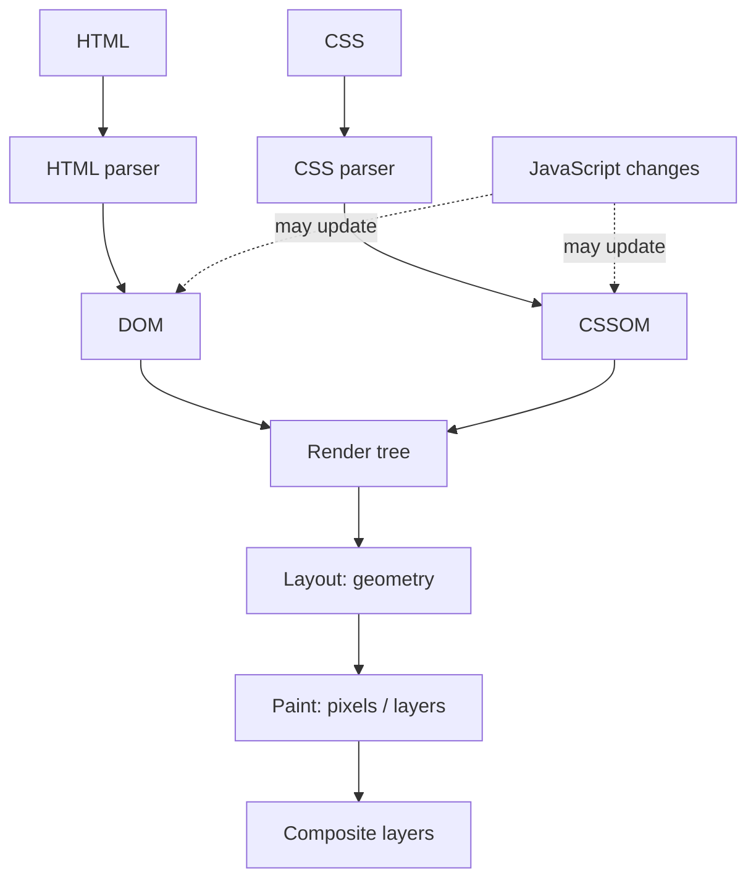

 Browser Internals

Tags: #browser #performance
Difficulty: Medium
Status: Learning

## Definition

Browser internals refer to how the browser parses HTML, builds the DOM, lays out elements, paints pixels, and processes events.

## Why it matters / when to use

These concepts explain rendering behavior, layout thrashing, input responsiveness, and performance bottlenecks.

## How it works

The browser pipeline usually consists of parsing, style calculation, layout, paint, and composition. Async tasks and the event loop also matter for JavaScript execution.



## Code example

```js
console.log("start");

setTimeout(() => console.log("timeout"), 0);

Promise.resolve().then(() => console.log("microtask"));

console.log("end");
```

## Time and space complexity

Browser performance is more about pipeline costs than algorithmic complexity, but layout and repaint costs can be modeled in terms of DOM size and style complexity.

## Common mistakes and pitfalls

- Reading layout values repeatedly in a loop
- Triggering reflows by updating layout-dependent properties too often
- Ignoring the event loop when writing blocking code

## Interview questions

### Q: What is the difference between layout and paint?
Model answer: Layout calculates where elements should appear on screen. Paint draws the pixels after layout has determined geometry and styles.

## Related topics

- [React interview notes](react.md)
- [Performance tuning](performance.md)
- [Accessibility](accessibility.md)
