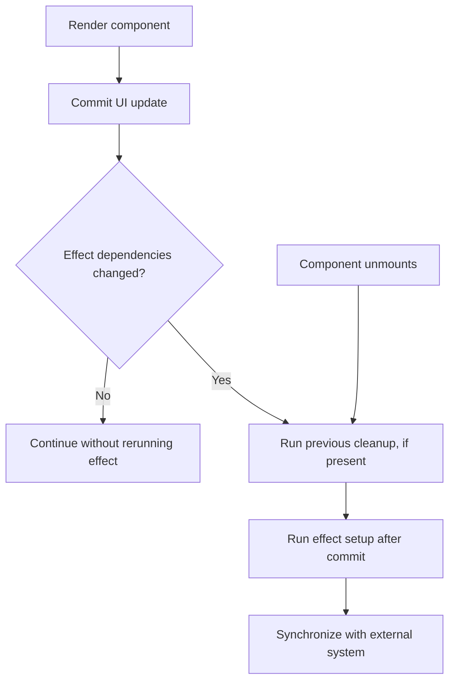

# Hooks and useEffect pitfalls

## Definition

Hooks let function components use state, effects, and context. `useEffect` is tempting for almost everything, but it is often the wrong tool for logic that should happen during render or event handlers.

## Key patterns

- `useState`: local state
- `useMemo`: memoize derived values
- `useCallback`: memoize function identity
- `useEffect`: side effects after render



## useEffect pitfalls

- Dependency arrays can hide stale values.
- Effects can trigger loops if state is updated inside the effect without guard conditions.
- Data fetching inside effects is common, but it must handle races, cancellation, and unmounted state.

## Example

```tsx
import React, { useEffect, useState } from 'react';

export function UserProfile({ userId }: { userId: number }) {
  const [user, setUser] = useState<{ name: string } | null>(null);

  useEffect(() => {
    let active = true;

    fetch(`/api/users/${userId}`)
      .then((res) => res.json())
      .then((data) => {
        if (active) setUser(data);
      });

    return () => {
      active = false;
    };
  }, [userId]);

  return <div>{user?.name ?? 'Loading...'}</div>;
}
```

## Interview guidance

- Prefer deriving values during render instead of storing redundant state.
- Use event handlers for user actions and effect for synchronization with external systems.
- When reading stale state is a problem, use functional updates or refs carefully.

## Related notes

- [Rendering and reconciliation](rendering-and-reconciliation.md)
- [Memoization and state](memoization-and-state.md)
- [Next.js rendering](nextjs-rendering.md)
