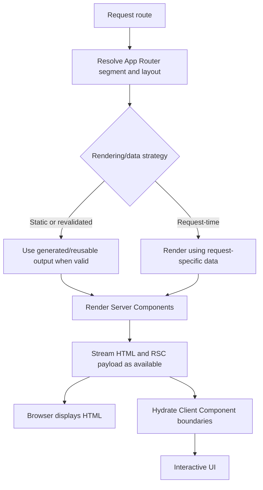

# Next.js rendering

> **Version note:** Examples use the App Router and current React Server Component conventions. Cache defaults and some APIs have changed across Next.js releases. Confirm exact behavior against the project's pinned Next.js version and deployment adapter; use explicit cache/revalidation intent rather than relying on an assumed default.

## Definition

Next.js rendering is the process of producing route output and delivering it to the browser. The App Router supports static and request-time rendering, streaming, Server Components, Client Components, and data/route cache controls.

## How it works

### Rendering choices

| Approach | When output/data is produced | Typical fit | Trade-off |
| --- | --- | --- | --- |
| Static rendering (SSG) | During build or other static generation | Public content that can be shared and cached | Fast delivery; freshness depends on rebuild/revalidation strategy |
| Request-time rendering (SSR/dynamic) | For a request when route/data requires it | Personalized or frequently changing content | Fresh data; adds server work and may add latency |
| ISR / revalidation | Static output/data can be refreshed under configured rules | Mostly stable content that needs bounded staleness | Balances reuse and freshness; invalidation policy matters |

SSR, SSG, and ISR describe rendering/freshness strategies; App Router describes routing and component architecture. They are not four mutually exclusive modes.

### App Router and components

- Files and folders under `app/` define route segments; `page.tsx` supplies route content and `layout.tsx` shares UI across a segment.
- Components are Server Components by default. Add `'use client'` at a component boundary when using client state, event handlers, effects, or browser APIs.
- Server Components can fetch server-side data without shipping that component's implementation to the browser. Props crossing into Client Components must be serializable.
- Streaming and `loading.tsx` can expose ready UI while slower work continues. `error.tsx` provides a route-segment error boundary.
- Cache and revalidation behavior depends on version and explicit configuration; identify the data's freshness requirement before choosing controls.



## Code example

### Request-time rendering (App Router)

```tsx
// app/products/page.tsx
import { headers } from "next/headers";

export default async function ProductsPage() {
  const requestHeaders = await headers();
  const language = requestHeaders.get("accept-language") ?? "not provided";
  const products = [
    { id: "ring-1", name: "Silver ring" },
    { id: "necklace-1", name: "Gold necklace" },
  ];

  return (
    <main>
      <h1>Products</h1>
      <p>Request language: {language}</p>
      <ul>
        {products.map((product) => (
          <li key={product.id}>{product.name}</li>
        ))}
      </ul>
    </main>
  );
}
```

This self-contained page reads request headers with the asynchronous `headers()` API, so the rendered output depends on the current request. `headers()` is a dynamic API and its asynchronous signature is version-sensitive; verify it against the pinned Next.js version. In a real page, apply the corresponding explicit caching behavior to each data source.

### Static generation / revalidation shape

For a public dynamic route, `generateStaticParams` can provide parameters for static generation. Route revalidation is version/configuration-sensitive; consult the project's version before adopting this sketch.

```tsx
// app/articles/[slug]/page.tsx
export const revalidate = 300;

export async function generateStaticParams() {
  return [{ slug: "interview-prep" }];
}

export default async function ArticlePage({
  params,
}: {
  params: Promise<{ slug: string }>;
}) {
  const { slug } = await params;
  return <article><h1>{slug}</h1></article>;
}
```

The `params` Promise shape applies to newer App Router conventions; verify it for the pinned version. The example's `revalidate` interval is illustrative, not a recommendation for a real content SLA.

## Complexity / trade-offs

- Rendering a list of $n$ items with constant-cost item rendering is O(n) application work; network, server rendering, cache lookup, hydration, and browser layout costs are additional.
- Static output reduces per-request rendering work but can be stale until revalidation or rebuild.
- Request-time rendering supports freshness/personalization but consumes server resources per request and can affect latency.
- Client Components support interactivity but increase client JavaScript and hydration work.
- Revalidation intervals and on-demand invalidation trade freshness, cache hit rate, and origin load; choose based on data correctness requirements.

## Common mistakes

- Mixing Pages Router APIs such as `getStaticProps` with App Router examples.
- Treating SSR/SSG/ISR and App Router as mutually exclusive concepts.
- Assuming a particular `fetch` cache default without checking Next.js version/configuration.
- Caching personalized responses so they can be reused across users.
- Adding `'use client'` to an entire page when only a small leaf component needs interactivity.
- Using a server-only secret or non-serializable value across a Client Component boundary.
- Rendering time/random/browser-only values differently on server and initial client render, causing hydration mismatch.

## Interview questions

### Q1: Compare SSR, SSG, and ISR.
**Model answer:** SSR renders using request-time data, SSG produces reusable static output, and ISR/revalidation refreshes reusable output under configured rules. Choose based on freshness, personalization, latency, and origin load.

### Q2: Is the App Router a rendering mode?
**Model answer:** No. It is the route/component architecture under `app/`; a route can use static or request-time behavior depending on its data and configuration.

### Q3: What is a Server Component?
**Model answer:** It is a component rendered in a server environment. It can access server-side resources and avoids shipping its implementation as client JavaScript, but cannot use client-only hooks or browser APIs.

### Q4: When should a component use `'use client'`?
**Model answer:** When it needs client state, event handlers, effects, or browser APIs. Put the directive at the narrowest practical boundary to limit client JavaScript.

### Q5: What is the purpose of `generateStaticParams`?
**Model answer:** It supplies route parameters that Next.js can use to generate dynamic route paths statically. Exact behavior and options should be checked against the pinned Next.js version.

### Q6: How do you make a request-time fetch explicit?
**Model answer:** Configure the supported fetch/cache behavior for the installed version, for example `cache: "no-store"` when fresh request-time data is required, and ensure the response is not placed in a shared cache inappropriately.

### Q7: What is the difference between a data cache and route output caching?
**Model answer:** They can apply to different layers: reuse of fetched data is distinct from reuse of rendered route output. Understand the configured cache layers for the actual version and hosting platform.

### Q8: How do streaming and `loading.tsx` help?
**Model answer:** They allow portions of the UI or a fallback to be delivered while slower work is pending, improving perceived responsiveness; they do not make the underlying operation itself faster.

### Q9: What causes hydration mismatch?
**Model answer:** The initial client render differs from server-generated markup, often due to non-deterministic values, browser-only state, or inconsistent data. Make the initial output deterministic and isolate browser-only behavior to client code.

### Q10: What must be considered when caching user-specific data?
**Model answer:** Cache keys and scope must prevent one user's data from being served to another. Verify authorization, freshness, invalidation, and the behavior of the deployed platform's cache layers.

## Related notes

- [Next.js interview notes](nextjs.md)
- [React rendering and reconciliation](rendering-and-reconciliation.md)
- [Core Web Vitals](core-web-vitals.md)
- [Memoization and state](memoization-and-state.md)

## Related notes

- [Rendering and reconciliation](rendering-and-reconciliation.md)
- [Core Web Vitals](core-web-vitals.md)
- [Memoization and state](memoization-and-state.md)
