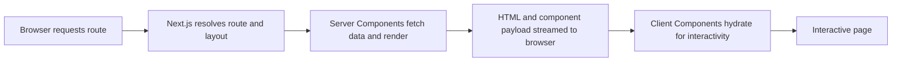

 Next.js Interview Notes

Tags: #nextjs #frontend
Difficulty: Medium
Status: Learning

## Definition

Next.js is a React framework that supports SSR, SSG, ISR, routing, and optimization patterns for production-grade web apps.

## Why it matters / when to use

Next.js is used where SEO, fast initial rendering, layout control, and routing are important.

## How it works

The framework decides how pages are rendered based on the route and fetching strategy. Common choices are server-side rendering, static generation, and incremental regeneration.

| Approach | When output is generated | Typical fit |
| --- | --- | --- |
| SSR / dynamic rendering | Per request | Request-specific or frequently changing data |
| SSG / static rendering | Ahead of requests, commonly at build time | Public content that can be cached broadly |
| ISR / revalidation | Static output refreshed according to configured revalidation | Mostly static content that should update without rebuilding everything |
| App Router | Routing and component architecture, not a rendering mode by itself | Nested layouts, Server Components by default, and route-level rendering choices |

## App Router request and render flow

Server Components are the default in the App Router; Client Components are used for browser-only interactivity. Static/dynamic rendering and cache/revalidation behavior depend on route data and configuration.



## Code example

```tsx
export default function Page() {
  return <h1>Hello from Next.js</h1>;
}
```

## Time and space complexity

Runtime complexity is mostly determined by the data-fetching strategy and app architecture rather than the framework alone.

## Common mistakes and pitfalls

- Mixing client and server state incorrectly
- Using unnecessary client components in an app router design
- Ignoring caching and revalidation strategy

## Interview questions

### Q: What is the difference between SSR and SSG?
Model answer: SSR renders per request; SSG generates content at build time and serves cached HTML. Choose based on freshness, performance, and caching needs.

## Related topics

- [React interview notes](react.md)
- [Browser internals](browser-internals.md)
- [Performance tuning](performance.md)
