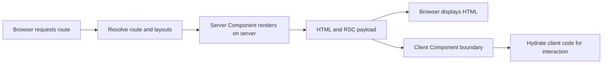

# Next.js Interview Notes

## Definition

Next.js is a React framework that adds file-system routing, server rendering, data access, caching/revalidation, and deployment conventions to React applications. This note focuses on the App Router and React Server Components.

## Why it matters / when to use

Next.js is useful when an application benefits from server-rendered or statically generated output, route-level layouts, streaming, or server-side data access. The framework does not automatically make every page faster; rendering and caching choices must match freshness and user-specific data requirements.

## How it works

The App Router organizes route segments under `app/`. Layouts can be shared across nested routes. Components are Server Components by default; a file marked with `'use client'` creates a client boundary for browser interactivity and client-only hooks. Server/Client describes where component code can run; it is distinct from static vs dynamic rendering.

The App Router supports route-level static and dynamic rendering, streaming, and cache revalidation. Exact cache defaults and APIs are version-sensitive: see the version caveat in [Next.js rendering](nextjs-rendering.md).

## Server and Client Component boundary

Use Server Components for server-side data access and markup when browser interactivity is not required. Use Client Components for state, event handlers, effects, and browser APIs; keep that boundary narrow to avoid shipping unnecessary JavaScript.



## Code example

```tsx
// app/products/page.tsx — Server Component in the App Router
const products = [
  { id: "ring-1", name: "Silver ring" },
  { id: "necklace-1", name: "Gold necklace" },
];

export default function ProductsPage() {
  return (
    <main>
      <h1>Products</h1>
      <ul>
        {products.map((product) => (
          <li key={product.id}>{product.name}</li>
        ))}
      </ul>
    </main>
  );
}
```

This is a self-contained App Router Server Component example; a real page can load data on the server using a data source and explicit cache/revalidation behavior appropriate to its installed Next.js version.

## Complexity and trade-offs

- Framework overhead has no single application-level Big-O. For a page rendering $n$ products, the mapping shown is O(n) time and O(n) output-element work, apart from network and React rendering costs.
- Server rendering can improve access to request-time data and keep server-only dependencies off the client, but adds server work and can increase request latency.
- Client Components enable interactivity but contribute JavaScript to the client bundle and hydration work.
- Static output can be cached efficiently; revalidation and dynamic data introduce freshness/consistency trade-offs.

## Common mistakes

- Treating Server/Client Components as synonyms for SSR/CSR or static/dynamic rendering.
- Adding `'use client'` high in the tree when only a small interactive component needs it.
- Importing server-only secrets or modules into a Client Component.
- Assuming all server `fetch` calls are cached by default across every Next.js version.
- Returning user-specific data from shared caches without an appropriate cache key or dynamic strategy.
- Forgetting loading, error, not-found, and authorization behavior for route segments.

## Interview questions

### Q1: What does the App Router provide?
**Model answer:** It is Next.js's route system based on the `app/` directory, with nested layouts, route segments, Server Components by default, and support for streaming and route-level rendering/data behavior.

### Q2: What is a React Server Component?
**Model answer:** It is a component rendered in a server environment that can access server-side data/resources and does not ship its component implementation as client JavaScript. It cannot use client-only hooks or browser APIs.

### Q3: When do you add `'use client'`?
**Model answer:** At the smallest component boundary that needs client-side state, event handlers, effects, or browser APIs. Keeping the boundary narrow helps limit client JavaScript.

### Q4: Are Server Components the same as SSR?
**Model answer:** No. Server Component describes where component code executes and what is sent to the client; SSR/static/dynamic rendering describe when or how route output is produced. They are related but separate axes.

### Q5: How do nested layouts help?
**Model answer:** Layouts let route segments share UI and structure. Persistent layouts can remain mounted across navigation within their segment, while pages represent route-specific content.

### Q6: How should a Server Component handle data-fetch errors?
**Model answer:** Check response status or handle rejected operations and provide a route-level error boundary such as `error.tsx` where appropriate. Avoid silently rendering invalid data.

### Q7: Why avoid making an entire route tree a Client Component?
**Model answer:** It can increase client JavaScript and hydration work and move work/data access to the browser unnecessarily. Put interactivity in focused client boundaries.

### Q8: How do you protect secrets in an App Router application?
**Model answer:** Keep secrets in server-only code and environment configuration, and do not pass them as props or import secret-bearing modules into Client Components. Authorization must be enforced server-side.

### Q9: How does caching work in Next.js?
**Model answer:** Next.js has multiple caching layers and behavior has evolved across versions. Decide caching per data/route need, use explicit cache/revalidation controls supported by the installed version, and avoid sharing personalized results accidentally.

### Q10: How do you debug a hydration mismatch?
**Model answer:** Find output that differs between server render and the initial client render, such as time/random/browser-only values or inconsistent data. Make initial output deterministic, move browser-only work to client effects where appropriate, and inspect the warning rather than suppressing it.

## Related topics

- [React interview notes](react.md)
- [Browser internals](browser-internals.md)
- [Performance tuning](performance.md)
