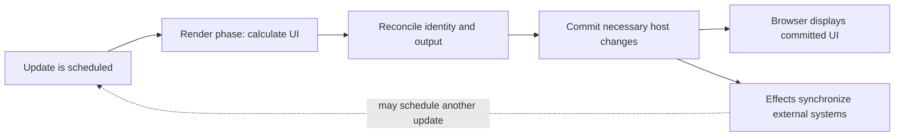

# React Interview Notes

## Definition

React is a library for building user interfaces from components. Components describe UI as a function of props, state, and context; React schedules rendering work and commits necessary host updates.

## Why it matters / when to use

React is commonly used for interactive web applications. Interviews focus on render triggers, state snapshots, reconciliation, component identity, effects, and performance trade-offs.

## How it works

### Render and commit

- A state update, changed parent props, or changed context can schedule rendering. A parent render normally evaluates its children again unless an optimization boundary can reuse prior work.
- During render, React calls components to calculate the next UI description. Rendering should be pure: do not mutate external state or perform side effects in the component body.
- Reconciliation uses element type, tree position, and keys to determine whether component state can be preserved or should reset.
- In the commit phase, React applies necessary host changes and runs commit-related work. A component render does not guarantee that every DOM node changes.
- Effects synchronize with external systems after commit; event handlers handle user actions.

### State and identity

- State is a snapshot for a particular render. Use functional updates when the next value depends on the previous value.
- A stable `key` helps React match siblings across insertions, removals, and reordering. Keys are local to a sibling list and are not passed as component props.
- Changing a component's key intentionally creates a new identity and resets its state.

### React 19 and optimization

- React 19 is the current major version targeted by this note. Core rendering principles still apply.
- `memo`, `useMemo`, and `useCallback` are performance tools, not correctness requirements. Measure first; shallow prop equality and dependency stability affect whether memoization helps.
- React Compiler can automate some memoization when enabled and supported by the project's toolchain; do not assume every React 19 app has it enabled.
- Development Strict Mode may re-run render logic or effect setup/cleanup to expose impure behavior. This is a development check, not a promise of duplicate production commits.



## Code example

```tsx
import { memo, useCallback, useState } from "react";

type SaveButtonProps = { onSave: () => void };

const SaveButton = memo(function SaveButton({ onSave }: SaveButtonProps) {
  return <button onClick={onSave}>Save</button>;
});

export default function Editor() {
  const [count, setCount] = useState(0);
  const [saved, setSaved] = useState(false);
  const handleSave = useCallback(() => setSaved(true), []);

  return (
    <section>
      <p>Count: {count}</p>
      <button onClick={() => setCount((previous) => previous + 1)}>Increment</button>
      <SaveButton onSave={handleSave} />
      <p role="status">{saved ? "Saved" : "Unsaved"}</p>
    </section>
  );
}
```

This demonstrates a functional state update and a stable callback passed to a memoized child. `memo` may skip `SaveButton` rendering when its props are shallowly equal; it does not prevent the parent from rendering, and it should be retained only if it helps measured performance.

## Complexity and trade-offs

- There is no general Big-O bound for a React application: cost depends on the components evaluated, reconciliation work, DOM changes, and application computations.
- For rendering a list of $n$ items with constant-cost row rendering, application-level work is typically O(n); filtering/sorting can add their own costs.
- `useCallback` retains a function and dependency list (space relative to dependency count); it does not make the callback body faster.
- Memoization trades comparison work and retained values for potentially skipped computation. Measure with React DevTools Profiler and realistic interactions.

## Common mistakes

- Saying React always computes and applies the “smallest possible DOM diff”; that is not a public complexity guarantee.
- Mutating state or doing side effects during render.
- Using array positions as keys when items can be reordered, inserted, or removed.
- Treating `memo`, `useMemo`, or `useCallback` as mandatory or as fixes for incorrect state design.
- Using captured state in repeated updates when a functional update is needed.
- Confusing a component render with a DOM mutation or browser paint.

## Interview questions

### Q1: What is the difference between render and commit?
**Model answer:** Render calculates the next UI description and may be restarted or repeated. Commit applies necessary host changes and commit-related work; rendering itself does not imply that DOM nodes changed.

### Q2: What commonly schedules a component to render?
**Model answer:** Its state update, a parent rendering it with changed inputs, or a context value it consumes can schedule work. Memoization may allow React to reuse work when inputs compare equal, but it is an optimization rather than a semantic guarantee.

### Q3: Why do keys matter, and why can array indices be unsafe?
**Model answer:** Keys help React match sibling identity across renders. An index can attach prior state to the wrong item after reordering or insertion; prefer stable IDs from the data.

### Q4: What does `memo` do?
**Model answer:** It lets React skip rendering a component when its props compare equal under the memoization behavior. It does not prevent updates from the component's own state or consumed context, and is useful only when the saved work outweighs comparison/maintenance cost.

### Q5: Why use a functional state update?
**Model answer:** It computes the next state from the latest queued previous state, avoiding stale captured values when updates are batched or repeated.

### Q6: What should and should not happen during render?
**Model answer:** Render should be pure: derive output from inputs and avoid observable side effects or mutation. Synchronize with external systems in effects and handle user actions in event handlers.

### Q7: What is component identity, and how can a key reset state?
**Model answer:** React preserves state when it can match a component by type, position, and key. Giving it a different key creates a new identity, so state is initialized again.

### Q8: Does React 19 automatically memoize every component?
**Model answer:** No. React Compiler can provide automatic memoization when adopted and enabled in a supported toolchain, but applications should not assume it is active. `memo` and hooks remain available for measured cases.

### Q9: Why might Strict Mode appear to run render or effects more than once in development?
**Model answer:** Development Strict Mode performs additional checks to reveal impure rendering and missing effect cleanup. This does not mean the production app necessarily commits the same UI twice.

### Q10: How do you investigate a slow React interaction?
**Model answer:** Reproduce it, profile with React DevTools and browser tools, identify expensive renders or computations, then optimize the measured bottleneck and compare the same interaction again.

## Related topics

- [Next.js interview notes](nextjs.md)
- [Browser internals](browser-internals.md)
- [Performance tuning](performance.md)
