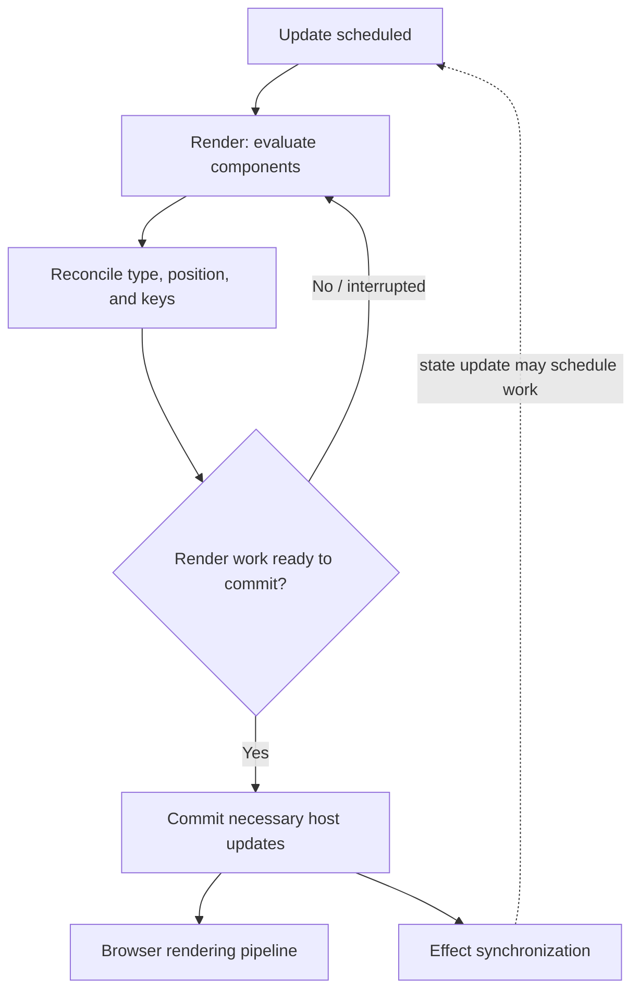

# React rendering and reconciliation

## Definition

Rendering is React calling components to calculate the next UI description. Reconciliation matches the new element tree with prior identity to determine which state can be preserved and which host updates are needed. Commit applies necessary host changes; these are distinct stages.

## Why it matters / when to use

The distinction helps explain state preservation, list keys, effect timing, and performance. A render can happen without a DOM mutation, and React does not promise a particular diff algorithm or complexity to application code.

## How it works

1. An update is scheduled, for example by state, context, or a parent render.
2. React evaluates components to produce elements. In concurrent-capable rendering, work may be interrupted or restarted before commit; render code must remain pure.
3. Reconciliation considers element type, position, and sibling keys. Matching identity can preserve component state; changed type/key can reset it.
4. React commits the necessary host updates. Not every evaluated component causes a DOM change.
5. The browser processes the resulting DOM/style/layout/paint work; React render is not itself a browser paint.



## State preservation and keys

- Keys identify siblings within their parent; the same key in different sibling lists does not establish global identity.
- Stable keys should represent logical item identity, commonly a database or domain ID.
- Index keys may be acceptable for static lists that never reorder, insert, or delete, but can associate state with the wrong item when order changes.
- Changing type or key can intentionally reset local state. Avoid unstable keys such as a new random value on every render.
- `React.memo` can skip some child renders when props compare equal, but it does not change identity or guarantee a DOM update is skipped in every circumstance.

## Code example

```tsx
import { useState } from 'react';

type Task = { id: string; label: string };

export function TaskList({ tasks }: { tasks: Task[] }) {
  const [selectedId, setSelectedId] = useState<string | null>(null);

  return (
    <ul>
      {tasks.map((task) => (
        <li key={task.id}>
          <button
            aria-pressed={selectedId === task.id}
            onClick={() => setSelectedId(task.id)}
          >
            {task.label}
          </button>
        </li>
      ))}
    </ul>
  );
}
```

Stable `task.id` keys let React match each logical task across reordering. If the key used the array index, selected component state in stateful row components could follow positions rather than tasks.

## Complexity / trade-offs

- A list render evaluates $n$ rows, so application-level list construction is O(n) if each row's render work is constant. The actual UI cost also depends on row work, reconciliation, host updates, and browser rendering.
- Avoid claiming a universal Big-O bound for React's internal reconciliation; React's public API does not promise a specific diff complexity.
- Stable keys improve identity matching but require stable identifiers. Memoization can reduce repeated work but adds comparison and code complexity.

## Common mistakes

- Saying every render results in DOM changes or a paint.
- Assuming React always computes the globally smallest DOM diff.
- Using keys as if they were passed to a component as ordinary props.
- Using unstable or positional keys for reorderable stateful lists.
- Performing side effects during render because it appears to run once in a local example.
- Applying memoization before measuring the actual bottleneck.

## Interview questions

### Q1: What work happens during render?
**Model answer:** React evaluates components and produces the next element description. Render should be pure and may be repeated or interrupted before commit.

### Q2: What does reconciliation decide?
**Model answer:** It matches new elements against previous identity using factors including type, position, and keys, determining which component state can be preserved and what host updates are required.

### Q3: Does a component render always update the DOM?
**Model answer:** No. React may evaluate a component and determine that host output is unchanged, so there may be no corresponding DOM mutation.

### Q4: How do keys affect state preservation?
**Model answer:** A stable key lets React match a logical sibling across renders. Changing the key or element type can create a new identity and reset local state.

### Q5: Why can an array index key be wrong?
**Model answer:** After insertion, deletion, or reordering, the same index may refer to a different item, so state can become associated with the wrong logical item.

### Q6: What is the difference between render, commit, and browser paint?
**Model answer:** Render calculates UI; commit applies host changes; the browser then performs its rendering work such as style, layout, and paint. These stages are related but not interchangeable.

### Q7: Why must render be pure?
**Model answer:** React may call render more than once or abandon work before commit. Side effects in render could happen for work that never commits or happen multiple times.

### Q8: How do you profile unnecessary work?
**Model answer:** Reproduce the interaction, inspect component commits with React DevTools Profiler and browser performance tools, then optimize the measured hot path and re-profile.

### Q9: What can `React.memo` skip, and what does it not guarantee?
**Model answer:** It can skip some renders when props compare equal, but it does not stop the component's own state/context updates and is not a guarantee of fewer DOM changes or better overall performance.

### Q10: When should changing a key be intentional?
**Model answer:** When a different logical entity should get fresh component state, such as switching between independent forms. A changing random key on every render is usually a bug because it remounts the subtree.

## Related notes

- [Hooks and useEffect](hooks-and-useeffect.md)
- [Memoization and state](memoization-and-state.md)
- [Core Web Vitals](core-web-vitals.md)
