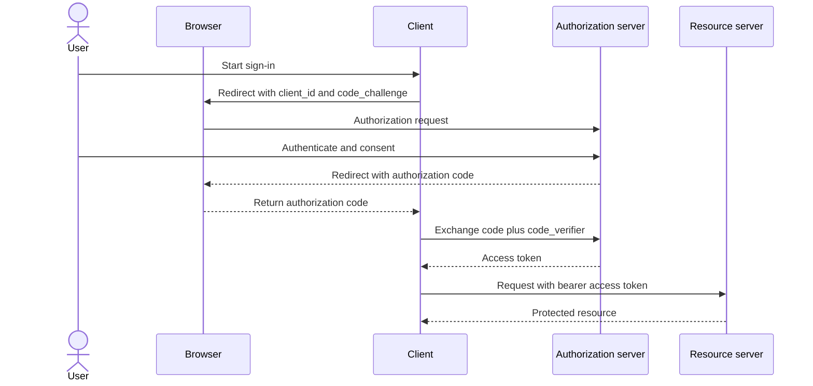

# JWT and OAuth2

## JWT (JSON Web Token)

JWT is a signed token containing claims. It is commonly used to carry identity and authorization data between services without requiring a server-side session store.

### Key security concerns

- **Signed $\neq$ Encrypted**: Standard JWTs are Base64Url encoded and signed. The payload is **completely readable** by anyone who intercepts the token. **Never store sensitive data** (passwords, PII, secrets) in the payload.
- **Signature Validation**: Always validate the signature using the secret/public key before trusting the payload.
- **Issuer and Audience**: Verify the `iss` (issuer) and `aud` (audience) claims to prevent tokens from being used across different environments.
- **Expiration**: Use short-lived access tokens and longer-lived refresh tokens to minimize the window of risk if a token is stolen.
- **Secret Management**: Store signing keys in a secure vault (e.g., AWS Secrets Manager, HashiCorp Vault) and rotate them regularly.

## OAuth2

OAuth2 is a delegation framework. A client asks the authorization server for access to specific resources on behalf of a user or service.

### Common flows

- **Authorization Code**: The most secure flow; uses a temporary code to exchange for an access token.
- **Client Credentials**: Used for machine-to-machine communication where no user is involved.
- **Refresh Token**: Used to obtain a new access token without requiring the user to re-authenticate.

### Authorization Code flow with PKCE (Proof Key for Code Exchange)

This sequence shows a public client (like a SPA) obtaining an access token. PKCE binds the authorization request to the later token exchange using a cryptographically random `code_verifier` and its hash `code_challenge`, preventing "authorization code injection" attacks.

## Implementation Guidance

### Token Validation (Java/Spring Security)
When implementing a resource server, ensure the validation logic checks:
1. **Algorithm**: Explicitly define the expected algorithm (e.g., `HS256`) to prevent "alg: none" attacks.
2. **Expiration**: Check the `exp` claim.
3. **Signature**: Verify using the public key or shared secret.

### Interview Guidance

- **AuthN vs AuthZ**: Authentication (AuthN) asks "who are you?"; Authorization (AuthZ) asks "what are you allowed to do?".
- **JWT vs Session**: Sessions are stateful (server stores the ID); JWTs are stateless (server verifies the signature).
- **OAuth2 vs JWT**: OAuth2 is the *protocol* for obtaining access; JWT is a *format* often used to represent the resulting token.

## Related notes

- [REST design](rest-design.md)
- [Spring Boot internals](spring-boot-internals.md)
- [Transactions and N+1](transactions-and-n-plus-one.md)
