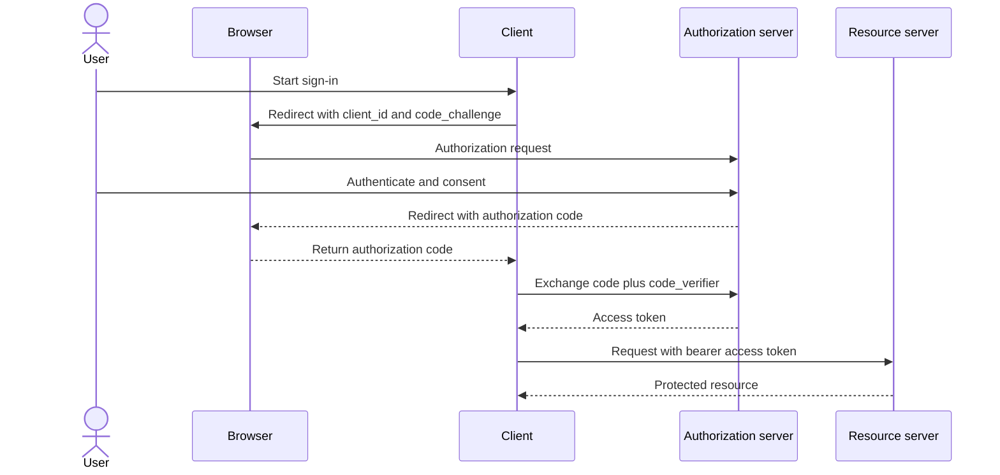

# JWT and OAuth2

## JWT

JWT is a signed token containing claims. It is commonly used to carry identity and authorization data between services.

### Key security concerns

- Validate signature and issuer
- Keep secret or signing keys secure
- Set appropriate expiration and refresh flows
- Do not store sensitive data in the token payload unless needed

## OAuth2

OAuth2 is a delegation framework. A client asks the authorization server for access on behalf of a user or service.

### Common flows

- Authorization Code
- Client Credentials
- Refresh Token

### Authorization Code flow with PKCE

This sequence shows a public client obtaining an access token. PKCE binds the authorization request to the later token exchange using a verifier.



## Example token checks

```java
String token = "...";
// Validate algorithm, signature, expiration, issuer, and audience.
```

## Interview guidance

- AuthN asks: who are you?
- AuthZ asks: what are you allowed to do?
- JWT is often used to carry claims; OAuth2 is the protocol for obtaining tokens.

## Related notes

- [REST design](rest-design.md)
- [Spring Boot internals](spring-boot-internals.md)
- [Transactions and N+1](transactions-and-n-plus-one.md)
