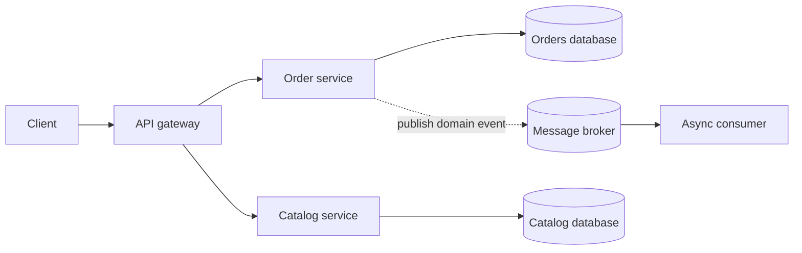

 Microservices Patterns

Tags: #backend #architecture
Difficulty: Hard
Status: Learning

## Definition

Microservices split a system into independently deployable services with clear ownership and interfaces.

## Why it matters / when to use

They help teams scale and deliver features independently, though they increase operational complexity and distributed-system overhead.

## How it works

Each service owns a bounded domain, communicates through APIs, and often relies on service discovery, observability, and deployment automation.



## Code example

```yaml
services:
  api:
    image: my-api:latest
  worker:
    image: my-worker:latest
```

## Time and space complexity

The complexity is dominated by coordination, network latency, and dependency management rather than algorithmic cost.

## Common mistakes and pitfalls

- Breaking boundaries too finely or too coarsely
- Ignoring observability and failure isolation
- Overusing synchronous service-to-service communication

## Interview questions

### Q: When should you avoid microservices?
Model answer: When a small team is building a narrow product or the operational overhead outweighs the independent scaling benefits.

## Related topics

- [Spring Boot essentials](spring-boot.md)
- [REST API design](rest-api.md)
- [Messaging systems](messaging.md)
