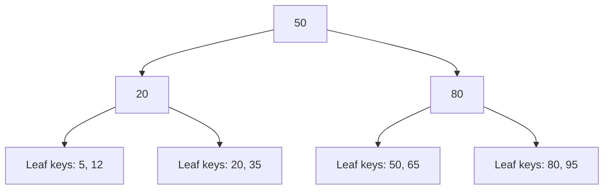

 Indexing and Query Optimization

Tags: #database #performance
Difficulty: Medium
Status: Learning

## Definition

Indexes speed up reads by creating a data structure that helps locate matching rows quickly.

## Why it matters / when to use

Indexing is essential for large tables and high-traffic queries. It changes both read and write trade-offs.

## How it works

Indexes are usually B-tree or hash-based structures. They reduce the number of rows scanned but add overhead to inserts, updates, and deletes.



This simplified tree illustrates how an index narrows the search path; actual B-tree page layouts and fan-out depend on the database implementation.

## Code example

```sql
CREATE INDEX idx_orders_user_created
ON orders (user_id, created_at);
```

## Time and space complexity

- Lookup: often O(log n) or better for index-driven access
- Space: O(n) additional storage for the index structure

## Common mistakes and pitfalls

- Indexing every column blindly
- Ignoring query plans
- Creating low-cardinality indexes that do not help much

## Interview questions

### Q: Why are indexes sometimes harmful?
Model answer: Extra indexes increase write overhead and storage usage, and they may not improve performance for unselective queries.

## Related topics

- [SQL essentials](sql-basics.md)
- [Transactions and isolation](transactions.md)
- [Redis interview notes](redis.md)
