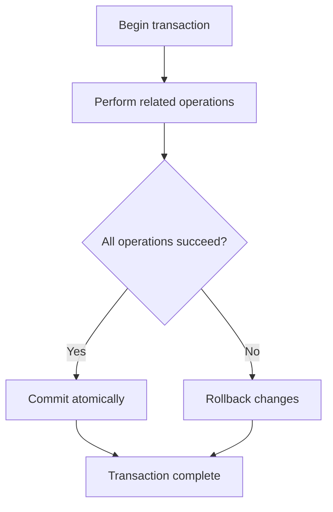

 Transactions and Isolation

Tags: #database #transactions
Difficulty: Medium
Status: Learning

## Definition

A transaction groups multiple operations so they are all committed or rolled back together.

## Why it matters / when to use

Transactions protect consistency in financial, inventory, and payment workflows.

## How it works

Database systems enforce atomicity, consistency, isolation, and durability (ACID). Isolation levels determine how concurrent transactions interact.



## Code example

```sql
BEGIN;
UPDATE accounts SET balance = balance - 100 WHERE id = 1;
UPDATE accounts SET balance = balance + 100 WHERE id = 2;
COMMIT;
```

## Time and space complexity

Transaction performance depends on locks, storage, and concurrency. The main costs are lock contention and recovery overhead.

## Common mistakes and pitfalls

- Ignoring isolation semantics under concurrency
- Forgetting rollback behavior on failure
- Mixing business logic and transaction boundaries poorly

## Interview questions

### Q: What is dirty read?
Model answer: It happens when a transaction reads uncommitted data from another transaction, which can be prevented with stronger isolation levels.

## Related topics

- [SQL essentials](sql-basics.md)
- [Indexing and query optimization](indexing.md)
- [Normalization and schema design](normalization.md)
