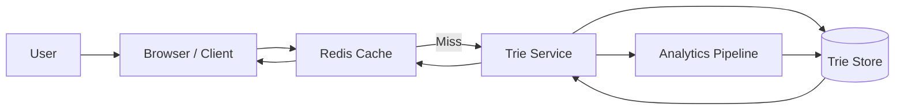

# System Design Case: Autocomplete

## Requirements

### Functional requirements
- **Suggestions**: As the user types, provide the top 5-10 most relevant suggestions.
- **Real-time**: Suggestions must update in $<100\text{ms}$ to feel instantaneous.
- **Ranking**: Suggestions should be ranked by popularity/frequency.
- **Personalization**: (Optional) Prioritize suggestions based on user's past history.

### Non-functional requirements
- **Extremely Low Latency**: The bottleneck is the network; the search must be near-instant.
- **High Availability**: Autocomplete is a high-traffic feature; it should not crash the main search.
- **Scalability**: Support millions of queries per second.

## Estimation
- **Queries per second (QPS)**: 100k - 1M.
- **Average query length**: 3-10 characters.
- **Data size**: Millions of unique search terms.

## API design

### Endpoints
| Method | Path | Purpose |
| :--- | :--- | :--- |
| GET | `/suggest?q=abc` | Return list of suggestions for prefix `abc` |

## Data model

- **Trie (The core structure)**: A Trie stores all possible search terms. Each node stores the frequency of the term passing through it.
- **Cache**: Redis stores the top 10 results for the most common prefixes (e.g., "a", "ap", "app").

## High-level architecture

## Deep dives

### The Trie Data Structure
A standard Trie is too large for memory if it stores every term.
- **Optimization**: Instead of storing the full word at each node, store only the **Top 10 IDs** of the most popular words in that subtree.
- **Result**: Search becomes $O(L)$ where $L$ is the length of the prefix, as the top suggestions are already pre-calculated and stored at the node.

### Ranking and Updates
Search trends change (e.g., "World Cup" becomes popular for a month).
- **Data Collection**: Every time a user selects a suggestion, an event is sent to a Kafka topic.
- **Offline Aggregation**: A MapReduce/Spark job runs every hour to aggregate frequencies and update the weights in the Trie.
- **Trie Update**: The updated Trie is pushed to the Trie Service servers in the background.

### Latency Optimization
- **Client-side Caching**: Cache the results for a prefix in the browser for a few minutes.
- **Debouncing**: Don't send a request on every keystroke; wait for 100-200ms of inactivity.
- **Edge Caching**: Use a CDN to cache common prefix results (e.g., "how to...") globally.

## Bottlenecks and trade-offs

- **Memory Usage**: A Trie with millions of terms is memory-intensive.
- **Mitigation**: Use a **Compressed Trie (Radix Tree)** to merge nodes with only one child.
- **Consistency vs Latency**: The Trie is updated hourly, meaning a new trending term takes an hour to appear.
- **Trade-off**: Accept eventual consistency for the sake of sub-100ms response times.

## Follow-up questions

- **How to handle typos?** — Use **Edit Distance (Levenshtein)** or fuzzy matching. If no results are found for "Applr", suggest "Apple".
- **How to handle personalization?** — Merge the global Trie results with a user-specific history list stored in a fast KV store.
- **How to handle multiple languages?** — Maintain separate Tries per language or use a Unicode-aware Trie implementation.
