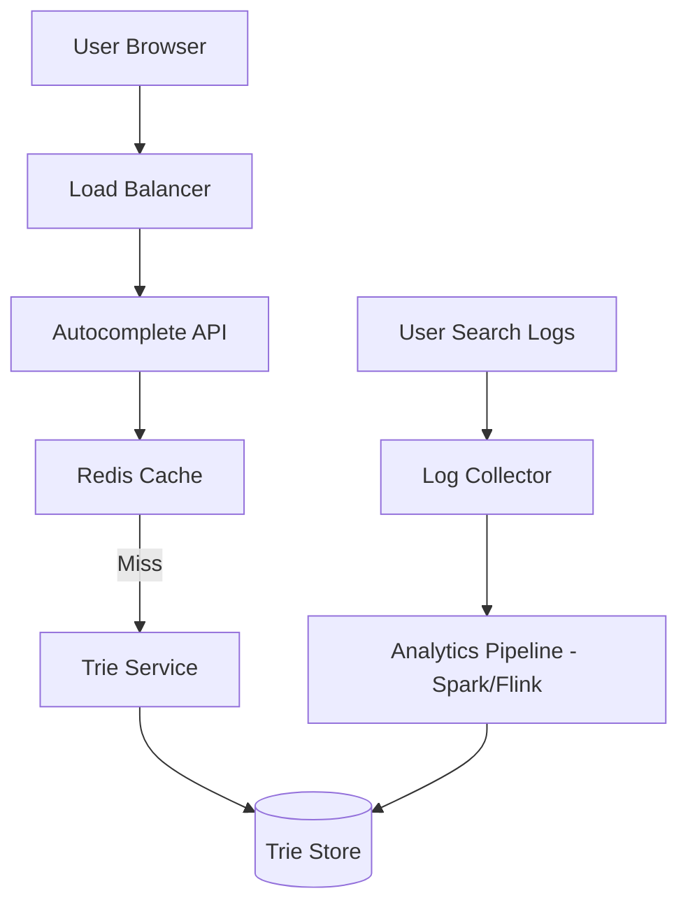

# Search Autocomplete Design

## 1. Requirements

### Functional
- **Real-time Suggestions**: As the user types, provide the top $K$ most frequent suggestions.
- **Low Latency**: Suggestions must appear almost instantaneously (typically < 100ms).
- **Freshness**: Popular searches should trend and update the suggestion list.
- **Personalization**: (Optional) Suggestions based on user history.

### Non-Functional
- **High Availability**: Autocomplete is a critical entry point for search.
- **Scalability**: Must handle millions of queries per second (QPS).
- **Fault Tolerance**: If the suggestion service is down, the search box should still function.

## 2. High-Level Architecture

## 3. Deep Dive: The Data Structure

The core of autocomplete is a **Trie (Prefix Tree)**. Each node stores:
- The character.
- The weight (frequency) of the most popular word in its subtree.
- Pointers to children.

### Optimization: Pre-computing Top $K$
Searching the entire subtree for the top $K$ words at request time is too slow ($O(\text{nodes in subtree})$). 
- **Optimization**: Each node stores a pre-computed list of the **top $K$ words** that pass through it.
- **Result**: Lookup time becomes $O(L)$ where $L$ is the length of the prefix, regardless of how many millions of words are in the Trie.

## 4. Data Modeling & Storage

### Trie Storage
- **In-Memory**: For ultra-low latency, the Trie is kept in memory (e.g., using Redis or a distributed memory store).
- **Persistence**: The Trie is periodically snapshotted to disk (S3/HDFS) and reloaded on startup.

### Analytics Pipeline (Updating the Trie)
We cannot update the Trie in real-time for every single keystroke.
1. **Log Collection**: All searches are sent to a Kafka topic.
2. **Aggregation**: A MapReduce or Spark job runs hourly/daily to aggregate counts.
3. **Trie Update**: The aggregated counts are used to rebuild the Trie or update weights.

## 5. Trade-offs & Bottlenecks

### Client-side vs. Server-side Caching
- **Client-side**: Cache the last few prefixes typed by the user in the browser.
- **Server-side**: Use a CDN or Redis to cache the top 10,000 most common global prefixes.

### Memory Constraints
If the Trie becomes too large for a single machine:
- **Trie Sharding**: Partition the Trie by prefix (e.g., all words starting with 'a'-'m' on Server 1, 'n'-'z' on Server 2).

## 6. Interview Q&A

**Q: How do you handle "trending" searches (e.g., breaking news)?**
**A**: Use a **Two-Tiered system**. A static Trie for long-term popular searches and a separate, smaller "Trending" cache (Redis) that is updated every few minutes from a stream processing pipeline (like Flink).

**Q: How do you handle typos?**
**A**: 
1. **Edit Distance (Levenshtein)**: If no exact prefix match is found, search for words with an edit distance of 1 or 2.
2. **Phonetic Matching**: Use algorithms like Soundex to find words that sound similar.

## Related notes

- [Trie](01-dsa/trie.md)
- [Scalability basics](scalability-basics.md)
- [Rate limiter](rate-limiter.md)
