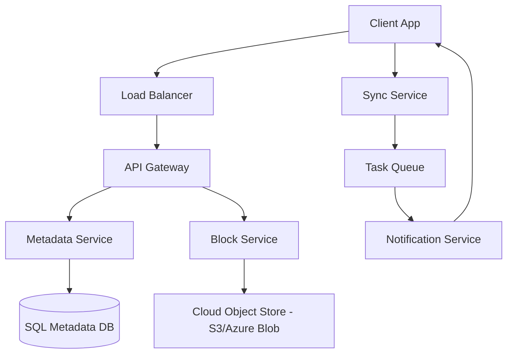

# File Storage System Design (Dropbox/Google Drive style)

## 1. Requirements

### Functional
- **File Upload/Download**: Users can upload and retrieve files.
- **File Versioning**: Keep track of changes to a file over time.
- **Syncing**: Changes made on one device sync to all other devices.
- **Sharing**: Users can share files/folders with others via permissions.
- **Offline Access**: Users can edit files offline and sync upon reconnection.

### Non-Functional
- **Durability**: Files must never be lost (high replication).
- **Availability**: High availability for file access.
- **Efficiency**: Minimize bandwidth usage (delta synchronization).
- **Scalability**: Handle petabytes of data and millions of concurrent users.

## 2. High-Level Architecture

## 3. Deep Dive: Optimization Strategies

### Block-Based Storage (Chunking)
Instead of storing a file as one giant blob, the system splits it into fixed-size **chunks** (e.g., 4MB).
- **Deduplication**: If two users upload the same file, the system stores only one copy of each chunk (Content-Addressable Storage using SHA-256 hashes).
- **Delta Sync**: When a file is edited, only the modified chunks are uploaded, significantly reducing bandwidth.

### Metadata Management
The Metadata Service tracks:
- **File Mapping**: Which chunks (and in what order) make up a specific file.
- **Version History**: A pointer to the root chunk of each version.
- **User Permissions**: Who owns the file and who has access.

## 4. Data Modeling

### File Metadata (SQL - for ACID consistency)
| Column | Type | Description |
| :--- | :--- | :--- |
| `file_id` | UUID (PK) | Unique file identifier |
| `name` | String | File name |
| `parent_folder`| UUID | For directory hierarchy |
| `current_version`| Integer | Pointer to latest version |
| `is_deleted` | Boolean | Soft delete flag |

### Block Map (NoSQL - for scale)
| Column | Type | Description |
| :--- | :--- | :--- |
| `block_hash` | String (PK) | SHA-256 hash of block content |
| `storage_path` | String | Path in S3/Blob storage |
| `ref_count` | Integer | Number of files using this block |

## 5. Trade-offs & Bottlenecks

### Consistency vs. Availability
- **Metadata**: Requires **Strong Consistency**. If a user moves a folder, it should be reflected immediately.
- **File Data**: **Eventual Consistency** is acceptable. It is okay if a file takes a few seconds to sync across all global regions.

### Handling Large Files
- **Multipart Upload**: Use a sequence of API calls to upload chunks in parallel.
- **Checksums**: Verify the integrity of the file after upload by comparing the total hash.

## 6. Interview Q&A

**Q: How do you handle concurrent edits to the same file?**
**A**: Use **Optimistic Locking** (version numbers). The client sends the version it's editing; if the server has a newer version, it returns a conflict error, and the client must merge changes (similar to Git).

**Q: How do you reduce the load on the Metadata DB during a sync storm?**
**A**: 
1. Use a **Write-Back Cache** (Redis) for frequent metadata updates.
2. Implement **Client-side Delta tracking** so only changes are sent to the server.

## Related notes

- [CAP, PACELC and Consistency](cap-consistency.md)
- [Scalability basics](scalability-basics.md)
- [Sharding and queues](sharding-and-queues.md)
