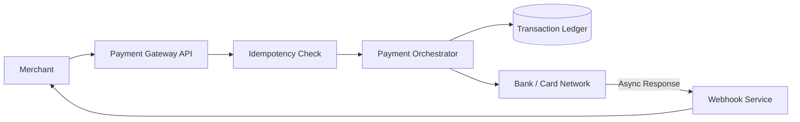

# System Design Case: Payments

## Requirements

### Functional requirements
- **Process Payment**: Accept payment requests and interact with banks/gateways.
- **Payment Status**: Track payment states (Pending, Success, Failed, Refunded).
- **Webhook Notifications**: Notify merchants when a payment is completed.
- **Refunds**: Support partial or full refunds to the original payment method.

### Non-functional requirements
- **Atomic Transactions**: No payment should be "lost" or "double-charged."
- **High Reliability**: 99.999% availability; payment failures cost money and trust.
- **Security**: PCI-DSS compliance; no sensitive card data stored in plain text.
- **Idempotency**: Repeating a request must not result in multiple charges.

## Estimation
- **Transaction Volume**: 10,000 TPS (Transactions Per Second) during peak.
- **Consistency**: Strong consistency required for balance and status updates.
- **Latency**: End-to-end payment confirmation should be under 2-5 seconds.

## API design

### Endpoints
| Method | Path | Purpose |
| :--- | :--- | :--- |
| POST | `/payment/create` | Create a payment intent (returns paymentId) |
| POST | `/payment/capture` | Confirm the payment with the bank |
| GET | `/payment/status/{id}` | Check current payment state |
| POST | `/payment/refund` | Initiate a refund request |

## Data model

- **Payment Intent**: SQL (PostgreSQL) for strong ACID guarantees. `PaymentId`, `Amount`, `Currency`, `MerchantId`, `CustomerId`, `Status`.
- **Transaction Log**: Append-only ledger for every state change. `TxId`, `PaymentId`, `FromStatus`, `ToStatus`, `Timestamp`.
- **Idempotency Keys**: Redis for short-term storage of request keys.

## High-level architecture

## Deep dives

### Idempotency (The most critical part)
To prevent double-charging, the system uses an **Idempotency Key** (usually a UUID generated by the client).
1. Client sends `POST /payment/create` with `Idempotency-Key: uuid_123`.
2. Server checks Redis for `uuid_123`.
3. If it exists, return the cached response.
4. If not, create a record in the DB and execute the payment.

### Distributed Transactions (Saga Pattern)
A payment involves multiple steps: (1) Reserve funds $\rightarrow$ (2) Update Merchant balance $\rightarrow$ (3) Notify User. If step 3 fails, we cannot "undo" a bank transfer.
- **Solution**: Use the **Saga Pattern (Choreography)**. Each service performs its local transaction and publishes an event. If a failure occurs, "compensating transactions" are triggered to revert the previous steps (e.g., issuing a refund if the order fails after payment).

### Security and PCI-DSS
To avoid the liability of storing credit card numbers:
- **Tokenization**: The client sends card data directly to the payment provider (e.g., Stripe/Razorpay). The provider returns a "Token" (e.g., `tok_123`).
- **Payment Intent**: The merchant only stores the token. The actual card data never touches the merchant's server.

## Bottlenecks and trade-offs

- **Sync vs Async**: Waiting for a bank's response synchronously can block threads.
- **Mitigation**: Use an **Asynchronous Polling/Webhook** model. The API returns `PENDING` immediately, and the final result is delivered via a webhook.
- **Consistency vs Latency**: Strong consistency in the ledger increases latency.
- **Trade-off**: Use a high-performance SQL DB with sharding by `MerchantId` to distribute the load.

## Follow-up questions

- **How do you handle "Ghost" payments?** — (Payment successful at bank, but webhook failed). Implement a **Reconciliation Job** that queries the bank API for all "Pending" payments every hour.
- **How to handle partial refunds?** — Store a `refunded_amount` column in the Payment table and validate that `total_refunded <= original_amount`.
- **How to scale the ledger?** — Use database sharding or a specialized ledger database (like Amazon QLDB) for an immutable, cryptographically verifiable log.
