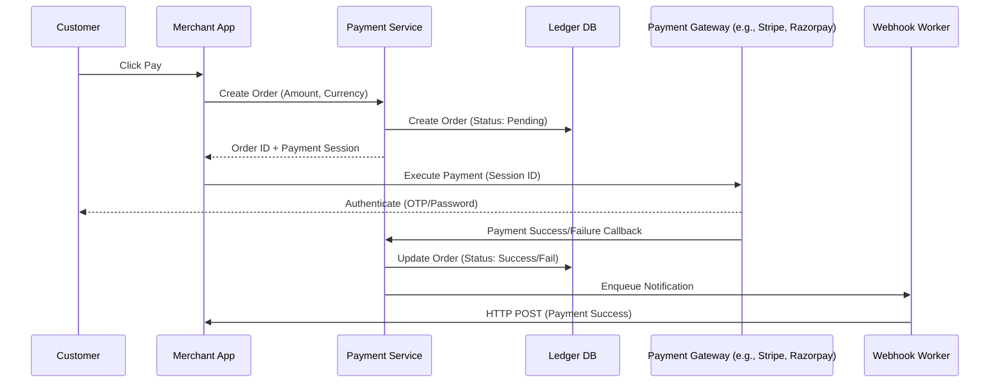

# Payment System Design (Razorpay-style)

## 1. Requirements

### Functional
- **Payment Initiation**: User can initiate a payment via various methods (Credit Card, UPI, NetBanking).
- **Payment Processing**: System must securely communicate with Payment Gateways (PGs) and Banks.
- **Webhook Notifications**: Notify the merchant of payment success/failure asynchronously.
- **Refunds**: Support partial or full refunds of a transaction.
- **Transaction History**: Users and merchants can view their payment status.

### Non-Functional
- **Idempotency**: A user clicking "Pay" twice should not result in two charges (Critical).
- **Consistency**: Financial ledger must be strictly consistent (Strong Consistency).
- **High Availability**: Payment initiation must be highly available to avoid revenue loss.
- **Security**: PCI-DSS compliance; no storage of raw card numbers.

## 2. High-Level Architecture

## 3. Deep Dive: Idempotency

To prevent double-charging, the system must use an **Idempotency Key**.

### Implementation Flow
1. **Client-Side Key**: The Merchant App generates a unique `idempotency_key` (e.g., a UUID) for the transaction.
2. **Server-Side Check**:
    - Payment Service checks if `idempotency_key` exists in the database.
    - **Case A (New Key)**: Create order $\rightarrow$ Process payment $\rightarrow$ Store result.
    - **Case B (Existing Key)**: Return the cached result of the previous request without re-processing.
3. **Atomic Lock**: Use a distributed lock (Redis) on the `idempotency_key` to handle concurrent requests for the same order.

## 4. Data Modeling

### Orders Table (SQL - Strong Consistency)
| Column | Type | Description |
| :--- | :--- | :--- |
| `order_id` | UUID (PK) | Primary key |
| `merchant_id` | UUID | Linked merchant |
| `amount` | Decimal | Exact payment amount |
| `currency` | String | USD, INR, etc. |
| `status` | Enum | PENDING, SUCCESS, FAILED, REFUNDED |
| `idempotency_key`| String (Unique) | Prevent double charging |
| `created_at` | Timestamp | Audit trail |

## 5. Trade-offs & Bottlenecks

### Strong vs. Eventual Consistency
- **Ledger**: Must use **Strong Consistency** (e.g., PostgreSQL with ACID transactions). A user cannot have a "possibly successful" payment.
- **Notifications**: Use **Eventual Consistency**. Webhooks can be delayed, but the source of truth (Ledger) must be correct.

### Handling Gateway Failures
- **Circuit Breaker**: If Razorpay is down, automatically fail-over to an alternative gateway (e.g., Stripe) to maintain availability.
- **Exponential Backoff**: For webhooks, retry with increasing delays to avoid overloading the merchant's server.

## 6. Interview Q&A

**Q: How do you handle a scenario where the PG charges the user but the callback to your system fails?**
**A**: Implement a **Polling/Reconciliation Job**. The system periodically queries the PG API for all "Pending" orders from the last 24 hours to sync the status.

**Q: How do you ensure the system scales during a flash sale?**
**A**: 
1. Use a **Queue (Kafka)** to buffer payment callbacks.
2. Implement **Rate Limiting** at the API Gateway to prevent the Ledger DB from crashing under peak load.
3. Read-replicas for transaction history views.

## Related notes

- [CAP, PACELC and Consistency](cap-consistency.md)
- [Sharding and queues](sharding-and-queues.md)
- [Rate limiter](rate-limiter.md)
