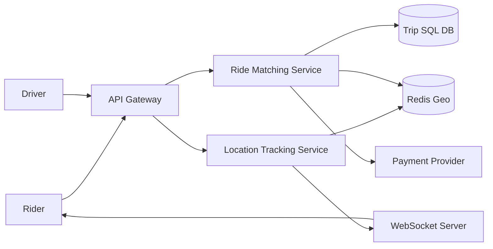

# System Design Case: Ride-Hailing

## Requirements

### Functional requirements
- **Request Ride**: User can specify pickup and destination; system matches them with the nearest available driver.
- **Driver Availability**: Drivers can toggle their status (Online/Offline).
- **Real-time Tracking**: Users can see the driver's location moving on the map in real-time.
- **Fare Calculation**: System calculates price based on distance, traffic, and demand (surge pricing).
- **Payment**: Automatic payment upon trip completion.

### Non-functional requirements
- **Low Latency**: Matching must happen in seconds.
- **High Availability**: The system must be available 24/7; a failure in one region shouldn't affect others.
- **Scalability**: Support millions of concurrent users and drivers.
- **Consistency**: A driver cannot be matched to two riders simultaneously (Strong consistency for matching).

## Estimation
- **Daily Trips**: 10 Million.
- **Peak Concurrent Users**: 1 Million.
- **Driver Location Updates**: Every 3-5 seconds per active driver.
- **Write Volume**: Millions of location updates per second $\rightarrow$ requires a highly optimized spatial index.

## API design

### Endpoints
| Method | Path | Purpose |
| :--- | :--- | :--- |
| POST | `/ride/request` | Request a ride (userId, pickup, destination) |
| PATCH | `/driver/status` | Toggle availability (driverId, status) |
| GET | `/ride/track/{rideId}` | Get current driver location |
| POST | `/ride/complete` | End trip and trigger payment |

## Data model

- **Users/Drivers**: SQL (PostgreSQL) for profile and billing data.
- **Trips**: SQL for transactional integrity (RideId, RiderId, DriverId, Status, Fare).
- **Driver Locations**: NoSQL / In-Memory (Redis) using **Geo-hashes** or **S2 Cells** for fast spatial queries.

## High-level architecture

## Deep dives

### Spatial Indexing (The Core Challenge)
To find the "nearest" driver, we cannot query a standard SQL DB using `SELECT... WHERE distance < X` (too slow).
- **Approach**: Use **Geo-hashing**. Divide the world into a grid of cells. Each cell has a unique string ID.
- **Optimization**: Store driver IDs in a Redis sorted set where the score is the geo-hash. To find drivers, we calculate the hash of the rider's location and query that cell and its 8 neighbors.

### Real-time Tracking
Using HTTP polling for location is too expensive.
- **Mechanism**: **WebSockets** or **gRPC**.
- **Flow**: The driver's app pushes location updates to the `LocationService` $\rightarrow$ Service updates Redis $\rightarrow$ Service pushes the update to the matched Rider's WebSocket connection.

### Surge Pricing
- **Algorithm**: A background analyzer monitors the ratio of `RideRequests` vs `AvailableDrivers` per geo-cell.
- **Implementation**: If the ratio exceeds a threshold, a multiplier is applied to the base fare. This is cached in Redis for quick lookup during the `request ride` call.

## Bottlenecks and trade-offs

- **The "Thundering Herd"**: When a ride is offered, multiple drivers might try to accept it.
- **Mitigation**: Use a **Distributed Lock** (Redis Redlock) on the `RideId`. Only the first driver to acquire the lock wins the trip.
- **Consistency vs Availability**: We prioritize consistency for matching (no double-matching) but availability for location updates (it's okay if a location update is dropped).

## Follow-up questions

- **How do you handle "dead zones" (no drivers)?** — Expand the geo-hash search radius incrementally until a driver is found.
- **How do you handle a driver disconnecting mid-trip?** — The system detects the WebSocket timeout and triggers a "Re-assignment" flow or alerts the rider.
- **How to optimize for "battery life" on driver apps?** — Implement adaptive location updates: update every 3s when moving, every 30s when stationary.
