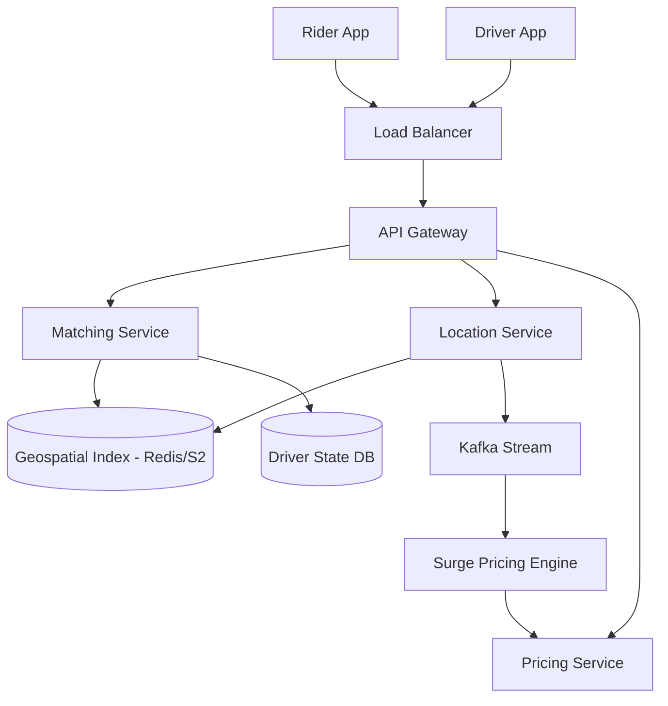

# Ride-Hailing System Design (Uber/Lyft style)

## 1. Requirements

### Functional
- **Ride Request**: User can request a ride by specifying pickup and drop-off locations.
- **Driver Matching**: System matches the request with the nearest available drivers.
- **Real-time Tracking**: User and driver can see each other's location in real-time.
- **Pricing**: Dynamic pricing based on demand (surge pricing).
- **Payment**: Automatic payment upon trip completion.

### Non-Functional
- **Low Latency**: Matching must happen in seconds.
- **High Availability**: The system must be available 24/7.
- **Accuracy**: Geospatial queries must be precise.
- **Scalability**: Support millions of concurrent drivers and riders across multiple cities.

## 2. High-Level Architecture

## 3. Deep Dive: Geospatial Indexing

The biggest challenge is finding "nearest drivers" in a 2D plane efficiently. A standard SQL query `WHERE lat BETWEEN x AND y` is too slow.

### Google S2 Geometry / H3 (Uber)
Instead of raw coordinates, the system uses **Grid-based Indexing**:
- **S2 Cells**: Maps the sphere to a 1D Hilbert Curve. The world is divided into cells of varying sizes.
- **Process**:
    1. Driver updates location every few seconds.
    2. System maps $(lat, lng) \rightarrow \text{Cell ID}$.
    3. Store `Cell ID` in a Redis sorted set or geospatial index.
    4. When a rider requests a ride, query the current cell and adjacent cells for available drivers.

### Location Update Frequency
To avoid overloading the system:
- **Adaptive Updates**: Drivers moving at high speeds update more frequently; stationary drivers update less often.
- **WebSocket/gRPC**: Use persistent connections for real-time bidirectional updates rather than HTTP polling.

## 4. Data Modeling

### Driver Location (In-Memory / Redis)
| Key | Value | TTL |
| :--- | :--- | :--- |
| `driver_loc:{driver_id}` | `{lat, lng, cell_id, status}` | 30s |

### Trip Table (SQL - for consistency)
| Column | Type | Description |
| :--- | :--- | :--- |
| `trip_id` | UUID (PK) | Unique trip ID |
| `rider_id` | UUID | Linked rider |
| `driver_id` | UUID | Linked driver |
| `pickup_loc` | Point | Geo coordinates |
| `dropoff_loc` | Point | Geo coordinates |
| `status` | Enum | REQUESTED, ACCEPTED, IN_PROGRESS, COMPLETED |
| `fare` | Decimal | Final price |

## 5. Trade-offs & Bottlenecks

### Matching Algorithms
- **Greedy**: Match the absolute nearest driver. (Fast, but may leave other riders stranded).
- **Global Optimization**: Batch requests every 2 seconds and use the Hungarian Algorithm to minimize total wait time for all users. (Better UX, higher latency).

### Surge Pricing
- **Demand/Supply Ratio**: Calculate `(requests / available_drivers)` per cell.
- **Price Multiplier**: If ratio $> \text{threshold}$, apply a multiplier (e.g., 1.5x).
- **Smoothing**: Use a moving average to prevent prices from jumping wildly every second.

## 6. Interview Q&A

**Q: How do you handle the "Thundering Herd" problem when 100 drivers are notified of one ride?**
**A**: Use a **Sequential Notification** strategy. Notify the top 5 nearest drivers. If none accept within 10 seconds, notify the next 5. This prevents 100 drivers from trying to "claim" the ride simultaneously.

**Q: How do you ensure the rider doesn't see the driver "jump" on the map?**
**A**: **Client-side Interpolation**. The app doesn't just teleport the icon to the new coordinate; it smoothly animates the icon from point A to point B over the update interval.

## Related notes

- [CAP, PACELC and Consistency](cap-consistency.md)
- [Sharding and queues](sharding-and-queues.md)
- [Rate limiter](rate-limiter.md)
