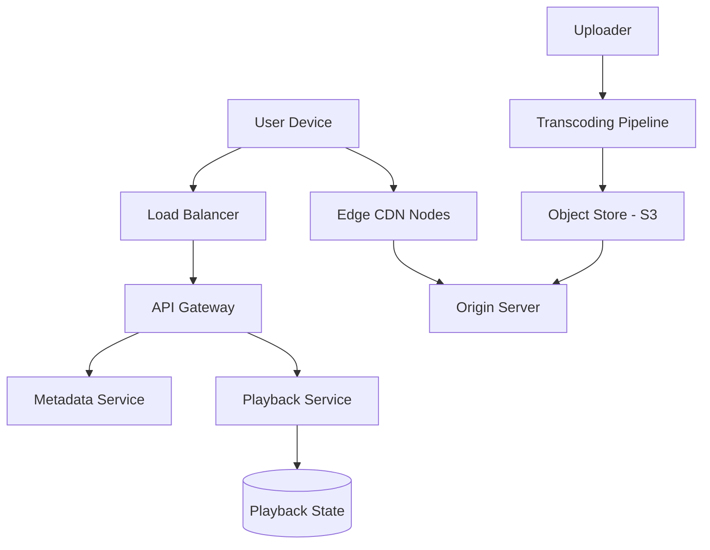

# Video Streaming System Design (Netflix/YouTube style)

## 1. Requirements

### Functional
- **Video Upload**: Users can upload videos of varying formats and sizes.
- **Video Playback**: Users can stream videos with minimal buffering.
- **Adaptive Bitrate Streaming (ABS)**: Automatically adjust quality based on network speed.
- **Search/Recommendation**: Find videos based on metadata.
- **Playback State**: Remember where the user stopped watching.

### Non-Functional
- **Low Latency (Start-up)**: Video should start playing almost instantly.
- **Availability**: System must be globally available.
- **Scalability**: Handle massive concurrent viewers (e.g., during a live event).
- **Reliability**: No mid-stream crashes or corruption.

## 2. High-Level Architecture

## 3. Deep Dive: The Video Pipeline

### Transcoding and Encoding
A raw video is too large for direct streaming. The **Transcoding Pipeline** performs:
1. **Chunking**: Splits video into 2-10 second segments.
2. **Multi-bitrate Encoding**: Creates multiple versions of each chunk (e.g., 360p, 720p, 1080p, 4K) using different codecs (H.264, VP9, AV1).
3. **Packaging**: Wraps chunks into streaming protocols (HLS or DASH).

### Adaptive Bitrate Streaming (ABS)
The client player monitors the download speed of the current chunk.
- **Network Slows**: Client requests the next chunk from the 360p manifest.
- **Network Speeds Up**: Client requests the next chunk from the 1080p manifest.
- **Result**: The video keeps playing without buffering, though quality may fluctuate.

## 4. Content Delivery Network (CDN)

To avoid the "bottleneck" of a single origin server, the system uses a **Hierarchical CDN**:
- **Edge Nodes**: Located physically close to the user. They cache the most popular chunks.
- **Regional Nodes**: Serve as a mid-tier cache between the edge and the origin.
- **Origin Server**: The source of truth (S3 bucket).

### Cache Eviction
Use **Least Recently Used (LRU)**. Popular videos stay at the edge; obscure videos are fetched from the origin.

## 5. Trade-offs & Bottlenecks

### Storage vs. Quality
- **Trade-off**: Storing 5 different resolutions of the same 4K video increases storage costs by 5-10x.
- **Optimization**: Use **Per-Title Encoding**. High-action videos (sports) get higher bitrates; static videos (interviews) get lower bitrates.

### Cold Start Problem
The first few seconds of a video are the most critical.
- **Optimization**: Pre-cache the first 2 seconds (the "intro chunk") of popular videos at every edge node to ensure instant playback.

## 6. Interview Q&A

**Q: How do you handle live streaming versus VOD (Video on Demand)?**
**A**: 
- **VOD**: Transcode once, store indefinitely, cache heavily.
- **Live**: Use **LL-HLS (Low Latency HLS)**. The transcoding happens in real-time; chunks are created and pushed to the CDN within milliseconds.

**Q: How do you prevent illegal redistribution of content?**
**A**: Use **DRM (Digital Rights Management)** like Widevine or FairPlay. The video is encrypted, and the client must request a decryption key from a license server after authentication.

## Related notes

- [CAP, PACELC and Consistency](cap-consistency.md)
- [Scalability basics](scalability-basics.md)
- [Load balancing and caching](load-balancing-and-caching.md)
