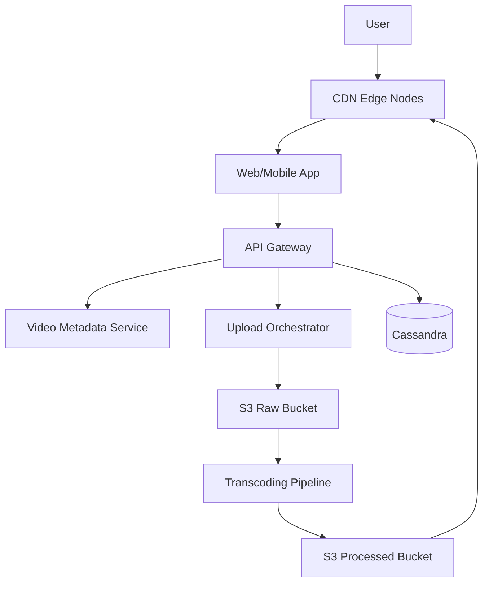

# System Design Case: Video Streaming

## Requirements

### Functional requirements
- **Upload Video**: Users can upload videos of varying formats and sizes.
- **Stream Video**: Users can watch videos with adaptive quality (auto-adjusting based on bandwidth).
- **Search**: Find videos by title or tags.
- **User Progress**: Save the current timestamp for "resume watching."

### Non-functional requirements
- **Low Buffering**: Video should start playing almost instantly.
- **High Availability**: Content must be accessible globally.
- **Scalability**: Support millions of concurrent viewers.
- **Reliability**: No loss of video data upon upload.

## Estimation
- **Daily Uploads**: 100k videos.
- **Peak Viewers**: 10 Million concurrent.
- **Storage**: Petabytes of data.
- **Bandwidth**: Massive egress costs $\rightarrow$ necessitates a robust CDN strategy.

## API design

### Endpoints
| Method | Path | Purpose |
| :--- | :--- | :--- |
| POST | `/video/upload` | Start upload (returns upload URL) |
| GET | `/video/stream/{id}` | Get streaming manifest (m3u8/mpd) |
| POST | `/video/progress` | Update playback timestamp |
| GET | `/search?q=...` | Search for videos |

## Data model

- **Video Metadata**: SQL (PostgreSQL) for title, description, user ID, and upload date.
- **Video Blobs**: Object Storage (AWS S3 / Google Cloud Storage).
- **Playback Progress**: NoSQL (Cassandra/DynamoDB) for high-write throughput of timestamps.
- **Search Index**: Elasticsearch.

## High-level architecture

## Deep dives

### The Transcoding Pipeline
A raw video is too large and in a single format. It must be processed before streaming.
1. **Chunking**: Split the video into small segments (e.g., 2-10 seconds).
2. **Encoding**: Encode each segment into multiple resolutions (360p, 720p, 1080p, 4K) and formats (H.264, VP9, AV1).
3. **Manifest Generation**: Create a manifest file (m3u8 for HLS or mpd for MPEG-DASH) that lists all segments for each quality level.

### Adaptive Bitrate Streaming (ABS)
The client-side player doesn't just download one file; it continuously monitors network speed.
- **Logic**: If the bandwidth drops, the player requests the next 5-second segment from the 360p manifest instead of 1080p. This prevents the "spinning wheel" of buffering.

### Content Delivery Network (CDN)
To avoid the "Long Haul" from a central server, we use a CDN.
- **Edge Caching**: Popular videos are cached at edge locations near the user.
- **Cache Eviction**: Use LRU (Least Recently Used) to keep only popular content at the edge; rare videos are fetched from the origin S3 bucket on demand.

## Bottlenecks and trade-offs

- **Storage vs. Quality**: Storing 5 versions of every video is expensive.
- **Mitigation**: Use "Just-in-Time" (JIT) transcoding for rare videos or only store high-resolution versions for the first 30 days.
- **Upload Reliability**: Large videos often fail mid-upload.
- **Mitigation**: Implement **Chunked Uploads** (Multipart upload). The client uploads 5MB chunks; the server tracks which chunks are received and only requests the missing ones upon retry.

## Follow-up questions

- **How do you handle "Live Streaming"?** — Use a lower-latency protocol like LL-HLS or WebRTC, and a specialized "Live" transcoder that processes chunks in real-time.
- **How to implement a "Continue Watching" feature?** — Periodically send the current timestamp to a high-write NoSQL DB (Cassandra). When the user clicks play, fetch the last timestamp for that `UserId` and `VideoId`.
- **How to prevent piracy/unauthorized sharing?** — Use **Digital Rights Management (DRM)** like Widevine or FairPlay, which encrypts the segments and requires a license key from a secure server to decrypt.
