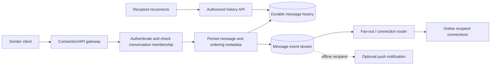
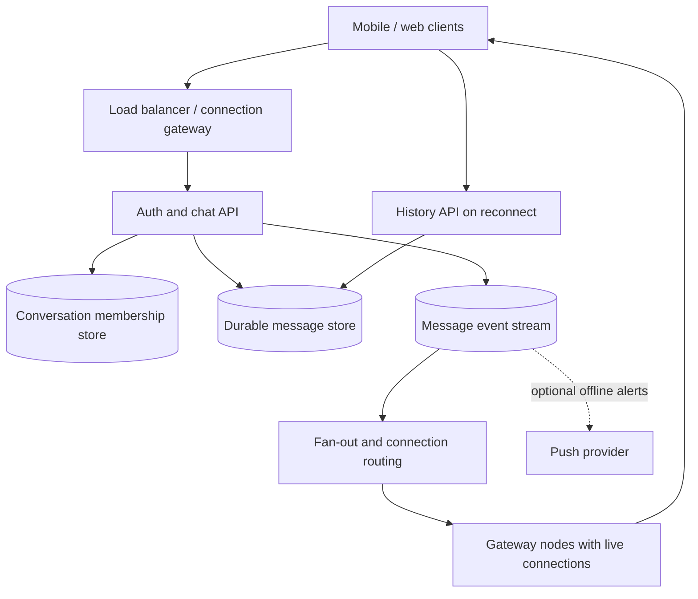

# Case Study: Chat System

> **Scope note:** This is a generic interview design. User counts, message rates, retention, latency goals, and provider choices are deliberately left as assumptions to elicit rather than invented benchmarks.

## Definition

A chat system accepts messages from authorized participants, persists them, delivers them to online recipients, and makes history available to online or reconnecting clients.

## Requirements

### Functional requirements

- One-to-one and/or group conversations: confirm scope.
- Send and receive messages; retrieve paginated history.
- Show delivery/read state and online presence only if required.
- Support reconnect and catch-up after temporary disconnection.

### Non-functional requirements

- Define target message-send and delivery latency, availability, durability, and history retention.
- Preserve authorization and privacy between conversations.
- Support bursty connections and unevenly popular conversations.
- Define ordering scope (typically per conversation) and delivery semantics explicitly.

## How it works

### APIs and connection model

| Operation | Example interface | Purpose |
| --- | --- | --- |
| Send | `POST /v1/conversations/{id}/messages` | Validate membership, accept idempotency key, persist message |
| History | `GET /v1/conversations/{id}/messages?before={cursor}` | Return an authorized, cursor-paginated page |
| Live delivery | WebSocket or another chosen realtime transport | Push new messages/events to connected members |
| Presence | `POST /v1/presence/heartbeat` or connection lifecycle event | Optional, ephemeral online state |

The actual choice of WebSocket, server-sent events, or polling depends on client needs, infrastructure, and expected connection behavior.

### Send and delivery flow

1. Authenticate sender and authorize membership in the conversation.
2. Validate message size/content and idempotency key.
3. Assign a durable message ID and per-conversation ordering value if the product requires ordering.
4. Persist the message before acknowledging durable acceptance.
5. Publish a delivery event; online recipients receive it through their active connection, while offline recipients fetch history on reconnect and may receive a push notification if in scope.
6. Track delivery/read receipts only to the level required; avoid confusing server acceptance with recipient delivery or read.



## Estimation

Use values from the interviewer or explicitly state assumptions. Do not present these formulas as measured production capacity.

- Concurrent connections = active users × concurrent-session fraction.
- Average message writes/s = daily active senders × messages per sender per day / 86,400.
- Peak message writes/s = average writes/s × an explicitly assumed peak factor, or derive from a traffic curve.
- Stored bytes = messages/day × average stored message bytes × retention days; separately estimate indexes, replication, metadata, attachments, and backups.
- Fan-out work depends on recipients per message and delivery policy; group size and hot conversations may dominate request counts.

Concrete traffic, size, retention, concurrency, and latency assumptions: `> TODO: verify` for a real system.

## Data model

| Entity | Example fields | Access pattern / concern |
| --- | --- | --- |
| Conversation | `id`, `type`, `createdAt` | Membership and conversation metadata |
| Membership | `conversationId`, `userId`, `role`, `joinedAt` | Authorization and participant lookup |
| Message | `conversationId`, `sequence`, `messageId`, `senderId`, `body`, `createdAt` | Ordered, cursor-paginated history |
| Receipt | `conversationId`, `messageId`, `userId`, `state`, `updatedAt` | Optional delivered/read state; can grow rapidly |

Choose indexes/partition keys from required read and write patterns. Partitioning by conversation can support per-conversation history/order but may create hot partitions for unusually active groups; verify store-specific limits.

## Code example

This runnable TypeScript example demonstrates authorization and idempotent acceptance within a single process. A production system must enforce the uniqueness/idempotency rule in durable shared storage; an in-memory `Map` is not sufficient across instances or restarts.

```ts
type Message = {
    conversationId: string;
    messageId: string;
    senderId: string;
    body: string;
};

type AcceptResult = { status: "accepted" | "duplicate"; message: Message };

function acceptMessage(
    message: Message,
    membersByConversation: ReadonlyMap<string, ReadonlySet<string>>,
    storedByKey: Map<string, Message>,
): AcceptResult {
    const members = membersByConversation.get(message.conversationId);
    if (!members?.has(message.senderId)) throw new Error("sender is not a conversation member");
    if (message.body.trim().length === 0) throw new Error("message body must not be empty");

    const key = `${message.conversationId}:${message.messageId}`;
    const existing = storedByKey.get(key);
    if (existing) return { status: "duplicate", message: existing };

    storedByKey.set(key, message);
    return { status: "accepted", message };
}

const members = new Map([["c1", new Set(["u1", "u2"])]]);
const stored = new Map<string, Message>();
const message = { conversationId: "c1", messageId: "m1", senderId: "u1", body: "Hello" };
console.log(acceptMessage(message, members, stored).status);
console.log(acceptMessage(message, members, stored).status);
```

Expected output: `accepted`, then `duplicate`. Map operations are expected O(1) average; retained message space is O(m) for $m$ stored messages. Durable membership checks, uniqueness, and transactions depend on the production storage design.

## High-level architecture



## Deep dives

### Ordering, durability, and delivery semantics

- Define whether ordering is required globally or only within a conversation; global order is usually unnecessary overhead for chat.
- Persist before acknowledging accepted messages when durable acceptance is required.
- Separate accepted, delivered, and read states; they are different events and can arrive late or more than once.
- Use idempotency keys or unique message IDs to make client retries safe. Delivery is often at-least-once in practical pipelines; consumers should tolerate duplicates if that is the selected contract.

### Fan-out and hot conversations

- Fan-out-on-write can make recipient reads fast but costs more writes for large groups.
- Fan-out-on-read reduces write amplification but shifts work to reads and may increase delivery latency.
- Hybrid strategies may be appropriate for groups with different sizes/activity; choose based on measured workload distribution.

### Presence, offline users, and reconnect

- Presence is ephemeral and may be approximate; define heartbeat expiry and tolerate delayed state changes.
- On reconnect, clients should provide a cursor/last-seen sequence and request missed messages.
- Push notifications are hints to reconnect, not the durable message store.

### Security and reliability

- Check conversation membership on send and history reads, not only at the client.
- Define message retention, deletion, abuse controls, encryption requirements, and key management from product/security requirements.
- Bound payload sizes, connection counts, retries, and queue backlog; monitor send-to-deliver latency, disconnects, and consumer lag.

## Complexity / trade-offs

- Appending a message is O(1) amortized at the API level if the chosen store supports append/indexed writes; actual behavior is storage-specific.
- Delivering/fanning out one message to $r$ recipients requires O(r) delivery work in a direct fan-out model.
- History retrieval is O(k) response work for a page of $k$ messages plus index/storage lookup; cursor pagination avoids large offset scans in many stores.
- Fan-out-on-write trades write amplification/storage operations for lower read-time delivery work; fan-out-on-read trades the reverse.
- Persistent connections reduce per-message connection setup but increase connection-state and gateway capacity complexity.

## Common mistakes

- Treating an HTTP 200/accepted response as proof a recipient received or read a message.
- Claiming exactly-once delivery without defining transactional boundaries and deduplication.
- Assuming global ordering when per-conversation ordering is sufficient.
- Ignoring group-size skew, reconnect catch-up, offline recipients, and queue lag.
- Checking membership only in the UI instead of authorizing on every server-side operation.
- Inventing QPS, latency, or storage figures instead of stating assumptions and formulas.

## Interview questions

### Q1: How do you preserve message ordering?
**Model answer:** Define the required ordering scope, commonly per conversation, then assign a sequence/order key at a serialization point or partition. Do not impose global ordering unless requirements justify its cost.

### Q2: When do you acknowledge a message to the sender?
**Model answer:** Acknowledge durable acceptance after the message is persisted if the product promises it will not be lost after acceptance. Delivery/read acknowledgments are separate states.

### Q3: How do clients recover after disconnecting?
**Model answer:** Reconnect, authenticate, and request messages after a last-seen cursor/sequence. The server returns an authorized page from durable history; live delivery resumes without relying on push as storage.

### Q4: How would you handle a large group conversation?
**Model answer:** Measure group-size distribution and compare fan-out-on-write with fan-out-on-read or a hybrid. Partition/routing and asynchronous queues can help, but introduce ordering, lag, and duplicate handling requirements.

### Q5: How do you prevent duplicate messages on client retry?
**Model answer:** Accept a client idempotency key or stable message ID and enforce uniqueness at the durable boundary. A repeated request returns the prior result rather than creating a second message.

### Q6: How do you model online presence?
**Model answer:** Keep presence as ephemeral state with heartbeat/expiry or connection lifecycle updates. Treat it as approximate because network failures can delay disconnect detection.

### Q7: How do you secure conversation history?
**Model answer:** Authenticate the requester and verify current membership/authorization on every history request. Do not rely on an unguessable conversation ID or client-side filtering.

### Q8: What is the difference between accepted, delivered, and read?
**Model answer:** Accepted means the service durably accepted the send; delivered means a recipient client acknowledged receipt under the chosen contract; read means the client reported viewing it. Each requires separate semantics.

### Q9: What metrics reveal delivery problems?
**Model answer:** Track send acceptance latency, send-to-delivery latency percentiles, queue/consumer lag, connection failures, reconnect catch-up volume, and error rates, segmented by relevant workload characteristics.

### Q10: How do you estimate the system's write load?
**Model answer:** Convert daily senders and messages per sender into average writes per second, state a peak factor or use observed distribution, and separately estimate recipient fan-out and retained storage.

## Follow-up questions

- What is the ordering guarantee and where is sequence assigned?
- How do you handle edits, deletions, attachments, and moderation?
- How does message durability work across a region failure?
- What are the encryption/key management and retention requirements?

## Related notes

- [System design fundamentals](system-design-fundamentals.md)
- [Sharding and queues](sharding-and-queues.md)
- [Notification system](notification-system.md)
- [System design case template](../templates/system-design-case.md)
