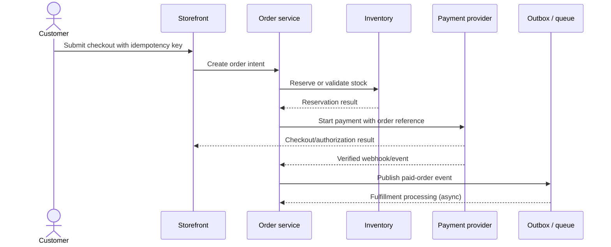
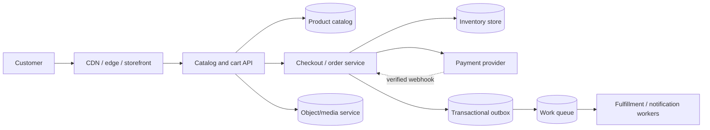

# Case Study: E-commerce Platform

> **Scope note:** This is a generic interview design, not a description of Anaa Jewels or another candidate project. User/order counts, payment providers, traffic, inventory rules, and service choices must be elicited or stated as assumptions; no benchmarks are asserted here.

## Definition

An e-commerce platform lets customers discover products, manage a cart, place orders, pay, and track fulfillment while maintaining correct inventory and order state.

## Requirements

### Functional requirements

- Browse/search products and view product details.
- Add/remove cart items and calculate an order quote.
- Submit checkout, authorize payment, and create/track an order.
- Reserve/decrement inventory and handle cancellation/refund according to business rules.
- Support product administration and fulfillment only if in scope.

### Non-functional requirements

- Protect customer and payment-related data; minimize the system's card-data scope.
- Preserve order/payment/inventory invariants under retries and concurrent purchases.
- Define browse/checkout latency, availability, consistency, audit, and recovery objectives.
- Handle traffic spikes and external provider failures without corrupting order state.

## How it works

### APIs

| Method | Path | Purpose | Important considerations |
| --- | --- | --- | --- |
| GET | `/v1/products?cursor={cursor}` | Browse catalog | Cursor pagination, filters, cache/freshness policy |
| GET | `/v1/products/{id}` | Product details | Availability/price freshness and media references |
| POST | `/v1/carts/{id}/items` | Update cart | Validate quantity and product availability; cart is not a stock reservation unless explicitly designed so |
| POST | `/v1/checkouts` | Create checkout/order intent | Idempotency key; server recalculates authoritative prices |
| POST | `/v1/payment-webhooks/{provider}` | Receive payment event | Verify provider authenticity; deduplicate and reconcile state |

### Checkout flow

1. Authenticate customer and load cart.
2. Recalculate prices, discounts, taxes, shipping, and inventory on the server; client totals are not authoritative.
3. Create an order/checkout intent idempotently and apply the chosen stock reservation strategy.
4. Initiate payment with the provider using a stable reference/idempotency strategy where supported.
5. Confirm payment through a verified provider response/webhook and update order state durably.
6. Publish fulfillment work through an outbox/queue; handle retries, cancellation, and compensation explicitly.

Payment confirmation can be asynchronous. A browser redirect alone should not be treated as authoritative proof of payment unless that is backed by the provider's verified contract.



## Estimation

Use explicit input assumptions and distinguish browsing from checkout:

- Browse QPS = daily active shoppers × browse requests per shopper per day / 86,400.
- Checkout attempts/s = daily orders or checkout attempts / 86,400; peak traffic should be estimated separately from average.
- Catalog storage = product count × average product metadata size, plus indexes and media references. Image/video bytes are usually a distinct object/media storage concern.
- Order storage = orders per day × retained days × average order record size, plus line items, indexes, replication, and audit data.
- Payment-provider capacity and latency are external constraints; use the provider's actual quota/contract.

Concrete shoppers, conversion, order volume, basket size, peak factor, data retention, and provider limits: `> TODO: verify` for an actual system.

## Data model

| Entity | Example fields | Key concerns |
| --- | --- | --- |
| Product | `productId`, `price`, `currency`, `status`, `mediaRefs` | Price changes, visibility, searchable attributes |
| Inventory | `sku`, `available`, `reserved`, `version` | Concurrent updates and reservation expiry |
| Cart | `cartId`, `customerId`, item quantities, `updatedAt` | Cart contents are not necessarily inventory reservations |
| Order | `orderId`, `customerId`, line-item/price snapshots, `status`, `createdAt` | Immutable purchase-time price snapshot and lifecycle |
| Payment attempt | `providerRef`, `orderId`, `status`, `idempotencyKey` | Duplicate requests, webhook verification, reconciliation |

Schema/index choices should follow catalog search, customer order history, inventory updates, and payment reconciliation patterns. Treat payment state and order state as related but not identical concepts.

## High-level architecture



## Deep dives

### Inventory and concurrency

- Define whether stock is reserved at cart, checkout, or payment initiation; each has different oversell and abandoned-reservation risks.
- Use atomic conditional updates/version checks or another transaction-safe mechanism to prevent two checkouts selling the same final unit.
- Reservation expiry/release must be idempotent and coordinated with payment/order transitions.

### Payment safety and idempotency

- Store a stable order/payment reference and deduplicate checkout retries and webhook events.
- Verify webhook authenticity using the provider's documented method; do not trust client-supplied “paid” state.
- Reconcile uncertain outcomes (e.g. provider timed out after accepting a request) rather than blindly creating another charge.
- Keep sensitive payment data out of logs and avoid handling raw card data unless explicitly in scope and compliant with applicable requirements.

### Consistency and failure handling

- Order, payment, inventory, and fulfillment may not share one transaction. Model explicit states, outbox events, retries, and compensating actions.
- A payment success with inventory failure and an inventory reservation with payment failure need defined resolution paths.
- Separate durable order state from cache/catalog projections; invalidate or refresh caches after product updates.

### Search, media, and CDN

- Catalog search and media delivery may use specialized indexes/storage; choose based on query and asset needs.
- CDN caching is suitable for public/static content with explicit invalidation/versioned assets; do not cache personalized cart/checkout responses as shared public content.
- Provider names such as Razorpay, Cloudinary, Vercel, Cloudflare, and MongoDB are only candidate-profile technologies; this generic case does not assert any were used in Anaa Jewels.

### Alternatives considered

| Decision | Alternative | Trade-off to discuss |
| --- | --- | --- |
| Reserve stock | Reserve at checkout vs decrement only after payment | Oversell risk vs abandoned reservations and release complexity |
| Fulfillment trigger | Synchronous call vs outbox/queue | Simplicity vs decoupling, retryability, and eventual consistency |
| Catalog delivery | Origin-only vs CDN/cache for public catalog/media | Freshness/control vs latency and invalidation complexity |

Actual chosen alternatives and evidence for a real project: `> TODO: verify`.

## Code example

This TypeScript example validates legal order-state transitions. It is a pure domain helper; persistence, concurrency control, payment verification, and authorization must be implemented separately.

```ts
type OrderStatus = "pending_payment" | "paid" | "payment_failed" | "cancelled" | "fulfilled";

const allowedTransitions: Record<OrderStatus, readonly OrderStatus[]> = {
  pending_payment: ["paid", "payment_failed", "cancelled"],
  paid: ["cancelled", "fulfilled"],
  payment_failed: ["pending_payment", "cancelled"],
  cancelled: [],
  fulfilled: [],
};

function transitionOrder(current: OrderStatus, next: OrderStatus): OrderStatus {
  if (!allowedTransitions[current].includes(next)) {
    throw new Error(`Invalid order transition: ${current} -> ${next}`);
  }
  return next;
}

console.log(transitionOrder("pending_payment", "paid"));
```

Expected output: `paid`. The lookup and membership check are O(1) for this fixed-size transition table and use O(1) extra space. Persisted transitions still require concurrency control and a trusted payment signal.

## Complexity / trade-offs

- Product listing cost depends on query/index selectivity and page size; a page of $k$ products has at least O(k) response work.
- Checkout spans multiple systems and has no single Big-O complexity; latency/reliability depend on inventory, payment, storage, and network calls.
- Stronger coordination for inventory reduces oversell risk but can increase contention and failure coupling.
- Queues/outbox improve retryability and isolation but make fulfillment eventually consistent and require reconciliation/monitoring.
- CDN/cache improves public catalog/media delivery but adds invalidation and staleness policy.

## Common mistakes

- Trusting client-provided price, discount, inventory, or payment status.
- Treating cart contents as a guaranteed stock reservation without saying so.
- Failing to handle duplicate checkout submissions or webhook redelivery.
- Assuming payment, order, inventory, and fulfillment updates share one atomic transaction.
- Omitting refund, cancellation, reservation expiry, or reconciliation paths.
- Claiming particular vendors were used in the candidate's project without confirming the mapping.
- Inventing traffic, conversion, or revenue figures rather than stating assumptions.

## Interview questions

### Q1: How do you prevent overselling the last item?
**Model answer:** Use an atomic conditional inventory update or reservation with concurrency control. Define reservation expiry and release behavior, and ensure retries are idempotent.

### Q2: Why must the server recalculate checkout prices?
**Model answer:** Client values are untrusted and may be stale or modified. The server recomputes price, discount, tax, and shipping from authoritative rules before creating the order.

### Q3: How do you handle payment webhooks safely?
**Model answer:** Verify authenticity, deduplicate by stable provider event/reference, validate the order relationship, and apply an allowed state transition transactionally or through a durable event/outbox flow.

### Q4: What if payment succeeds but the client times out?
**Model answer:** Treat the result as uncertain until confirmed through the provider's authoritative response or webhook/reconciliation API. Reuse stable idempotency/reference keys rather than starting a second charge blindly.

### Q5: How do you coordinate order, inventory, and payment without one distributed transaction?
**Model answer:** Use explicit state machines, durable events/outbox, idempotent consumers, retries, and compensating actions such as releasing a reservation or refunding when business rules require it.

### Q6: Which data should be cached?
**Model answer:** Public catalog and versioned media are common candidates with explicit freshness/invalidation. Avoid shared caching of personalized cart, checkout, or account data.

### Q7: How would you design payment idempotency?
**Model answer:** Associate a stable idempotency key with a customer/order scope, persist the request/result relationship, and ensure retries return the same logical attempt rather than create another charge.

### Q8: What are the trade-offs of reserving inventory at checkout?
**Model answer:** It reduces oversell risk but can lock stock for abandoned checkouts. Add expiry/release rules and make those transitions safe under retries and delayed payment events.

### Q9: How do you estimate capacity?
**Model answer:** Separate browse traffic from checkout/order writes, derive rates from daily counts and time windows, then state peak assumptions and account for provider limits, fan-out, storage, and media bandwidth.

### Q10: How would you secure the payment flow?
**Model answer:** Minimize sensitive data handling, keep secrets server-side, verify provider callbacks, authorize order access, protect endpoints from abuse, and follow the applicable provider/compliance requirements for the actual implementation.

## Follow-up questions

- How would you support flash sales or high-demand inventory?
- How do refunds and partial fulfillment affect order state?
- Which product fields are indexed for catalog search, and why?
- How are CDN invalidation and versioned product images handled?

## Related notes

- [System design fundamentals](system-design-fundamentals.md)
- [Notification system](notification-system.md)
- [URL shortener](url-shortener.md)
- [Anaa Jewels project deep dive](../14-resume-deep-dive/anaa-jewels.md)
