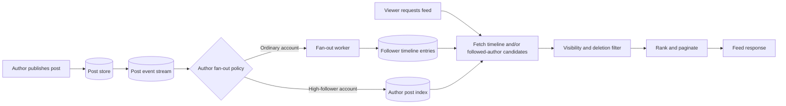
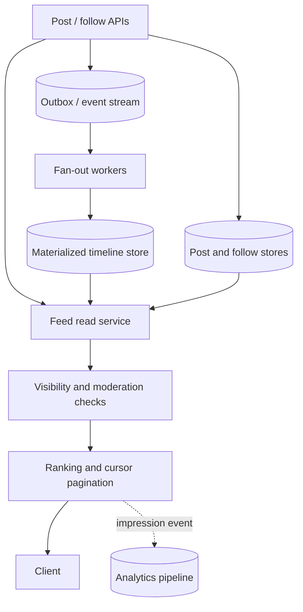

# Case Study: News Feed

> **Scope note:** This is a generic interview design. User counts, post rates, read traffic, ranking rules, and latency goals must be elicited or stated as assumptions; no benchmark values are asserted here.

## Definition

A news feed returns a personalized, ordered page of posts relevant to a user, commonly from followed accounts or groups, with a freshness/ranking policy.

## Requirements

### Functional requirements

- Publish, edit, or delete posts according to product scope.
- Follow/unfollow accounts or groups.
- Retrieve a paginated personalized feed.
- Apply ranking, visibility, moderation, and privacy rules.

### Non-functional requirements

- Low-latency feed reads and resilient post publishing.
- Eventual consistency may be acceptable for feed propagation, but authorization/deletion rules must be enforced.
- Handle celebrity/high-follower accounts and skewed read/write patterns.
- Define freshness, ranking quality, availability, retention, and cost goals.

## How it works

### Feed construction strategies

- **Fan-out-on-write:** when a user posts, add a feed entry to followers' timelines. Reads are fast; writes can explode for high-follower authors and post changes/deletes need propagation.
- **Fan-out-on-read:** on feed request, fetch posts from followed authors and merge/rank them. Writes are cheap; reads cost more and may be slower for users following many accounts.
- **Hybrid:** precompute for ordinary accounts and merge high-follower/celebrity content at read time. The threshold is a workload/product decision, not a universal constant.

### Request flow

1. Authenticate the viewer and load their follow/visibility context.
2. Fetch candidate post IDs from a materialized timeline, author feeds, or both.
3. Filter deleted, blocked, private, or already-seen content according to policy.
4. Rank candidates using the defined ranking inputs; fetch post details in batches.
5. Return a cursor for stable pagination and record appropriate feed-impression signals.



## Estimation

State assumptions and use workload formulas; do not present them as measured traffic.

- Post writes/s = daily active authors × posts per author per day / 86,400.
- Feed reads/s = daily active viewers × feed requests per viewer per day / 86,400.
- Fan-out writes/post = eligible followers for that post under the chosen policy.
- Materialized timeline storage = feed entries written per day × retention days × bytes per entry, plus indexes and replication.
- Candidate reads depend on follow counts, fan-out strategy, freshness window, and ranking depth.

Concrete user counts, read/write ratio, follower distribution, retention, and latency objective: `> TODO: verify` for a real service.

## API design

| Method | Path | Purpose | Notes |
| --- | --- | --- | --- |
| POST | `/v1/posts` | Publish a post | Authenticate; validate visibility/content; idempotency may be useful on retries |
| GET | `/v1/feed?cursor={cursor}` | Read a page | Cursor-based pagination; apply viewer visibility rules |
| PUT | `/v1/users/{id}/follows/{authorId}` | Follow an author | Authorization and duplicate-follow handling |
| DELETE | `/v1/users/{id}/follows/{authorId}` | Unfollow an author | Define whether existing timeline entries are removed or filtered |

## Data model

| Entity | Example fields | Access pattern / concern |
| --- | --- | --- |
| Post | `postId`, `authorId`, `createdAt`, `visibility`, `contentRef`, `status` | Author timeline and post lookup |
| Follow | `followerId`, `authorId`, `createdAt` | Follower lists and followed-author lookup |
| Timeline entry | `viewerId`, `postId`, `rankTime/score`, `createdAt` | Cursor-paginated feed candidate store |
| Feed event | `eventId`, `postId`, `authorId`, `createdAt` | Async fan-out and replay; consumer should be idempotent |

Index and partition keys should match feed reads, follower enumeration, and author post lookup. Large follower lists and hot authors require explicit skew handling.

## High-level architecture



## Deep dives

### Ranking and pagination

- Separate candidate generation from ranking so freshness/quality rules can evolve.
- Use deterministic tie-breakers, such as post ID, to avoid inconsistent ordering when scores match.
- Use cursors based on stable sort keys rather than large offsets; define behavior when new posts arrive between page requests.
- Ranking may depend on freshness, interactions, relevance, and policy constraints; actual signals and model are product-specific.

### Consistency, deletion, and privacy

- Feed propagation can be eventually consistent; define acceptable delay and what happens on retries/replay.
- Deletion, blocking, privacy changes, and moderation may need read-time filtering even if timeline entries have not yet been removed.
- Ensure authorization is checked for each viewer; a timeline entry is a candidate, not proof of permission.

### Hot authors and hybrid fan-out

- Fan-out-on-write cost grows with eligible follower count.
- Fan-out-on-read cost grows with candidate author count and post lookup/ranking work.
- A hybrid policy can limit write amplification while keeping ordinary reads fast; select thresholds from measured workload distribution and latency targets.

## Code example

This runnable TypeScript helper ranks a bounded candidate array by descending score with a stable ID tie-breaker. It illustrates deterministic ordering only; production ranking signals and authorization are not defined by this sample.

```ts
type Candidate = { id: string; score: number };

function rankCandidates(candidates: readonly Candidate[], limit: number): Candidate[] {
  if (!Number.isSafeInteger(limit) || limit < 0) {
    throw new RangeError("limit must be a non-negative integer");
  }
  if (candidates.some((candidate) => !Number.isFinite(candidate.score))) {
    throw new RangeError("candidate scores must be finite");
  }

  return [...candidates]
    .sort((a, b) => b.score - a.score || a.id.localeCompare(b.id))
    .slice(0, limit);
}

console.log(rankCandidates([
  { id: "post-b", score: 8 },
  { id: "post-a", score: 8 },
  { id: "post-c", score: 5 },
], 2).map((candidate) => candidate.id));
```

Expected output: `['post-a', 'post-b']`. For $n$ candidates, sorting takes O(n log n) time and O(n) additional space for the copied array. A bounded top-$k$ heap can reduce ranking work when $k \ll n$, at the cost of more implementation complexity.

## Complexity / trade-offs

- Fan-out-on-write has O(f) work per post for $f$ eligible followers; fan-out-on-read work depends on candidate sources and ranking.
- Sorting $n$ candidates for a page is O(n log n); production systems commonly bound candidate windows or use a top-$k$ strategy.
- Materialized feeds trade storage/write amplification for lower read latency.
- Hybrid feed construction trades simpler extremes for policy/consistency complexity.
- There is no universal celebrity threshold; choose using measured distribution and service objectives.

## Common mistakes

- Assuming all authors have similar follower counts.
- Fan-out-on-write without considering celebrity/hot-account write amplification.
- Fan-out-on-read without bounding candidate retrieval and ranking latency.
- Treating a cached/materialized timeline as authoritative for visibility or access control.
- Using offset pagination that becomes expensive or unstable as new posts arrive.
- Inventing user counts or latency targets instead of stating assumptions.

## Interview questions

### Q1: Compare fan-out-on-write and fan-out-on-read.
**Model answer:** Fan-out-on-write materializes follower timelines at publish time, making reads fast but writes expensive for large audiences. Fan-out-on-read builds candidates at request time, keeping writes cheaper but making reads costlier.

### Q2: Why might a hybrid strategy be useful?
**Model answer:** Ordinary authors can be precomputed while high-follower authors are merged at read time, limiting write amplification. The policy threshold should come from observed workload and latency goals.

### Q3: How do you handle a celebrity author?
**Model answer:** Avoid writing one timeline entry per follower synchronously. Use deferred/batched fan-out, read-time merging, or a hybrid, while measuring backlog and feed freshness.

### Q4: How do you paginate a ranked feed?
**Model answer:** Use a cursor based on stable sort fields and a tie-breaker, not a large offset. Define how the cursor behaves when scores/posts change between requests.

### Q5: How do you handle deletion or privacy changes?
**Model answer:** Propagate cleanup asynchronously where appropriate, but enforce visibility at read time so stale materialized entries cannot expose inaccessible content.

### Q6: What consistency model is acceptable?
**Model answer:** Feed propagation may tolerate bounded eventual consistency, while authorization, blocking, and deletion constraints may need stronger read-time enforcement. Specify the guarantee per operation.

### Q7: How do you avoid duplicate feed entries during retries?
**Model answer:** Give events stable IDs and make fan-out writes idempotent with a uniqueness key such as viewer/post. Replays should not create duplicate timeline items.

### Q8: What should be measured?
**Model answer:** Feed latency percentiles, candidate count, ranking time, freshness delay, fan-out backlog, cache hit rate, error rate, and skew by author/follower distribution.

### Q9: How would you change the design for chronological feeds?
**Model answer:** Ranking becomes primarily time ordering, which simplifies scoring but still needs stable cursors, visibility checks, and a strategy for high-follower fan-out.

### Q10: How do you estimate feed storage and request load?
**Model answer:** Estimate reads/posts per active user per time window, then model fan-out entries as posts multiplied by eligible follower counts. State assumptions and separately add indexes, replication, and retention.

## Follow-up questions

- How would you support video/media posts and CDN delivery?
- How do ranking experiments affect reproducibility and cursor pagination?
- How do you rebuild materialized feeds after a ranking change?
- How should blocks, mutes, and private accounts affect fan-out?

## Related notes

- [System design fundamentals](system-design-fundamentals.md)
- [Scalability basics](scalability-basics.md)
- [Chat system](chat-system.md)
- [Notification system](notification-system.md)
