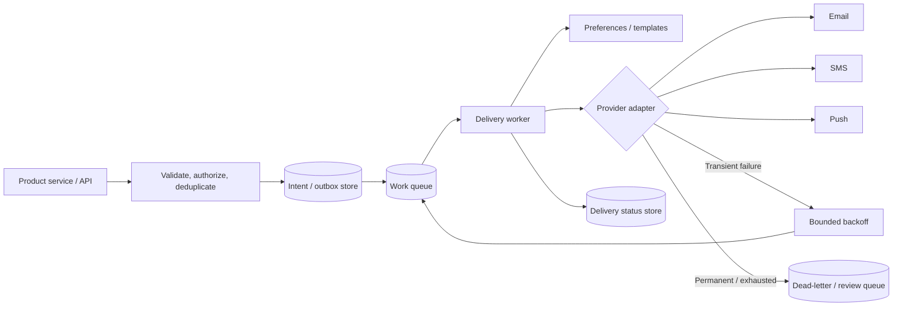

# Notification system

# Notification system

## Definition

A notification system accepts a notification intent, applies recipient/channel policy, and delivers messages through providers such as email, SMS, push, or in-app channels, usually asynchronously.

## Requirements

### Functional requirements

- Accept a notification request or domain event.
- Select recipients, channel, template, locale, and priority according to product policy.
- Track accepted/queued/delivered/failed status to the level required.
- Retry transient failures and expose terminal failures for investigation.

### Non-functional requirements

- Keep the initiating user request independent of slow providers when async delivery is acceptable.
- Define delivery semantics, acceptable delay, provider rate limits, privacy, retention, and cost.
- Prevent duplicate side effects where provider capabilities allow; document that exactly-once delivery across external providers is generally not guaranteed by an ordinary queue.

## How it works

1. API authenticates/authorizes caller, validates request, and applies idempotency policy.
2. Persist an intent/outbox record before acknowledging if acceptance must survive process failure.
3. Enqueue work and acknowledge the request with a stable notification/request ID.
4. Workers apply preferences, templates, consent, and channel rules; send using a provider adapter.
5. Record provider result and retry transient failures with bounded backoff; route exhausted/permanent failures for inspection.
6. Optionally emit status events or analytics without making them part of the delivery critical path.

### API and data model

| Interface / entity | Purpose | Design consideration |
| --- | --- | --- |
| `POST /v1/notifications` | Accept a notification intent | Idempotency key, authorization, validation, bounded payload |
| Notification intent | Recipient, template, variables, requested channels, priority | Keep sensitive payloads minimized and access-controlled |
| Delivery attempt | Notification ID, channel, attempt, outcome, provider reference | Record enough for retries/audit without leaking secrets |
| Preference/consent | Recipient channel preferences and opt-outs | Enforce before delivery and define freshness requirements |

## Estimation

- Average deliveries/s = accepted intents per time window × average recipient fan-out × average channels / window seconds.
- Peak deliveries/s = average deliveries/s × an explicit peak factor or observed peak distribution.
- Queue storage depends on arrival rate, payload size, and maximum tolerated backlog duration.
- Provider quotas, recipient fan-out, retries, and campaign bursts can dominate worker capacity.

Required counts, fan-out, provider quotas, payload sizes, retention, and delay targets: `> TODO: verify` for a real design.

## High-level architecture



## Code example

This runnable TypeScript helper calculates capped exponential retry delay without jitter. It is a pure policy helper; a production worker should add jitter where appropriate, persist attempts, respect provider `Retry-After` instructions, and enforce a retry limit.

```ts
function retryDelayMs(attempt: number, baseDelayMs: number, maxDelayMs: number): number {
    if (!Number.isSafeInteger(attempt) || attempt < 0) {
        throw new RangeError("attempt must be a non-negative integer");
    }
    if (!Number.isFinite(baseDelayMs) || baseDelayMs < 0) {
        throw new RangeError("base delay must be finite and non-negative");
    }
    if (!Number.isFinite(maxDelayMs) || maxDelayMs < baseDelayMs) {
        throw new RangeError("maximum delay must be finite and at least the base delay");
    }

    return Math.min(maxDelayMs, baseDelayMs * 2 ** attempt);
}

console.log(retryDelayMs(3, 500, 5_000));
```

Expected output: `4000`. The function runs in O(1) time and O(1) extra space. The formula is illustrative; retryability and limits must be based on provider and product semantics.

## Deep dives

### Idempotency and delivery semantics

- Use a unique intent key/durable constraint to deduplicate repeated API submissions.
- A queue may redeliver work; workers should make internal state transitions idempotent.
- A provider may accept a request while the response is lost. Provider idempotency keys or reconciliation can reduce duplicate external sends if supported.
- Distinguish accepted, queued, provider-accepted, delivered, bounced, and read; only report states the provider actually confirms.

### Retries, rate limits, and dead letters

- Retry transient network/server/throttle errors with bounded exponential backoff and jitter; do not retry permanent invalid-recipient or policy failures blindly.
- Respect provider quota and `Retry-After` guidance, and isolate provider-specific circuit/backpressure behavior.
- Dead-letter exhausted or poison work with enough safe diagnostic context for replay/inspection; replay must remain idempotent.

### Fan-out, preferences, and privacy

- Large recipient sets may need chunked fan-out and per-channel queues/quotas.
- Apply opt-outs, consent, quiet hours, locale, and priority before provider dispatch when required.
- Minimize sensitive data in queues, logs, and provider payloads; define retention and access controls.

## Complexity / trade-offs

- If an intent targets $r$ recipients and $c$ channels per recipient, naive fan-out creates O(rc) delivery tasks; batching/aggregation changes overhead but not the underlying recipient work.
- Retry scheduling is O(1) per attempt; total work grows with attempts and retry volume.
- Async queues improve request latency/isolation but introduce delivery delay, backlog, duplicate processing, and operational monitoring.
- A transactional outbox strengthens consistency between domain updates and event publication but adds storage/polling/cleanup complexity.

## Common mistakes

- Saying a queue guarantees exactly-once external delivery.
- Retrying permanent failures or retrying forever without limits/backoff.
- Acknowledging acceptance before durable intent storage when durability is promised.
- Ignoring provider quotas, consent/preferences, duplicate events, and dead-letter replay behavior.
- Treating provider acceptance as proof that a message reached or was read by the recipient.
- Logging full sensitive notification payloads or credentials.

## Interview questions

### Q1: Why put a queue between the API and providers?
**Model answer:** It decouples user-facing latency from slow delivery, absorbs bursts, and lets workers scale independently. The trade-offs are eventual delivery, backlog management, and duplicate/retry handling.

### Q2: How do you make notification submission idempotent?
**Model answer:** Accept a caller idempotency key and enforce uniqueness durably for the appropriate scope. Return the prior intent/result for duplicates rather than creating another logical notification.

### Q3: Can a queue provide exactly-once email delivery?
**Model answer:** A queue can provide particular delivery guarantees within its boundary, but an external provider call can succeed while its response is lost. Use idempotency support/reconciliation where available and design for duplicates.

### Q4: Which failures should be retried?
**Model answer:** Retry transient failures such as temporary network errors or throttling with bounded backoff and provider guidance. Permanent validation/policy failures should be recorded, not blindly retried.

### Q5: What belongs in a dead-letter queue?
**Model answer:** Work that cannot proceed after the defined retry policy or is malformed/poison. Retain safe diagnostics and a controlled replay process that preserves idempotency.

### Q6: How do you prevent one provider outage from blocking all channels?
**Model answer:** Isolate provider adapters, queues, concurrency limits, and circuit/backpressure policies where justified. Monitor provider-specific backlog and degrade only the affected channel if product policy allows.

### Q7: How do user preferences affect delivery?
**Model answer:** Check consent, opt-outs, quiet hours, and channel preference at a clearly defined point, balancing policy correctness against preference freshness and queued-work semantics.

### Q8: How do you estimate worker capacity?
**Model answer:** Estimate intent rate, recipient fan-out, channels, provider latency/quotas, and retries; load-test the worker and monitor queue age/lag rather than sizing from API request rate alone.

### Q9: What is the transactional outbox pattern?
**Model answer:** The application writes its business change and an event record in one database transaction; a separate publisher delivers the outbox event. It reduces the dual-write gap but requires polling/cleanup and idempotent consumers.

### Q10: Which delivery status can you promise to users?
**Model answer:** Only states supported by the system/provider contract. “Accepted” is not the same as “delivered” or “read”; define each state and its evidence.

## Follow-up questions

- How do you handle scheduled and digest notifications?
- How do you safely replay a dead-lettered message?
- What if provider callbacks arrive out of order?
- How do you protect recipient privacy and handle deletion requests?

## Related notes

- [Sharding and queues](sharding-and-queues.md)
- [Rate limiter](rate-limiter.md)
- [URL shortener](url-shortener.md)
- [Chat system](chat-system.md)

## Related notes

- [Sharding and queues](sharding-and-queues.md)
- [Rate limiter](rate-limiter.md)
- [URL shortener](url-shortener.md)
