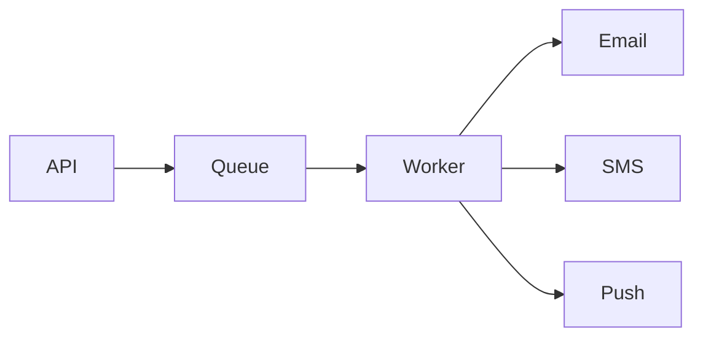

# Notification system

## Requirements

- Send email, SMS, push, or in-app notifications
- Respect idempotency and retries
- Support high-volume fan-out without blocking the user request

## Key design choices

- Use a queue to decouple send requests from delivery workers
- Batch or throttle low-priority notifications
- Maintain per-channel templates and delivery status tracking
- Retry with exponential backoff and dead-letter handling

## Architecture sketch

## Failure handling

- Duplicate delivery must be safe and idempotent.
- Slow downstream providers should not block the API.
- Dead-letter queues help isolate poison messages.

## Interview guidance

> A notification system is usually a queue-based async pipeline. The API accepts the request quickly, logs the event, and workers handle retries, rate limits, and delivery semantics.

## Related notes

- [Sharding and queues](sharding-and-queues.md)
- [Rate limiter](rate-limiter.md)
- [URL shortener](url-shortener.md)
