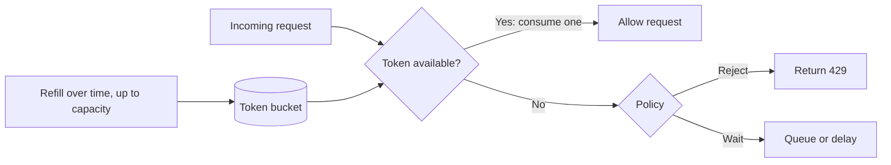

# Rate limiter

## Definition

A rate limiter controls how many requests a client or tenant can make over a time window. It protects backend capacity and limits abuse.

## Common algorithms

- Token bucket
- Leaky bucket
- Fixed window
- Sliding window log

| Algorithm | Burst handling | Main trade-off |
| --- | --- | --- |
| Token bucket | Allows bursts up to bucket capacity | Requires token state and refill logic |
| Leaky bucket | Smooths output to a steady rate | Can add queueing delay or drop excess traffic |
| Fixed window | Can allow a boundary spike | Simple, but counts reset abruptly at window edges |
| Sliding window log | More precise rolling limit | Stores timestamps, so memory cost can be higher |

## Visual example: token bucket

Requests consume tokens. Tokens refill at a configured rate; excess requests are rejected or delayed according to the API policy.

## Trade-offs

- Token bucket is popular for burst-friendly traffic shaping.
- Fixed window is simple but can allow spikes at window boundaries.
- Sliding window provides better fairness but is more expensive to compute.

## Typical interview answer

> For a public API, I would use a token bucket at the gateway or per-user level, with quota rules based on tenant and endpoint. The limiter should reject or slow down excess traffic before it hits expensive downstream services.

## Related notes

- [Load balancing and caching](load-balancing-and-caching.md)
- [CAP theorem and consistency](cap-consistency.md)
- [URL shortener](url-shortener.md)
