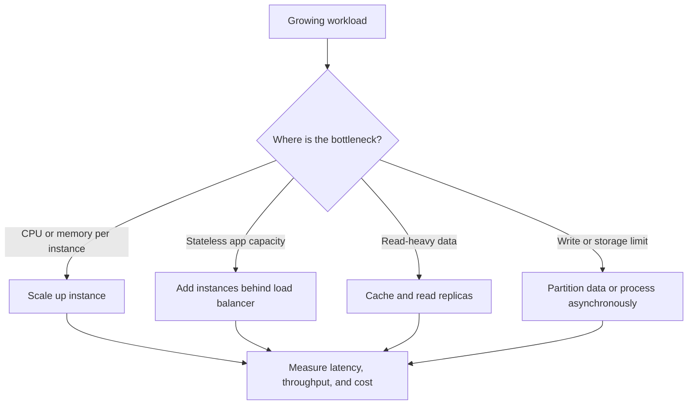

# Scalability basics

## Definition

A system is scalable when it can handle more load, more users, or more data without a proportional drop in performance or stability.

## Key metrics

- Throughput: requests per second
- Latency: p50, p95, p99
- Availability: uptime and recovery behavior
- Cost: compute, storage, and data transfer cost

## Scaling strategies

- Vertical scaling: more CPU/RAM on one machine
- Horizontal scaling: add more instances behind a load balancer
- Read scaling: cache and replicas
- Write scaling: partitioning, queueing, and async patterns

## Common interview answer

> Start with single-instance design, then identify bottlenecks. Scale reads with caching and replicas, scale writes with sharding or async workers, and add observability before you optimize prematurely.

## Related notes

- [Load balancing and caching](load-balancing-and-caching.md)
- [CAP theorem and consistency](cap-consistency.md)
- [Sharding and queues](sharding-and-queues.md)
