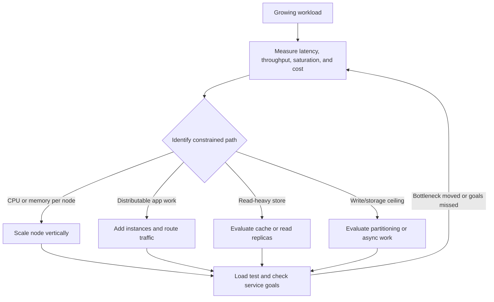

# Scalability basics

## Definition

A system is scalable when it can accommodate increased workload while continuing to meet agreed service goals. Scalability is workload- and bottleneck-specific; adding instances alone does not guarantee it.

## How it works

1. Measure or estimate load and define latency/availability/cost targets.
2. Identify the constrained resource or path (CPU, memory, database, network, lock contention, or downstream dependency).
3. Select a scaling change that addresses that bottleneck.
4. Re-test under representative load, including peak/skew and dependency failures.
5. Compare service goals and cost; repeat if the bottleneck moved.

## Key metrics

- Throughput: requests per second
- Latency: p50, p95, p99 (percentiles describe distributions; averages can hide tail latency)
- Availability: successful service over a defined window, plus recovery behavior
- Cost: compute, storage, and data transfer cost
- Saturation: how close constrained resources are to capacity

## Scaling strategies

- Vertical scaling: more CPU/RAM on one machine
- Horizontal scaling: add more instances behind a load balancer
- Read scaling: cache and replicas
- Write scaling: partitioning, queueing, and async patterns

| Strategy | Helps when | Costs / limits |
| --- | --- | --- |
| Vertical scaling | A node is resource-constrained and larger instances are available | Hardware ceilings, larger failure blast radius, possible downtime or cost jumps |
| Horizontal scaling | Work can be distributed across instances | Requires routing, health handling, capacity coordination, and usually stateless/app-compatible behavior |
| Read replicas | Reads dominate and replica lag is acceptable | Stale reads, replication cost, and failover complexity |
| Cache | Repeated reads dominate and freshness policy is defined | Invalidation, stale data, stampedes, memory cost, and cache failure modes |
| Queue / async workers | Work can be delayed and producers/consumers need decoupling | Eventual completion, retries, idempotency, ordering, and monitoring |
| Partitioning / sharding | A single store's capacity or write throughput is exhausted | Key choice, hotspots, cross-partition queries, rebalancing, and operational complexity |



## Code example

Use capacity measured under representative load; do not treat the function's inputs as universal defaults.

```ts
type CapacityInput = {
	peakRequestsPerSecond: number;
	measuredRequestsPerSecondPerInstance: number;
	targetUtilization: number;
	minimumInstances: number;
};

function requiredInstances(input: CapacityInput): number {
	const { peakRequestsPerSecond, measuredRequestsPerSecondPerInstance,
		targetUtilization, minimumInstances } = input;

	if (!Number.isFinite(peakRequestsPerSecond) || peakRequestsPerSecond < 0) {
		throw new RangeError("peak request rate must be finite and non-negative");
	}
	if (!Number.isFinite(measuredRequestsPerSecondPerInstance) || measuredRequestsPerSecondPerInstance <= 0) {
		throw new RangeError("measured per-instance capacity must be finite and positive");
	}
	if (!Number.isFinite(targetUtilization) || targetUtilization <= 0 || targetUtilization > 1) {
		throw new RangeError("target utilization must be in (0, 1]");
	}
	if (!Number.isSafeInteger(minimumInstances) || minimumInstances < 0) {
		throw new RangeError("minimum instances must be a non-negative integer");
	}

	const usableCapacity = measuredRequestsPerSecondPerInstance * targetUtilization;
	return Math.max(minimumInstances, Math.ceil(peakRequestsPerSecond / usableCapacity));
}

console.log(requiredInstances({
	peakRequestsPerSecond: 900,
	measuredRequestsPerSecondPerInstance: 300,
	targetUtilization: 0.75,
	minimumInstances: 1,
}));
```

The values are an **illustrative calculation only**, not a benchmark or production recommendation. The result is 4 instances. Real capacity depends on workload mix, latency target, failure reserve, deployment behavior, and load-test validity.

## Common interview answer

> Start with single-instance design, then identify bottlenecks. Scale reads with caching and replicas, scale writes with sharding or async workers, and add observability before you optimize prematurely.

## Complexity / trade-offs

- The sizing function uses a fixed number of arithmetic operations: O(1) time and O(1) extra space.
- System scaling does not have one universal Big-O; judge it using measured throughput, latency percentiles, saturation, failure behavior, and cost.
- Horizontal scaling can improve capacity only while bottlenecks (such as a shared database) also scale or remain sufficient.
- Read replicas and caches may trade freshness for read capacity; queues trade immediate completion for decoupling and smoothing.
- Include headroom/failure reserve based on explicit availability goals and evidence; do not assume a generic percentage.

## Common mistakes

- Scaling the component that is not the bottleneck.
- Using average traffic alone when peaks or hot keys dominate.
- Treating a load-test capacity number as valid for all request mixes.
- Ignoring replica lag, cache staleness, queue backlog, or downstream saturation.
- Adding shards or microservices before single-node limits are demonstrated.
- Reporting throughput improvements without comparing equivalent workloads and latency/error goals.

## Interview questions

### Q1: What is the difference between vertical and horizontal scaling?
**Model answer:** Vertical scaling increases resources on one node; horizontal scaling adds nodes and distributes work. Horizontal scale needs routing and workload compatibility and may expose shared bottlenecks.

### Q2: How do you find the right scaling strategy?
**Model answer:** Measure the workload, identify the saturated path, change the constrained component, then re-test against latency, error, availability, and cost goals.

### Q3: Why are p95/p99 latency useful?
**Model answer:** They reveal tail behavior experienced by slower requests, which averages can hide. They should be paired with throughput and error/saturation metrics.

### Q4: When can read replicas help?
**Model answer:** When reads dominate and the application can tolerate the replica's consistency/lag behavior. They do not automatically improve writes.

### Q5: What is a cache stampede?
**Model answer:** Many requests simultaneously recompute or fetch the same expired/missing item, overwhelming the origin. Mitigations may include request coalescing, staggered expiry, or controlled refresh, chosen for the workload.

### Q6: When is a queue a scaling tool?
**Model answer:** When work can complete asynchronously, a queue can absorb bursts and decouple producers from consumers. The design must handle backlog, retries, idempotency, and delivery semantics.

### Q7: When should you shard a database?
**Model answer:** When measured storage or throughput limits cannot be addressed sufficiently by query/index improvements, vertical capacity, or read scaling. Sharding adds routing, rebalancing, and cross-shard complexity.

### Q8: Why is measured per-instance capacity not a universal constant?
**Model answer:** It changes with request mix, data size, downstream latency, concurrency, hardware, software, and service goals. Use representative tests and state the test conditions.

### Q9: How do you account for traffic spikes?
**Model answer:** Use observed peak distributions when available; otherwise make a named assumption, test sensitivity, and plan admission control/queueing/capacity around the service objective.

### Q10: How can scaling make a system worse?
**Model answer:** It can increase cost, contention, stale reads, coordination overhead, or failure blast radius. Scaling must target the bottleneck and be verified against the full service goals.

## Related notes

- [Load balancing and caching](load-balancing-and-caching.md)
- [CAP theorem and consistency](cap-consistency.md)
- [Sharding and queues](sharding-and-queues.md)
