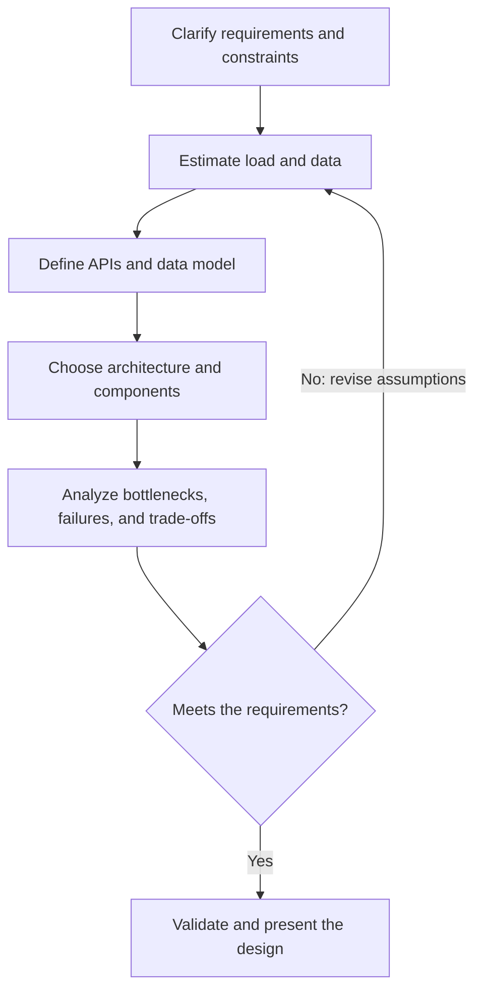

 System Design Fundamentals

Tags: #system-design #architecture
Difficulty: Medium
Status: Learning

## Definition

System design is the process of choosing the right architecture to meet required scale, reliability, latency, and maintainability goals.

## Why it matters / when to use

This is core for senior and staff engineering interviews. It tests how you reason about trade-offs under constraints.

## How it works

You identify business requirements, estimate load, define APIs, choose storage and compute patterns, and then analyze bottlenecks and resilience.



## Code example

```ts
// Example of a simple request estimator
function estimateRequestsPerSecond(users: number, activeRatio: number) {
  return users * activeRatio;
}

console.log(estimateRequestsPerSecond(100000, 0.02));
```

## Time and space complexity

System design does not usually use pure algorithmic complexity as the primary frame. It is more about throughput, latency, and operational constraints.

## Common mistakes and pitfalls

- Jumping to a solution before clarifying requirements
- Ignoring non-functional constraints like availability or cost
- Overoptimizing for a problem that never happens

## Interview questions

### Q: What is the first thing you do in a design interview?
Model answer: Clarify the core requirements, define the scope, and estimate traffic and important constraints before choosing a structure.

## Related topics

- [Core building blocks](scaling-patterns.md)
- [API design patterns](api-design.md)
- [Case study: URL shortener](case-study-url-shortener.md)
