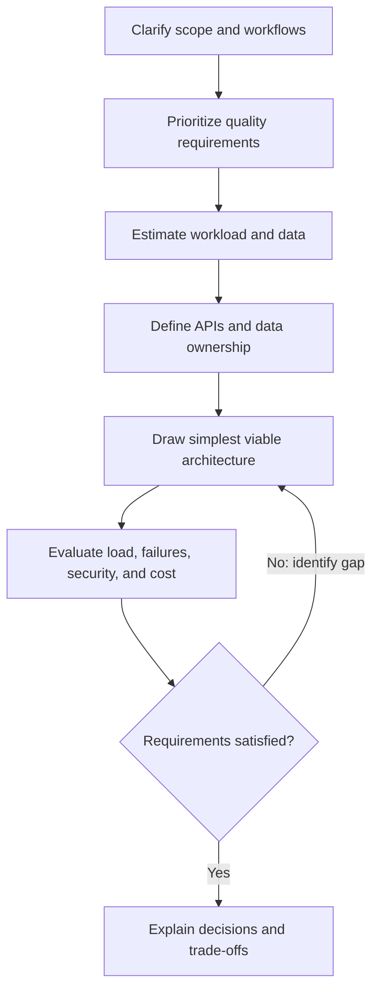
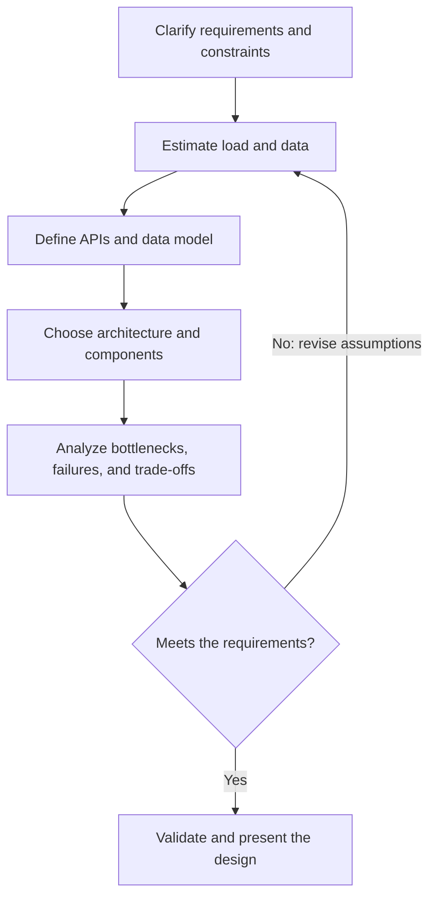

# System Design Fundamentals

## Definition

System design is the process of choosing and validating system boundaries, data flows, components, and operational strategies against explicit product and quality requirements.

## Why it matters / when to use

Design interviews evaluate problem clarification, quantitative reasoning, architecture choices, failure analysis, and the ability to explain trade-offs. The goal is a defensible design for the stated constraints, not the most complicated architecture.

## How it works

### Interview sequence

1. Clarify users, functional scope, out-of-scope behavior, and key workflows.
2. Identify non-functional requirements such as latency, availability, durability, consistency, privacy, and cost; ask which are most important.
3. Estimate traffic, storage, and bandwidth from explicit assumptions. Distinguish average from peak load.
4. Define APIs and data ownership before drawing components.
5. Start with a simple architecture, then add cache, queue, replica, partition, or service boundary only to address a stated need.
6. Walk through read/write paths, failures, bottlenecks, observability, and trade-offs; revise when assumptions change.



### Back-of-the-envelope estimation

Write assumptions before arithmetic. Common unit conversions:

- Average requests per second: daily requests divided by $86{,}400$ seconds.
- Peak requests per second: average requests per second multiplied by an explicitly assumed peak-to-average factor.
- Raw retained bytes: daily writes multiplied by bytes per record and retention days.
- Replicated bytes: raw bytes multiplied by the replication factor; index, compression, metadata, backups, and growth headroom must be considered separately.

Do not present a rough estimate as a measured production benchmark.



## Code example

```ts
type Workload = {
  dailyActiveUsers: number;
  requestsPerUserPerDay: number;
  peakToAverageFactor: number;
  writesPerUserPerDay: number;
  bytesPerRecord: number;
  retentionDays: number;
  replicationFactor: number;
};

function estimateWorkload(input: Workload) {
  const values = Object.values(input);
  if (values.some((value) => !Number.isFinite(value) || value < 0)) {
    throw new RangeError("workload assumptions must be finite and non-negative");
  }
  if (input.peakToAverageFactor < 1 || input.replicationFactor < 1) {
    throw new RangeError("peak and replication factors must be at least 1");
  }

  const averageRequestsPerSecond =
    (input.dailyActiveUsers * input.requestsPerUserPerDay) / 86_400;
  const peakRequestsPerSecond = averageRequestsPerSecond * input.peakToAverageFactor;
  const rawRetainedBytes =
    input.dailyActiveUsers *
    input.writesPerUserPerDay *
    input.bytesPerRecord *
    input.retentionDays;

  return {
    averageRequestsPerSecond,
    peakRequestsPerSecond,
    replicatedBytes: rawRetainedBytes * input.replicationFactor,
  };
}

const estimate = estimateWorkload({
  dailyActiveUsers: 1_000,
  requestsPerUserPerDay: 20,
  peakToAverageFactor: 3,
  writesPerUserPerDay: 2,
  bytesPerRecord: 500,
  retentionDays: 30,
  replicationFactor: 2,
});
console.log(estimate);
```

The inputs above are **synthetic arithmetic values**, not measurements or recommendations. The model omits indexes, compression, backups, metadata, traffic skew, and data growth; replace assumptions for a real design.

## Complexity / trade-offs

- The estimator performs a fixed number of arithmetic operations: O(1) time and O(1) extra space.
- Whole-system design is assessed through throughput, latency distributions, availability, durability, consistency, security, and cost—not a single Big-O value.
- Every scale-out component adds operational and correctness costs; justify it against a measured or explicitly estimated bottleneck.

## Common mistakes

- Designing before clarifying requirements and ranking constraints.
- Treating illustrative estimates as measured facts or hiding assumptions.
- Quoting average traffic without considering peak, skew, or growth.
- Adding services, queues, or shards before identifying the bottleneck they solve.
- Ignoring failure modes, security, observability, and operational ownership.
- Listing technologies without explaining why they fit the workload.

## Interview questions

### Q1: What do you clarify first in a design interview?
**Model answer:** Users, key workflows, functional scope, and out-of-scope behavior; then identify and prioritize latency, availability, consistency, durability, security, and cost requirements.

### Q2: How do you estimate average request rate from daily usage?
**Model answer:** Multiply daily active users by requests per user per day, then divide by 86,400 seconds. State that it is an average and separately estimate peak load.

### Q3: How do you estimate peak traffic?
**Model answer:** Apply an explicitly stated peak-to-average factor or use known traffic distribution data. If the factor is unknown, label it as an assumption and analyze sensitivity rather than claiming precision.

### Q4: How do you estimate storage needs?
**Model answer:** Estimate write volume times bytes per record times retention, then account separately for replication, indexes, metadata, compression, backups, and growth.

### Q5: Why define APIs and data ownership before choosing technologies?
**Model answer:** They clarify system boundaries and access patterns. Those constraints inform storage and service choices, avoiding technology-first designs.

### Q6: When should you add a cache?
**Model answer:** When repeated reads or latency to an authoritative store are a demonstrated bottleneck and the data's staleness/invalidation requirements are understood.

### Q7: When should you use a queue?
**Model answer:** To decouple work that can happen asynchronously, absorb bursts, or isolate slow dependencies. Define retry, ordering, idempotency, and dead-letter behavior.

### Q8: How do you reason about availability and consistency trade-offs?
**Model answer:** Start from business invariants and failure scenarios; state what users may observe during failures and choose consistency behavior per operation rather than applying a blanket rule.

### Q9: How do you make a design resilient?
**Model answer:** Identify component failures and recovery paths, then choose appropriate timeouts, bounded retries, idempotency, redundancy, health checks, observability, and tested recovery procedures.

### Q10: How do you communicate trade-offs?
**Model answer:** State the requirement, decision, alternative, benefit, cost, and failure mode. Make assumptions explicit and revisit them when estimates or constraints change.

## Related topics

- [Core building blocks](scaling-patterns.md)
- [API design patterns](api-design.md)
- [Case study: URL shortener](case-study-url-shortener.md)
- [Scalability basics](scalability-basics.md)
