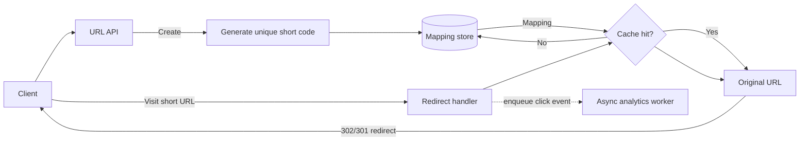

# URL shortener

## Requirements

### Functional

- Create a short URL from a long URL
- Redirect short URL to original URL
- Track basic analytics

### Non-functional

- High read throughput
- low-latency redirect
- high availability
- cost-effective storage

## Design approach

- Use a short key generated from base62 id or hash
- Store mapping from short code to original URL
- Cache hot URLs in Redis
- Add analytics logs asynchronously

## Core components

## Key trade-offs

- Use a short ID rather than a random string to simplify indexing.
- Cache redirects for hot URLs to reduce database reads.
- Keep write path small; analytics can be asynchronous.

## Follow-up questions

- How do you handle collisions?
- What happens with high skewed traffic?
- How do you support expiration or custom aliases?

## Related notes

- [Scalability basics](scalability-basics.md)
- [Load balancing and caching](load-balancing-and-caching.md)
- [Notification system](notification-system.md)
