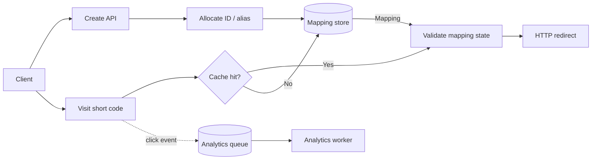
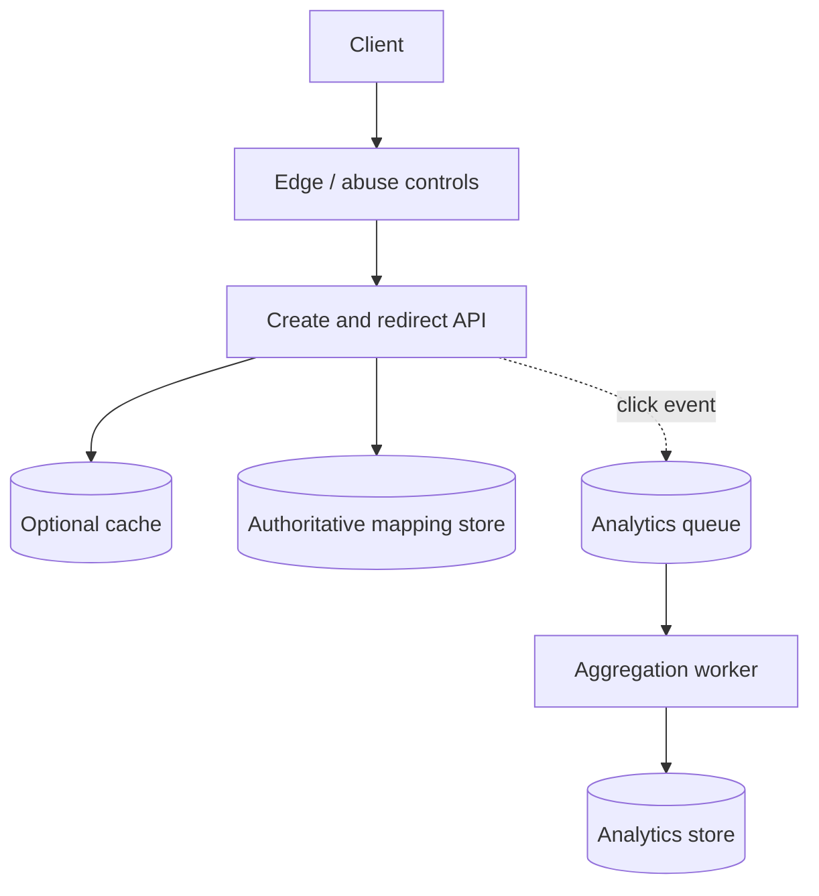

# URL shortener

## Definition

A URL shortener maps a compact public code to a validated destination URL and redirects visitors while enforcing ownership, expiry, abuse controls, and availability requirements.

## Requirements

### Functional requirements

- Create a short link from an allowed destination URL.
- Redirect a visitor from a code to its destination.
- Optionally support expiration, custom aliases, disable/delete, and aggregate analytics; confirm which features are in scope.

### Non-functional requirements

- Low redirect latency and high read availability.
- Durable mapping writes and uniqueness of codes.
- Abuse protection, safe URL validation, and privacy-aware analytics.
- Cost and retention limits for mappings and click events.

## How it works

### APIs

| Method | Path | Purpose | Notes |
| --- | --- | --- | --- |
| POST | `/v1/links` | Create a mapping | Auth/rate limit as product requires; idempotency may prevent duplicate create effects. |
| GET | `/{code}` | Resolve and redirect | Return an appropriate temporary/permanent redirect based on product semantics and caching policy. |
| DELETE | `/v1/links/{code}` | Disable a mapping | Owner/admin authorization and cache invalidation required if supported. |

### Code generation and collision handling

- One approach is to allocate a unique numeric ID and encode it in base 62. Unique IDs produce unique codes within the allocator's namespace; allocation must be coordinated across writers.
- Random codes avoid exposing sequence order but require a unique constraint and retry on collision.
- Hashing the destination can produce collisions and may reveal duplicate relationships; it needs collision handling and does not automatically provide access control.
- Store normalized/validated destination data, owner, created time, expiry/status, and any required policy metadata.

### Read path

1. Parse and validate the code.
2. Check a cache if configured; on a miss, load the authoritative mapping.
3. Reject unknown, expired, disabled, or policy-blocked links according to product rules.
4. Return the redirect and enqueue analytics asynchronously if required.



## Estimation

Use measured or explicitly stated inputs rather than assuming scale:

- Average create rate = new links per time window / window duration.
- Redirect QPS = expected active links times visits per link per window / window duration.
- Mapping storage = created links per day × retained days × average bytes per mapping; separately account for indexes, replication, backups, and growth.
- Peak QPS = average QPS × an explicit peak factor, or derive from observed traffic distribution.
- Analytics volume depends on event size and click rate; sample or aggregate if product requirements allow.

Required values, peak factor, retention, and payload sizes: `> TODO: verify` for any concrete deployment.

## Data model

Example logical mapping fields (implementation is a design choice):

| Field | Purpose |
| --- | --- |
| `code` | Unique lookup key |
| `destination` | Validated destination URL |
| `ownerId` | Authorization and management |
| `createdAt` | Audit and retention |
| `expiresAt` | Optional expiration |
| `status` | Active/disabled/deleted policy |

Index/partition decisions should follow lookup and write patterns. A unique index on code protects uniqueness at the storage boundary; cache entries must be invalidated or expire when a mapping changes.

## Code example

This TypeScript helper encodes a non-negative allocated `bigint` as base 62. It is only the encoding step: ID allocation, uniqueness across writers, persistence, and URL validation are separate responsibilities.

```ts
const alphabet = "0123456789abcdefghijklmnopqrstuvwxyzABCDEFGHIJKLMNOPQRSTUVWXYZ";
const base = BigInt(alphabet.length);

function encodeBase62(id: bigint): string {
	if (id < 0n) throw new RangeError("id must be non-negative");
	if (id === 0n) return alphabet[0];

	let value = id;
	const digits: string[] = [];
	while (value > 0n) {
		const digit = Number(value % base);
		digits.push(alphabet[digit]);
		value /= base;
	}
	return digits.reverse().join("");
}

console.log(encodeBase62(3844n));
```

Expected output: `100`. For $L$ output digits, time and auxiliary space are both O(L). This code requires a TypeScript target/runtime that supports `bigint` (ES2020 or newer).

## High-level architecture



## Deep dives

### Storage and cache

- The mapping store is authoritative; cache is an acceleration layer and should not be the only copy.
- Decide cache key, TTL, negative-cache behavior, and invalidation for disable/delete/expiry.
- Hot codes can create skew; use request coalescing or distributed cache strategy only if measured need justifies complexity.

### Security and abuse

- Restrict destination schemes and apply product policy against unsafe or disallowed targets.
- Consider phishing/malware reporting, create-rate limits, ownership checks, and safe preview behavior.
- Avoid leaking private analytics or unnecessary visitor identifiers; define retention and access rules.

### Analytics and reliability

- Keep redirect critical path independent from analytics persistence when eventual analytics is acceptable.
- Queue consumers should be idempotent or tolerate duplicate events; monitor backlog and failed events.
- Decide whether redirect availability or analytics completeness has priority during downstream failure.

## Complexity / trade-offs

- Mapping lookup is expected O(1) with a hash/key-value index or O(log n) with a balanced/tree index; actual latency depends on storage, cache, and network behavior.
- Code generation from a numeric ID takes O(L) time, where $L$ is encoded code length; allocation coordination is the distributed-systems trade-off.
- Cache improves repeated reads but adds staleness, invalidation, memory, and outage behavior to design.
- A permanent redirect may be cached by clients/intermediaries and is harder to change; a temporary redirect offers more control. Choose according to link mutability and cache policy.

## Common mistakes

- Assuming base62 encoding alone allocates unique IDs across independent writers.
- Omitting collision handling or relying only on an application-level uniqueness check.
- Allowing arbitrary destination schemes or overlooking abuse/reporting.
- Putting analytics writes synchronously on the redirect path without a stated consistency need.
- Treating cache as the source of truth or forgetting invalidation when links are disabled.
- Inventing QPS/storage values instead of showing assumptions and formulas.

## Interview questions

### Q1: How would you generate short codes?
**Model answer:** A coordinated unique ID encoded in base 62 is one option; random codes are another with a unique constraint and collision retry. The choice depends on code length, predictability, coordination, and scale.

### Q2: How do you guarantee uniqueness?
**Model answer:** Enforce a unique constraint in the authoritative store. For random codes, retry on conflict; for IDs, ensure the allocator is unique across writers and fail safely if allocation is uncertain.

### Q3: How do you estimate redirect capacity?
**Model answer:** Estimate active links and visits per link over a time window, convert to average QPS, then state a peak factor or use traffic data. I would validate the estimate with load tests and skew analysis.

### Q4: What belongs in the cache?
**Model answer:** Frequently resolved active mappings can be cached with a TTL. The database remains authoritative; update/disable/expiry paths must invalidate or safely age out cached values.

### Q5: How do you handle hot links?
**Model answer:** Measure key skew, then consider edge caching, replicated cache reads, request coalescing, or partition strategy. Each adds complexity and must respect redirect mutability and abuse policy.

### Q6: Why process analytics asynchronously?
**Model answer:** It keeps optional analytics work from adding latency or availability coupling to redirects. The trade-off is delayed or potentially duplicated events, so consumers need monitoring and idempotency/aggregation rules.

### Q7: What is the collision risk with hashes?
**Model answer:** Different inputs can map to the same finite code space. Use a uniqueness constraint and collision-resolution strategy; hashing also does not by itself provide secrecy or ownership.

### Q8: Should the redirect be 301 or 302?
**Model answer:** Choose based on whether the mapping is intended to be permanent and whether client/intermediary caching is acceptable. A permanent redirect can be harder to change after clients cache it; confirm exact HTTP semantics and cache headers for the product.

### Q9: How would you support expiration or deletion?
**Model answer:** Store status/expiry metadata, validate it on resolution, and ensure cache entries follow the same lifecycle. Deletion also needs ownership checks and defined analytics/retention behavior.

### Q10: How do you protect users from malicious links?
**Model answer:** Validate allowed schemes and apply abuse reporting/blocking policy, rate limits, and safe warning/preview behavior as requirements dictate. Monitor reports and avoid claiming a URL scanner without an actual implementation.

## Follow-up questions

- How do you support custom aliases without leaking user data?
- How do region failures affect ID allocation and redirects?
- How do you migrate code formats without breaking old links?
- Which analytics fields can be retained while respecting privacy requirements?

## Related notes

- [System design fundamentals](system-design-fundamentals.md)
- [Scalability basics](scalability-basics.md)
- [Load balancing and caching](load-balancing-and-caching.md)
- [Notification system](notification-system.md)
