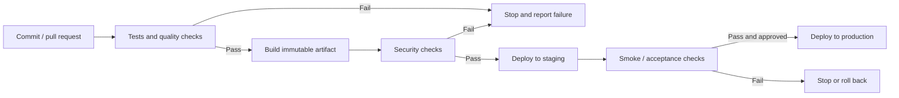

 CI/CD Principles

Tags: #devops #automation
Difficulty: Medium
Status: Learning

## Definition

CI/CD is the practice of continuously integrating code and continuously deploying validated changes.

## Why it matters / when to use

It shortens delivery cycles, reduces manual errors, and helps teams ship faster with more confidence.

## How it works

A pipeline usually runs tests, builds artifacts, performs security checks, and then deploys to staging or production with guardrails.



## Code example

```yaml
steps:
  - script: npm test
  - script: npm run build
  - script: docker build -t my-app .
```

## Time and space complexity

Delivery pipelines are judged by throughput, reliability, and failure recovery rather than Big O.

## Common mistakes and pitfalls

- Not separating staging from production environments
- Deploying without automated rollback
- Letting long pipelines block the team

## Interview questions

### Q: Why is a rollback plan important?
Model answer: It reduces the blast radius of a bad deployment and allows teams to restore service quickly while investigating the root cause.

## Related topics

- [Git workflow essentials](git.md)
- [Docker fundamentals](docker.md)
- [Jenkins basics](jenkins.md)
