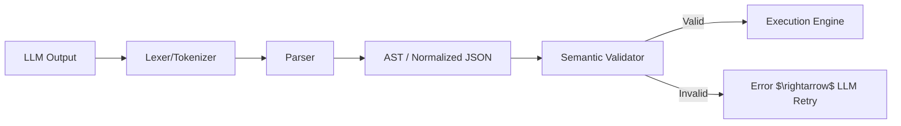

# Custom DSL Design for AI

## Definition

A Custom Domain-Specific Language (DSL) for AI is a constrained, structured language designed to bridge the gap between LLM natural language outputs and deterministic system execution. Instead of letting an LLM write arbitrary code, the system defines a strict grammar that the LLM must follow to trigger specific actions or UI changes.

## Why a DSL instead of JSON or Code?

| Approach | Pros | Cons |
| :--- | :--- | :--- |
| **Raw Code (JS/Python)** | Maximum flexibility | High security risk (XSS/Injection), unstable output, hard to validate. |
| **Standard JSON** | Machine readable, easy to parse | Verbose for LLMs (token heavy), prone to syntax errors (missing commas), hard for humans to audit. |
| **Custom DSL** | Token efficient, safe (sandboxed), easy to validate, human-readable | Requires custom parser/interpreter. |

## Design Principles for AI-driven DSLs

### 1. Constrained Expressiveness
A good AI DSL provides only the necessary primitives. If the goal is UI generation, the DSL should describe *intent* (e.g., `ShowChart(type="bar", data="revenue")`) rather than *implementation* (e.g., `div` styles and `canvas` calls).

### 2. Token Efficiency
LLMs are billed and limited by tokens.
- **Bad**: `{"component": "TextComponent", "properties": {"textValue": "Hello"}}`
- **Good**: `Text("Hello")`
By reducing verbosity, we reduce latency and cost while increasing the model's coherence.

### 3. Fail-Safe Validation
The DSL must be strictly validated before execution.
- **Syntactic Validation**: Does the input follow the grammar? (Parser)
- **Semantic Validation**: Does the requested component exist? Are the properties valid for that component? (Schema Validator)

## Implementation Workflow



## Working Code Example: DSL to AST Parser

This example shows a simplified parser that converts a custom DSL string into a structured object.

```ts
type DSLNode = {
  type: string;
  args: string[];
};

function parseDSL(input: string): DSLNode[] {
  // Matches: ComponentName("arg1", "arg2")
  const regex = /(\w+)\(([^)]*)\)/g;
  const results: DSLNode[] = [];
  let match;

  while ((match = regex.exec(input)) !== null) {
    const [_, type, argsString] = match;
    const args = argsString
      .split(',')
      .map(arg => arg.trim().replace(/^"|"$/g, ''));
    
    results.push({ type, args });
  }
  return results;
}

// Input: "Chart("revenue", "bar"), Text("Total Sales")"
const dslInput = 'Chart("revenue", "bar"), Text("Total Sales")';
const ast = parseDSL(dslInput);
console.log(JSON.stringify(ast, null, 2));
/* 
Output:
[
  { "type": "Chart", "args": ["revenue", "bar"] },
  { "type": "Text", "args": ["Total Sales"] }
]
*/
```

**Complexity**:
- **Time**: $O(N)$ where $N$ is the length of the input string.
- **Space**: $O(M)$ where $M$ is the number of identified nodes.

## Interview questions

### Q1: How do you handle "hallucinations" in a custom DSL?
**Model answer**: I implement a strict "allow-list" validator. After the parser converts the DSL to an AST, the validator checks if the `type` exists in the component registry and if the `args` match the expected types. If a hallucination is detected, the system can either discard the node or send the error back to the LLM for a self-correction loop.

### Q2: How do you balance expressiveness and safety?
**Model answer**: By limiting the DSL to a declarative style. I avoid allowing loops, variable assignments, or arbitrary function calls. By ensuring the DSL is not Turing-complete, I can guarantee that the execution will always terminate and cannot access unauthorized system resources.

### Q3: How do you optimize for token usage when using a DSL?
**Model answer**: I use "compressed" syntax. Instead of using long keys in JSON, I use a function-like notation (`Component(arg)`). I also provide a "System Prompt" with a concise dictionary of available components and a few short examples (Few-Shot prompting) to guide the model toward the most token-efficient output.

### Q4: What is the benefit of an AST over direct string replacement?
**Model answer**: An AST (Abstract Syntax Tree) provides a structured representation that is independent of the original string. This allows for easier semantic analysis, optimization (e.g., removing redundant components), and a cleaner mapping to the final execution logic or UI renderer.

### Q5: How do you version a DSL when the product evolves?
**Model answer**: I include a version tag in the DSL output (e.g., `v2: Chart(...)`). The parser uses this tag to select the appropriate grammar version, ensuring that old cached UI specifications remain compatible with the current runtime.

## Related notes

- [GenUI Studio](../14-resume-deep-dive/genui-studio.md)
- [Python GenUI Service](../14-resume-deep-dive/python-genui-service.md)
- [LLM Fundamentals](../09-agentic-ai/llm-basics.md)
