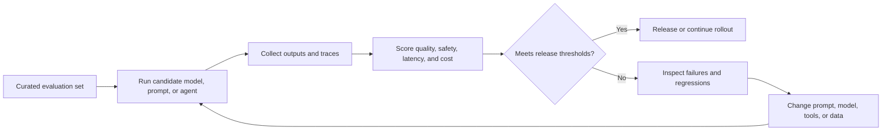

 Evaluation and Testing

Tags: #ai #evaluation
Difficulty: Medium
Status: Learning

## Definition

Evaluation measures whether an AI system is accurate, reliable, safe, and helpful in the scenarios it is meant to support.

## Why it matters / when to use

Without evaluation, it is hard to know whether a prompt, tool, or agent is improving or regressing.

## How it works

Typical metrics include correctness, latency, grounding, safety, cost, and user satisfaction. Robust systems track evaluation sets and regressions.



## Code example

```ts
const checks = [
  { name: "correctness", score: 0.92 },
  { name: "latency", score: 0.84 },
  { name: "safety", score: 0.97 }
];

console.log(checks.map((c) => `${c.name}: ${c.score}`));
```

## Time and space complexity

Evaluation cost depends on volume of tests, model calls, and operational scale rather than algorithmic complexity.

## Common mistakes and pitfalls

- Measuring only a single metric
- Forgetting regression tests for production behavior
- Evaluating only the happy path

## Interview questions

### Q: What is a good evaluation set?
Model answer: It should test both common and edge-case scenarios, include expected outcomes, and reflect the real usage environment as closely as possible.

## Related topics

- [LLM basics](llm-basics.md)
- [RAG](rag.md)
- [Tool use and agents](tool-use-and-agents.md)
