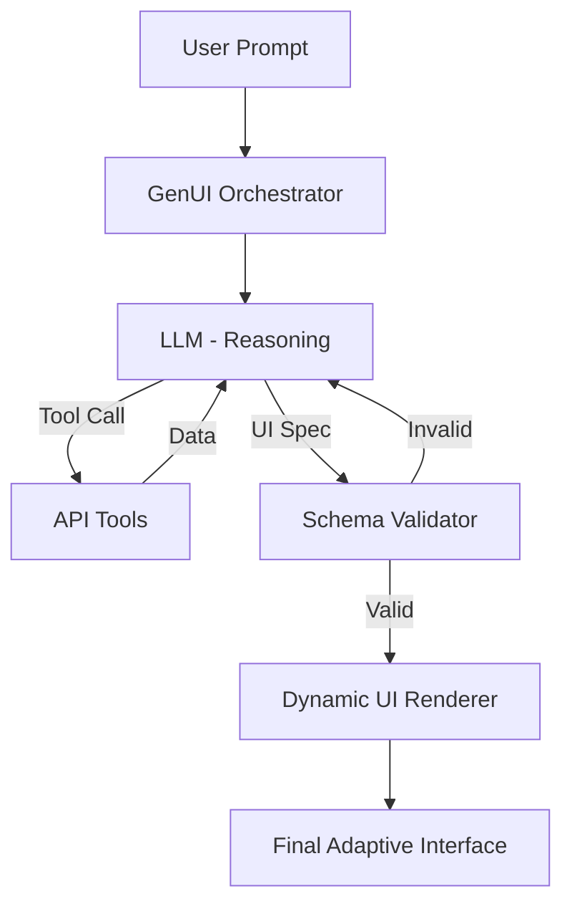

# Generative UI Orchestration

## Definition

Generative UI Orchestration is the process of coordinating an LLM, a set of data-fetching tools, and a dynamic UI renderer to produce a functional user interface that adapts in real-time to the user's intent.

## The Orchestration Lifecycle

The laentcy and quality of GenUI depend on the orchestration loop.

### 1. Intent Decomposition
The LLM doesn't just "draw" a UI; it decomposes the request into:
- **Required Data**: Which APIs need to be called?
- **Layout Intent**: Which components are best for this data? (e.g., "Trends" $\rightarrow$ Line Chart).
- **Constraints**: Are there specific accessibility or branding rules to follow?

### 2. Tool-Calling & Data Retrieval
The orchestrator uses a **ReAct (Reason + Act)** pattern:
1. **Reason**: "To show revenue, I need the `get_revenue` tool."
2. **Act**: Execute `get_revenue(period='last_month')`.
3. **Observe**: Receive JSON data from the API.
4. **Repeat**: If more data is needed, repeat.

### 3. Specification Generation
Once the data is gathered, the LLM generates a UI Specification (typically in a Custom DSL or JSON). This spec maps the data to the components.

### 4. Safe Rendering
The specification is validated against a schema and then passed to a dynamic renderer (e.g., a React-based engine) that maps DSL nodes to actual, pre-built, and secure components.

## High-level Architecture



## Performance Optimization

### Streaming UI
Waiting for the full LLM response creates a poor user experience.
- **Implementation**: Use **Server-Sent Events (SSE)** or WebSockets. As the LLM streams the DSL, the renderer parses it incrementally. A "Skeleton" component is shown first, and then filled as the DSL objects are completed.

### Speculative Rendering
The system can predict the most likely UI components based on the intent before the LLM finishes.
- **Approach**: While the LLM is thinking, the system fetches common data sources for that intent, reducing the perceived latency.

## Working Code Example: Orchestration Loop

This TypeScript example demonstrates the core logic of an orchestrator that handles a tool-call loop before final rendering.

```ts
type ToolResult = { tool: string; data: any };
type GenUIResponse = { spec: string; tools: string[] };

async function genUIOrchestrator(prompt: string) {
  let context = `User request: ${prompt}`;
  let iterations = 0;
  const MAX_ITERATIONS = 3;

  while (iterations < MAX_ITERATIONS) {
    // 1. Call LLM to either get a tool call or a final spec
    const response = await callLLM(context);

    if (response.type === 'FINAL_SPEC') {
      return validateAndRender(response.spec);
    }

    if (response.type === 'TOOL_CALL') {
      // 2. Execute the tool
      const data = await executeTool(response.toolName, response.args);
      // 3. Feed the result back into the context for the next iteration
      context += `\nTool ${response.toolName} returned: ${JSON.stringify(data)}`;
    }
    iterations++;
  }
  throw new Error("Max iterations reached without a final UI spec");
}

async function executeTool(name: string, args: any) {
  const registry: Record<string, Function> = {
    getRevenue: async (p) => ({ total: 10000, currency: 'USD' }),
    getUserInfo: async (id) => ({ name: 'Alice', tier: 'Gold' }),
  };
  return registry[name]?.(args) || { error: 'Tool not found' };
}

async function validateAndRender(spec: string) {
  console.log(`Rendering validated spec: ${spec}`);
  return { status: 'rendered', spec };
}

// Mock LLM call
async function callLLM(ctx: string) {
  if (ctx.includes('get_revenue')) return { type: 'FINAL_SPEC', spec: 'Chart("revenue")' };
  return { type: 'TOOL_CALL', toolName: 'get_revenue', args: { period: 'month' } };
}

genUIOrchestration("Show me my revenue").then(console.log);
```

**Complexity**:
- **Time**: $O(I \cdot L)$ where $I$ is iterations and $L$ is LLM latency.
- **Space**: $O(C)$ for the context window.

## Interview questions

### Q1: What is the most critical part of the GenUI pipeline?
**Model answer**: The **Validation layer**. Because LLMs can hallucinate, you can never trust the output directly. A strict schema validator ensures that only allowed components and valid properties reach the renderer, preventing crashes and security vulnerabilities.

### Q2: How do you handle "latency" in a generative UI?
**Model answer**: I use three strategies: 1) **Streaming**, rendering components as they are generated, 2) **Speculative data fetching**, retrieving common data before the LLM decides the final layout, and 3) **Optimized DSLs**, which reduce the number of tokens the LLM needs to generate.

### Q3: How do you evaluate the "correctness" of a generated UI?
**Model answer**: I use a "Golden Dataset" of prompt-response pairs. I compare the generated AST (Abstract Syntax Tree) against a reference AST using a structural similarity metric. I also implement a "Human-in-the-loop" feedback system where users can rate the UI, which is then used to fine-tune the system prompts.

### Q4: Why not use a standard UI library with a "config" file?
**Model answer**: Standard configs are static. GenUI allows the interface to adapt to the *nuance* of the request. For example, if a user asks "Why is my revenue down?", the system can decide to generate a "Comparison Chart" and a "Root Cause Analysis" text block, rather than just showing a generic dashboard.

### Q5: How do you prevent the LLM from entering an infinite tool-calling loop?
**Model answer**: I implement a `max_iterations` cap and a "Context Budget." If the LLM keeps calling the same tool with the same arguments without progressing toward a final spec, the orchestrator terminates the loop and returns a fallback UI.

## Related notes

- [Custom DSL Design](../09-agentic-ai/custom-dsl-design.md)
- [Python GenUI Service](../14-resume-deep-dive/python-genui-service.md)
- [Tool calling](../09-agentic-ai/tool-calling.md)
