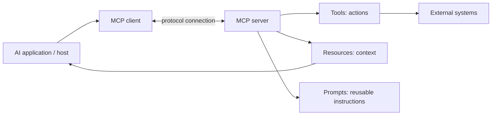

# MCP

## Definition

Model Context Protocol (MCP) is a way to standardize how AI systems discover and use tools and context sources.

## Why it matters

Without a protocol, every tool integration becomes custom. MCP gives a common interface pattern for tool exposure and context exchange.

## Common value

- easier tool integration
- safer contracts between models and systems
- more portable agent architectures

## Interview framing

> MCP is not the model itself; it is the plumbing and contract layer that lets agents interact with tools in a structured and portable way.

## Related notes

- [Tool calling](tool-calling.md)
- [Memory and guardrails](memory-and-guardrails.md)
- [Evaluation](evaluation.md)
