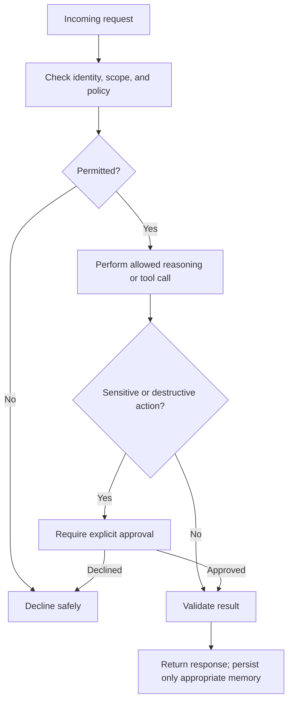

# Memory and guardrails

## Memory

Memory helps an agent carry context across steps or sessions.

### Types

- short-term memory: current conversation state
- working memory: intermediate task state
- long-term memory: user preferences or persistent facts

## Guardrails

Guardrails constrain agent behavior to keep it safe, useful, and aligned with policy.

### Typical guardrails

- allowlist of tools
- role-based permissions
- input/output validation
- confirmation step before destructive actions
- monitoring for prompt injection or unsafe instructions

## Interview guidance

- Memory improves continuity, but it must be filtered and versioned.
- Guardrails are essential before any agent is allowed to do real work.

## Related notes

- [What agents are](what-are-agents.md)
- [Tool calling](tool-calling.md)
- [Evaluation](evaluation.md)
