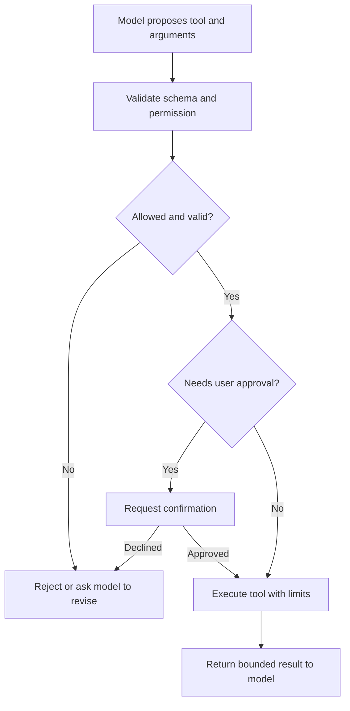

# Tool calling

## Definition

Tool calling is the mechanism by which an LLM chooses and invokes external capabilities such as search, API calls, code execution, or database reads.

## Why it matters

Without tools, an LLM is limited to its training and context. Tools give it access to current information, system state, and action-taking capabilities.

## Good tool design principles

- Clear input and output schema
- Restricted scope and permissions
- Retry and timeout policies
- Safe defaults and explicit approval for destructive actions



## Example

```json
{
  "tool": "search_docs",
  "args": { "query": "Spring Boot auto-configuration" }
}
```

## Interview guidance

- Tool choice should be explicit, constrained, and auditable.
- Tools reduce hallucination when they provide grounded data.
- A bad tool interface can be worse than no tool at all.

## Related notes

- [What agents are](what-are-agents.md)
- [MCP](mcp.md)
- [Evaluation](evaluation.md)
